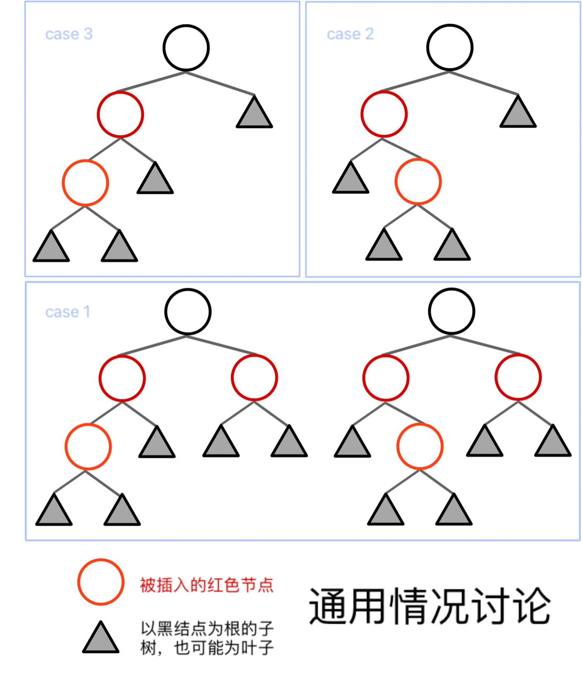
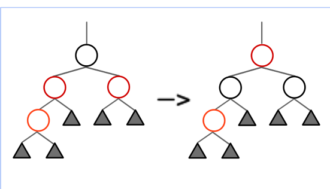
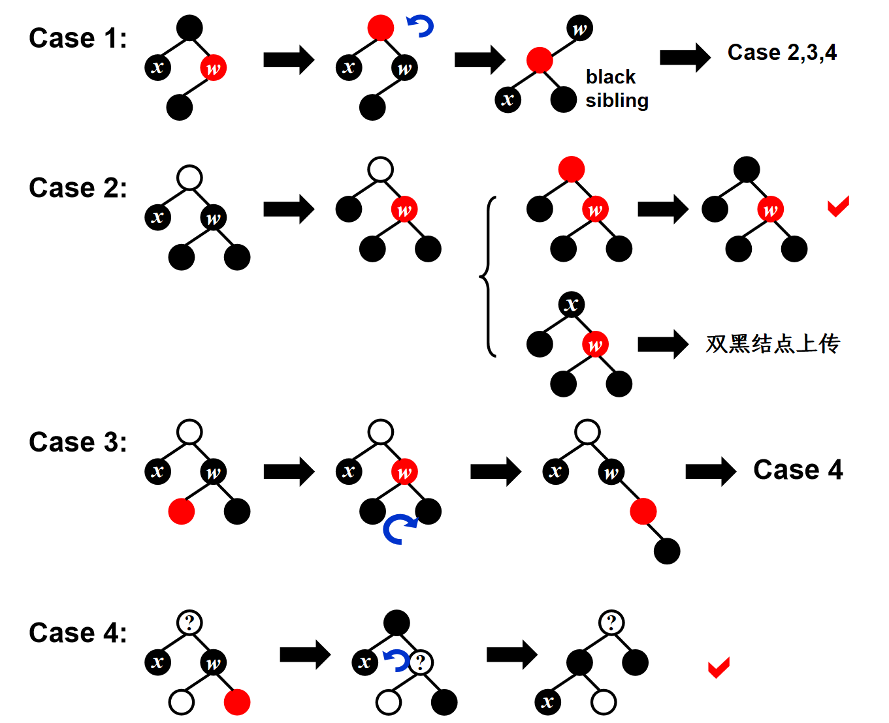

# Red Black tree（红黑树）
红黑树的目的是为了构建平衡二叉搜索树，其结点除包含键值和左右子树指针外，还有颜色字段

红黑树的内部节点即树本身具有的结点；外部节点是指每个内部节点的空孩子，我们称之为`NIL`结点，它也是黑色的；

若算上外部节点`NIL`，则红黑树的叶结点均为`NIL`
## 定义
红黑树是满足下列5条性质的**BST**

1. 每个结点非红即黑 
2. root为黑
3. 每个叶结点（`NIL`）均为黑色
4. 若某结点为红色，则它的两个孩子均为黑色
5. 对与每一个结点，从它开始的所有simple path（一路向下直到`NIL`）都包含相同数量的黑节点

### 子定义
黑高(black-height, bh)：某结点的黑高为从该结点开始的simple path上包含的黑结点数量（不包括自身）；bh(tree)=bh(root)

## 性质
有n个内部节点的红黑树，高度最大是 $2\log_2 (n+1)$

!!! proof "Height of RB Trees"
    > 一个显然的前提：任何simple path上的黑结点数大于等于红结点数

    1. 首先有 $n\ge 2^{bh}-1$，即 $bh\le \log_2(n+1)$
    2. 又显然有 $2bh(Tree)\ge h(Tree)$
    3. 因此 $h(Tree)\le 2\log_2 (n+1)$

## 操作
### insert
> 我们在插入新结点时一律将其设为红色，后续进行调整

+ 新结点的父亲为黑色，则无需调整
+ 新结点的父亲为红色
则有以下3种情况
!!! note
    由于新插入的结点也有子节点`NIL`，而在调整过程中也会出现父辈中的红结点违例现象，因此所有红结点在示意图中均有两个孩子，且“被插入的红色结点”未必是最底层的结点

!!! info "Insert"
    { align=left width="400" }

    + case3: 叔叔为黑，自己是叔叔的远侄

        可直接解决，不用递归向上

    -----
    
    + case2: 叔叔为黑，自己为叔叔的近侄

        先旋转成远侄，再按case3操作

        可直接解决，不用递归向上
    
    -----

    + case1: 叔叔为红

        将爷爷的黑向下传递给两个孩子（下放），爷爷变红，将问题抛给爷爷解决

!!! example "RBtree insert"
    === "case3"
        
    === "case2"
        {width="600"}
    === "case1"
        {width="400"}
### delete
由于删除红结点不影响黑高，因此以下1.和2.仅考虑删除黑结点：

1. 删除叶结点

2. 删除有单孩结点

3. 删除二孩结点
    
    用普通搜索树的删除操作，将左子树最大孩顶替上来，让它保持被删除结点的颜色；

    此时，相当于左子树最大孩原先所在的位置作为删除结点的位置，而该位置仅有单孩，所以可以归结为1. 和2. 的情形

我们将**被删除结点的子结点**移上来后，若该子结点原先为红，则此时染黑后正好符合，因此仅考虑该子结点原先为黑；

若该子结点原先为黑，则为了保持红黑树其他性质不变，我们将它设置为双黑结点（一个结点算作两个黑高），并将它记作x，它的兄弟记作w

于是，问题可以分为

+ 兄弟w为红(case1)

+ 兄弟w为黑

    + 近侄为黑，远侄为黑(case2)
    + 近侄为红，远侄为黑(case3)
    + 近侄？？，远侄为红(case4)

!!! info "Delete"
    { align=left width="450" }

    + case1: 兄弟红
    
    先父兄换色，然后再旋转->兄弟黑

    -----
    
    + case2: 两侄均黑
    
        x和w均**上传**一个黑高；

        若父亲为红，则染黑；若父亲为黑，则父亲双黑结点上传至父亲，递归解决
    
    -----

    + case3: 近侄红，远侄黑
        
        旋转成远侄红->case4

    -----

    + case4: 远侄红
        
        将远侄染黑；交换父兄颜色；旋转
        
!!! summary 
    对单结点而言，delete最多旋转3次
    
    + case1旋转一次->case2,3,4
    + case2不用旋转，或直接或递归解决
    + case3旋转一次->case4
    + case4旋转一次解决

    worst case即为：case1 -> case3 -> case4 -> done

# B+ tree（B+树）
## 定义
一棵**M阶**B+树的属性如下：

1. 根节点是叶结点，或有2~M个孩子的非叶结点
2. 所有非叶结点（除根结点外）均有$\lceil \frac{M}{2}\rceil$~$M$个孩子
3. 所有叶子高度相同，所有非根的叶结点也有$\lceil \frac{M}{2}\rceil$~$M$个孩子

## 操作
M阶B+树的插入复杂度为$O(\frac{M}{\log M}\log N)$
!!! proof "B+ tree insertion"
    树的最大高度为$O(\lceil\log_{\frac{M}{2}\rceil}{N})=O(\frac{\log N}{\log M})$，

    插入一个值可能会使每一层都分裂，分裂时需要拷贝$O(M)$个索引值，因此总时间复杂度为
    $$
    T(M,N)=O(M)O(\frac{\log N}{\log M})=O(\frac{M}{\log M}\log N)
    $$

查找复杂度则为$T_{find}(M,N)=O(\log M \times \frac{\log N}{\log M})=O(\log N)$