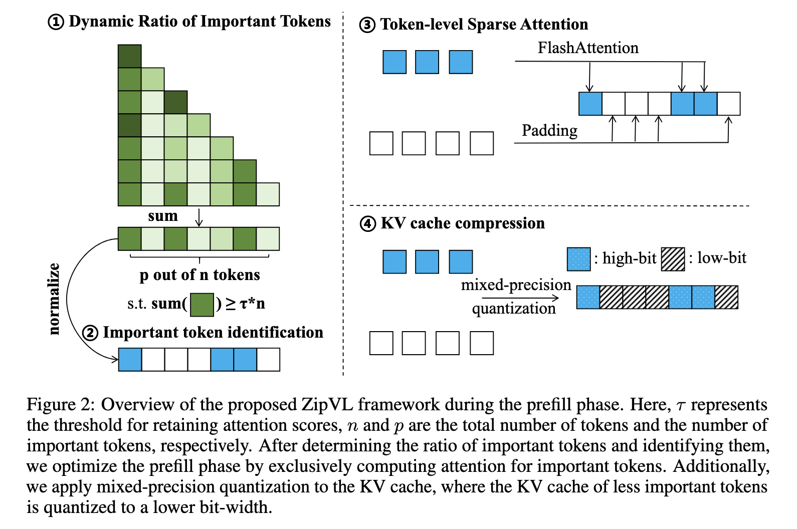

# prefill stage

prefill stage suffers from the quadratic complexity of the attention mechanism.

## adaptive layerwise sparsity
introduce a layer-wise adaptive ratio assignment scheme for important token, instead of predefined, unified fixed ratio.

### prefill (for the j-th token)
$$
a_j=\sum^n_{c=1}A_{c,j} \\
p=\min\{ p\in \Z | \sum^p_{j=1}a_{sorted(j)} \geq \tau\times n \}
$$

p is the selected number of important tokens

$$
\tilde a_j = \frac{\sum^n_{c=1}A_{c,j}}{nnz(A_{:,j})}\\
{\rm{\bold T}} = {\rm top\_ k\_ index}({\tilde a_j},p)
$$

${\rm{\bold T}}$ is the index of the selected important tokens, $nnz(A{:,j})$ is the number of non-zeros in the j-th row of attention matrix, i.e. total attention score of j-th token

### decode (newly generated token)
$$
q=xW_Q,\ K={\rm{Concat}}(K,xW_K),\ V={\rm{Concat}}(V,xW_V) \\
a={\rm{softmax}}(\frac{qK_T}{\sqrt{d}}),\ o=aV
$$

do prefill sparsity every 100 token generation

??? note "algorithm"
    

### ground
this allows the ratio to be adjusted according to task complexity.

### pros
this approach seamlessly integrates with existing fast attention implementations without requiring custom GPU kernels.

# decode stage
In the decoding phase, each new token interacts with all preceding tokens, requiring to fetch the full key-value (KV)cache from memory.

## utilize important set from **prefill stage**
the same set of important tokens is applied to compress the KV cache, where we employ high-bit quantization for caches of important tokens and low-bit quantization for those of less importance

## 

!!! note "zipvl"
    

# Further readings
+ [FlashAttention]()

+ [Learning Transferable Visual Models From Natural Language Supervision](https://arxiv.org/abs/2103.00020)

## ViT
[vit](https://github.com/google-research/vision_transformer)

## unstructured/semi-structured/structured sparse attention
+ [FastV]()

+ [HiRED]()

+ [MInference](https://arxiv.org/abs/2407.02490)

## KV cache compression
+ token dropping-based 
+ token merging-based
+ quantization-based

[ZipCache](https://arxiv.org/abs/2405.14256)

[KVQuant](https://arxiv.org/pdf/2401.18079)

