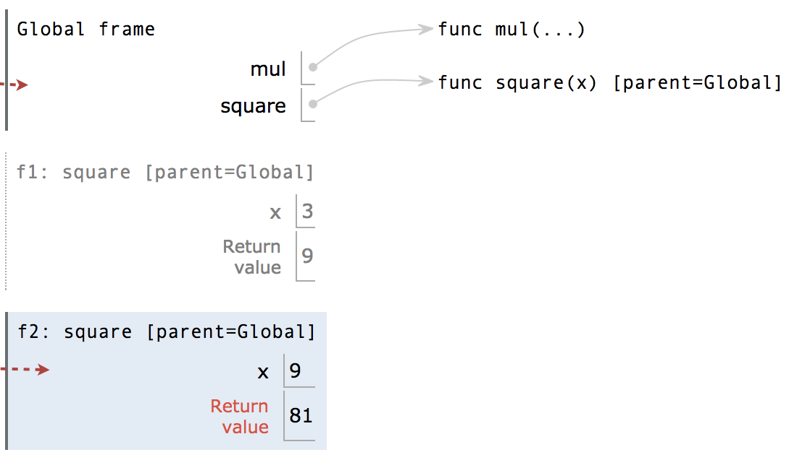

<h1>Ch1</h1>
> Most important two things I’ll say all day:
>
> 1. An environment is a sequence of frames.
> 2. A name evaluates to the value bound to that name in the earliest frame of the current
>    environment in which that name is found.

在python中，赋值语句是bind name with value，因此如果出现赋值语句f=max，然后再改变max的值，不会影响f的值，也就是f仍然是求最大数的函数

assignment rule for assignment statement：

1. 先对“=”右边进行估值
2. 将左边的name与右边估好的值进行bind

```python
a=1
b=2
b,a=a+b,b #eventually a=2,b=3
```

定义函数的格式：

```python
>>> def <name>(<formal parameters>):  #this line is Function signature
    	...
        return <expression> ;the rest is Function body
```

这个过程中，(1)一个函数被创建 (2)一个name与进行此操作的函数进行bind (3)return expression不会立刻被evaluate，它只在函数被调用时被evaluate

不管是import还是define的函数，每个函数在environment中都是一行，以 `func` 开头，后面是函数名和形参（无正式形参则用...表示）。函数名称重复两次，一次在frame中，一次在函数定义中，前者叫做bound name，后者叫做intrinsic name（内在名称）。两者不同在于：可以有很多不同名字指代同一个函数，但这个函数只有一个intrinsic name。而在evaluation时用的name时在frame中的name，而非intrinsic name。

关于**None**： None值represents nothing. 用于作为没有明确返回值的函数的返回值，而且None作为表达式的值不会被python interpreter 显示

+ Pure Function：仅返回值而没有side effect的函数，（而且每次input相同则output必相同）
+ Non-Pure Function：会有side effect的函数，如print
<h4>Environment</h4>
到现在为止，我们的program的含义仍然不明显，比如如果一个形参和一个函数重名了呢？在不同环境中同一个name有不同的含义

```python
from operator import mul
def square(square):
    return mul(square,square)
square(4)
```

对应的diagram：


该段代码中，作为函数名的square和作为形参的square会与不同的值bound，两者在不同的环境下估值。如前所述，A name evaluates to the value bound to that name <u>in the earliest frame of the current environment in which that name is found</u>. 在calling时， `return mul(square,square)` 会先经历新建的square frame，找到作为形参的square以此来估值，而非以global中作为函数名的square进行估值。

<h4>Multiple environment（多环境）</h4>

一个用户定义函数的生命周期：

1. def statement：创建一个新函数，并在现在的frame中将name和这个函数绑定
2. call expression：对operator和operand进行估值
3. calling：创建一个新local frame(only accessible to that function)，并将函数的形参(parameter)与实参(argument)绑定，在这个新环境中执行函数体(body)
3. 关于calling，详细版可以看看<a href="https://www.composingprograms.com/pages/13-defining-new-functions.html">textbook上的sum_squares函数</a>，说的非常清楚！

下面通过一段代码的diagram来看看执行过程

```python
from operator import mul
def square(x):
    return mul(x,x)
square(square(3))
```


> 第一步，将第一条import语句和第二条def语句（两行算作一句）所产生的变量（在这里即函数）放入global frame中
>
> 第二步，对第三条语句的operator和operand进行估值
>
> 第三步，开始调用相应函数进行计算

<h4>Ch1.4</h4>

默认参数值：

```python
>>> def pressure(v, t, n=6.022e23):
        """Compute the pressure in pascals of an ideal gas.

        v -- volume of gas, in cubic meters
        t -- absolute temperature in degrees kelvin
        n -- particles of gas (default: one mole)
        """
        k = 1.38e-23  # Boltzmann's constant
        return n * k * t / v
```

```python
>>> pressure(1, 273.15)
2269.974834 #如果没提供第三个参数，则用定义中默认的值
>>> pressure(1, 273.15, 3 * 6.022e23)
6809.924502 #如果提供了第三个参数，则忽略默认值
```

<h4>Ch1.5 Control</h4>

+ simple statement: expression,return,assignment
+ compound statement: def,control

format of compound statement:

```python
<header>:
    <statement>
    <statement>
    ... #this whole is called a clause
<separating header>:
    <statement>
    <statement>
    ...
...
```

```python
if <expression>:
    <suite>
elif <expression>:
    <suite>
else:
    <suite> #conditional statements
    
while <expression>:
    <suite> #iteration
```

**Testing**

1. Assertions.

   ```python
   assert fib(8) == 13, 'The 8th Fibonacci number should be 13'
   
   def fib_test():
   	assert fib(2) == 1, 'The 2nd Fibonacci number should be 1'
   	assert fib(3) == 1, 'The 3rd Fibonacci number should be 1'
   	assert fib(50) == 7778742049, 'Error at the 50th Fibonacci number'
   ```

   格式：assert <expression>, 'a quoted line of text'

​		如果<expression>值为true的话，没有影响；false的话打印quoted text并引起错误，halt程序

> Note：一般test都不会直接写在interpreter里面，而是写在同个文件或卸载同目录文件_test.py中

2. Doctest.

   ```python
   >>> def sum_naturals(n):
           """Return the sum of the first n natural numbers.
   
           >>> sum_naturals(10)
           55
           >>> sum_naturals(100)
           5050
           """
           total, k = 0, 1
           while k <= n:
               total, k = total + k, k + 1
           return total
       
   >>> from doctest import testmod #第一种测试函数
   >>> testmod()
   TestResults(failed=0, attempted=2)
   
   >>> from doctest import run_docstring_examples #第二种测试函数
   >>> run_docstring_examples(sum_naturals, globals(), True)
   Finding tests in NoName
   Trying:
       sum_naturals(10)
   Expecting:
       55
   ok
   Trying:
       sum_naturals(100)
   Expecting:
       5050
   ok
   ```

   第3行的空行可有可无，需要注意的是测试的argument和预期的behavior都要放在**docstring**中，以及**>>>**符号不能忘

<h4>Ch1.6 higer-order function And environment</h4>

1. 作为参数的函数

​		例如数列求和的通项函数term(n)

``` python
def summation(n, term):
	total, k = 0, 1
    while k <= n:
        total, k = total + term(k), k + 1
    return total
```

2. 作为通用方法的函数

​		概念：用一些函数来表达通用的计算方法(general methods)，而与它们调用的特定函数无关

​		例如，迭代改进的通用方法

```python
>>> def improve(update, close, guess=1):
        while not close(guess):
            guess = update(guess)
        return guess
```

​		迭代改进的算法从方程的`guess`解（推测解）开始，不断应用`update`函数来逼近方程条件，并用close函数与允许误差(tolerance)进行比较。

​		该`improve`函数是迭代求精的通用表达式，它并不会指定要解决的问题，细节会留给作为参数传入的`update`和`close`函数

​		一个具体的例子是黄金分割比x的求解，它的一个特性是可以通过反复对给定正数`guess`进行1/guess+1操作逼近x，另一个特性是x^2-x-1=0。综上，求解黄金分割比的`update`和`close`函数就可以这样写

```python
>>> def golden_update(guess):
        return 1/guess + 1

>>> def square_close_to_successor(guess):
        return approx_eq(guess * guess, guess + 1)
    
>>> def approx_eq(x, y, tolerance=1e-15):
        return abs(x - y) < tolerance
```

3. 嵌套定义

​		**lexical scope**:本地变量可以访问更大环境(parent)中的变量，但大环境中的变量无法访问定义在本地的变量

3. 作为返回值的函数

3. currying：将单个多参数函数转变为一连串单参数函数

3. Lambda expression：

   形式：lambda <argument>:<return value>；例如：lambda x : x*x

   lambda expression不需要绑定在某个特定name上，它会被evaluate为一个函数，这个函数没有intrinsic name，在diagram中写成 func λ(x) <line n> [parent = ...]；在调用时，形成框架的函数名写成 fm:λ <line n> [parent = ...]
   
3. Decorators

```python
>>> def trace(fn):
        def wrapped(x):
            print('-> ', fn, '(', x, ')')
            return fn(x)
        return wrapped

>>> @trace
    def triple(x):
        return 3 * x
#equals
>>> def triple(x):
        return 3 * x

>>> triple = trace(triple)
#个人理解：trace作为decorator对定义的函数进行修饰，使调用该函数不仅打印return值，还打印函数地址
```


<h4>Debug session (left for future) ......</h4>


<h2>Lab2 & Discussion2</h2>

<h4>assignment statement & def statement & call expression</h4>

* assignment : 

  * evaluate right value :当遇到name时，先在current frame中查找，再再parent frame中查找，再在parent的parent frame中查找，直到找到为止

  *  bind to left name :判断“=”左边的name是否在**current frame**中，若在则覆盖；若不在则在current中创建该name并bind

   > 注意并不是将外部帧中的该name的value修改，和C语言同理

* def:

  * draw the function object :格式为 func & intrinsic name & (formal parameter) &parent frame
  * judge : 该def中的intrinsic name在**current frame**中是否已有，若有，擦去；若没有，写入object表
  * bind :把def的函数对象与该name绑定

* call:

  * 估operator—>估operand—>新frame—>label新frame—>argument赋给parameter—>execution—>return value

  > 注意built-in和imported函数不用draw new frame

<h4>Short circuiting</h4>

and 和 or 表达式的结果并不都是`True`或`False`，它们会返回最后一个evaluated value，比如 1 or False，返回的是最后一个evaluated value，即1

<h2>Lab3 & hw2</h2>


<h1>Ch2</h1>

<h4>ch 2.3</h4>

* sequence:

  * sequence operation:

  * sequence iteration: **for** statement

  * sequence unpacking: 对多重嵌套sequence的子元素进行提取

   ```python
    >>> pairs = [[1, 2], [2, 2], [2, 3], [4, 4]]
    >>> same_count = 0
    >>> for x, y in pairs:
            if x == y:
                same_count = same_count + 1
    >>> same_count
    2
   ```

  * sequence processing: 
  
    * List comprehensions: 元素映射/筛选元素
  
    ```python
    [<map expression> for <name> in <sequence expression> if <filter expression>]
     # List comprehension general format, filter part can be omitted
    ```
  
    * Aggregation: 将sequence中的元素合并成一个value，如sum,min,max函数
  
  * Lists
  
  * range
  
  * strings
  
  * trees
  
  * Linked lists

<h4>Ch 2.4 Mutable data</h4>

+ object: A combination of data value and behavior；python中的任何value都是一个对象，有对应的data和method(class function)

* mutable object: value会随着程序执行而变化，比如list；

  list在赋值时，会将“=”左边的name指向对应的list对象，所以若有多个name指向同一个list object，对其中一个使用method，其他的都会相应变化。如果想要只复制value，可以通过`lst2=list(lst1)`进行。

​	为了判断两个name是否指向同个object，通过`name1 is name2`的真假来判断

* Tuple: 是immutable sequence，格式为`(element1,element2,...)`，括号可省略（一般不省略）；一个tuple的元素不可更改，但是可以更改其中mutable element中的元素

* Dictionaries: 属于mutable object

  * 目的：通过描述性的index，而非连续的数字index来存储和获取值
  * 格式：`numerals = {'I': 1.0, 'V': 5, 'X': 10}`
  * 一些语法：

  ```python
  >>> numerals['X'] 
  10 #look up
  
  >>> numerals['L'] = 50
  >>> numerals
  {'I': 1, 'X': 10, 'L': 50, 'V': 5} #add new pair
  
  >>> sum(numerals.values())
  66 #combine all the value
  
  >>> dict([(3, 9), (4, 16), (5, 25)])
  {3: 9, 4: 16, 5: 25} #convert a list of pairs into dictionary
  
  >>> numerals.get('V', 0)
  5 #look up value of 'V' and return it; if not existing,return 0
  
  >>> {x: x*x for x in range(3,6)}
  {3: 9, 4: 16, 5: 25} #dictionaries comprehension create a new dictionary object
  ```

  > 注意：Dictionaries的key-value pair是无序的，所以在interpreter中显示时次序可能会变。
  >
  > key不可以是或包含mutable value，所以不能用list作key；一般用Tuple

+ `nonlocal`声明：
  + 声明了该`name`不在current frame中，而是在第一个出现该name被赋值的frame中，通过`nonlocal`声明，就可以修改current frame之外的变量
  + 用途：可以用于有local state的函数，如withdraw()
  + 限制：python关于name的access有这样的限制，如果没有`nonlocal`声明，那么对于一个`name`的引用必须在同一frame中，不可以在**非本地帧**中找到某name，而在**本地帧**中进行bind。因为python在本地帧中遵循的原则是，若左边的name未在本地出现过，那么就在本地帧中创建该名字并赋值，这时就会造成混淆：evaluate时，到底是看nonlocal的name值，还是刚刚创建的name值呢？
+ `nonlocal`赋值的好处：可以创建一个函数抽象的多个实例，且各个实例之间会随着程序执行而发生状态改变，但彼此之间互不干扰，如：

```python
1	def make_withdraw(balance):
2	    def withdraw(amount):
3	        nonlocal balance
4	        if amount > balance:
5	            return 'Insufficient funds'
6	        balance = balance - amount
7	        return balance
8	    return withdraw
9	
10	wd = make_withdraw(20)
11	wd2 = make_withdraw(7)
12	wd2(6)
13	wd(8)
```

​	wd和wd2是两个不同的withdraw实例，有不同的parent（两次make_withdraw的的调用），都是通过make_withdraw创建，其中一个的balance变化不会影响另外一个，各管各的。

+ `nonlocal`赋值的局限性：re-binding操作不仅仅是返回值，它还可能会改变环境；同一个对象，由于它的状态会变化，因此不能根据它的data信息来识别它的identity，这叫做"change"；两个值相等的对象，未必就是同一个对象，这叫做"sameness"。


<h2>Disc4</h2>

data abstraction


<h2>Disc5</h2>

**Iterables**: 一种可以遍历其元素的对象，比如list、string等。任何在apply了built-in `iter` function之后返回`iterator`的object都是`iterator`。

**Iterators**: 也是一种object，通过调用`next`函数，追踪`iterable`中下一个元素，可以遍历`iterable`中的元素，调用完后此iterator对象状态变化，只剩没被遍历的元素；如果对iterator调用`iter`函数，则返回自身。

当iterator中已经遍历完所有元素后，再次调用`next`会raise`StopIteration`的exception。但怎样算遍历完了呢？不仅仅局限于直接调用 `next` 函数到没有元素为止，其他方法比如 `list(iterator1)` 也会遍历元素，因为`list` 需要直到 `iterator1` 中的所有元素，而iterator这种对象是**implicit sequence**，采用**lazy computation**，不会存储序列中的所有元素，而是在调用next后再弹出下一个元素，因此为了获取所有元素，也就implicitly遍历了 `iterator1`

**A comparison** : **Iterables**和**Iterators**的关系就像book和bookmark一样，可以有多个bookmark插在同一本book的不同位置，遍历此book；此外，bookmark并不知道book自身的变化，因此当book变化（remove或add或append等），bookmark还是插在相应的页之间，但调用 `next` 函数时会根据new book的状态来执行；当iterator弹出 `StopIteration` 后，相当于bookmark已经插在book的back cover之后了，所以不管如何改变iterable，对该iterator调用next函数只会弹出 `StopIteration` ，见下例2

> 注意：iterators在遍历元素时不影响原来的iterable

```python
>>> lst = [1, 2, 3, 4]
>>> list_iter = iter(lst)
>>> next(list_iter)
1
>>> list(list_iter) # Return remaining items in list_iter
[2, 3, 4]
```

```python
>>> s = [[1, 2, 3, 4]]
>>> i = iter(s)
>>> next(i)
[1, 2, 3, 4]
>>> s.append(5)
>>> next(i)
5
```

**Generators**: 一种特殊iterator，通过定义个性化的generator函数，return得到generator object

**yield statement**: generator函数中特有的语句

Generator函数的执行过程：调用generator函数（含`yield` statement的函数）产生一个 `generator` 对象，但不会执行generator函数的body；调用generator函数后，每次调用对该`generator`对象调用next函数，都会使对应的generator函数body开始执行，直到遇见`yield` statement（即返回`yield`后面的表达式的值），或遇到暂停点（比如`return`）；当暂停在某个 `yield` statement时，会记住此时离开的位置和状态，下次继续从该暂停点开始继续执行body

如果没元素可yield了，则raise `StopIteration`，与iterator类似

也可以用`yield from` statement从 `iterator` 或 `iterable` 中yield元素，见下例

```python
>>> def gen_list(lst):
...     yield from lst
...
>>> g = gen_list([1, 2])
>>> next(g)
1
>>> next(g)
2
>>> next(g)
StopIteration
```

