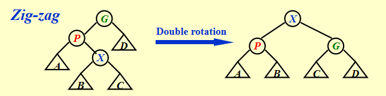
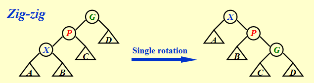

# AVL tree
## 定义
### 一些必要的前提定义

+ **高度(height of a tree)**：根结点到自己的叶孩子结点的最大距离。叶结点的高度为0，空结点的高度为-1

+ **平衡因子(Balance Factor, BF)**：一棵树T的BF为$BF(T)=height(T_l)-height(T_r)$，其中$T_l, T_r$分别为T的左、右子树

那么**AVL tree**就是一棵BST，满足对所有结点T，都有 $\left| h(T_l)-h(T_r)\right| \leq 1$，即**BF**绝对值不超过1；

换句话说，如果二叉树 T 是 AVL 树，则其左右子树也都应该是 AVL 树，且有 $BF(T) \in \{0,\pm 1\}$；
## 性质
### 高度与结点数的关系
可以证明，结点数为 $N$ 的AVL树的高度为 $O(\log N)$，证明如下：
??? proof "Height of AVL Trees"
    !!! inline note ""
        ```mermaid
        graph TD;
        A(("Root"))
        B[/"Left Subtree"\]
        C[/"Right Subtree"\]
        A === B
        A === C
        ```
    
    我们记 $n_h$ 是高度为 $h$ 的 AVL 树所包含的最少节点数，则有如下递推关系：

    $$
    n_h = \left\{
        \begin{array}{l}
            1                       & (h = 0) \\
            2                       & (h = 1) \\
            n_{h-1} + n_{h-2} + 1   & (h > 1)
        \end{array}
    \right.
    $$

    发现 $n_h + 1$ 符合 Fibonacci 数列的递推公式（但是初始条件不一样），所以我们可以用 Fibonacci 对其进行一个估计。

    而对于如下 Fibonacci 数列：

    $$
    F_i = \left\{
        \begin{array}{l}
            1                   & (i = 1) \\
            1                   & (i = 2) \\
            F_{i-1} + F_{i-2}   & (i > 2)
        \end{array}
    \right.
    $$

    其通项为：

    $$
    \begin{aligned}
        F_n &= \frac{1}{\sqrt{5}} \left( \left( \frac{1 + \sqrt{5}}{2} \right)^n - \left( \frac{1 - \sqrt{5}}{2} \right)^n \right) \\
            &\approx \frac{1}{\sqrt{5}} \left( \frac{1 + \sqrt{5}}{2} \right)^n \\
        \log{(F_n)} &\approx n
    \end{aligned}
    $$

    而 $n_h + 1 \approx F_{h+2}$，所以 $h \approx \log{(n_h)}$，也就是说 $h \approx \log{N}$。
## 操作
对于AVL树的**插入**，我们采用每插入一个结点，就动态「调整树结构+更新相关结点**BF**字段」的方式。调整的基本操作包括左旋、右旋；

两个结点的概念：
+ **Trouble maker**：指插入的新结点，它导致AVL树的性质违反+ 
+ **Trouble finder**：指因插入新结点，而导致其BF不再为0或1的结点
> 由于插入操作只会影响从新插入的叶结点到根这条路径上的结点的BF值，因此定位**Trouble maker**和**Trouble finder**时只需要考虑该路径上的结点；由于AVL树的递归定义形式，我们倾向于从叶子结点开始调整树的结构，因此在定位**Trouble finder**时一般先定位最靠近叶子的结点

而对于不同的情况，需要用到不同的左右旋组合。根据**Trouble maker**和**Trouble finder**的关系，我们把情况分为以下四种：
!!! note "4 cases"
    === "LL"
        + LL single rotation: **Trouble maker**位于**Trouble finder**的 ^^左孩子^^ 的 ^^左子树^^ 中

        === "before"
            ```mermaid
            flowchart TD
                A((("A")))
                B((("B")))
                Ar[/"A_R"\]
                Bl[/"B_L"\]
                Br[/"B_R"\]
                tm(("Trouble\nMaker"))
                A === B
                B === Bl === tm
                B === Br
                A === Ar
            ```
        === "after"
            ```mermaid
            flowchart TD
                A((("A")))
                B((("B")))
                Ar[/"A_R"\]
                Bl[/"B_L"\]
                Br[/"B_R"\]
                tm(("Trouble\nMaker"))
                B === Bl === tm
                B === A
                A === Br
                A === Ar
            ```

    === "RR"
        + RR single rotation: **Trouble maker**位于**Trouble finder**的 ^^右孩子^^ 的 ^^右子树^^
        
        === "before"
            ```mermaid
            flowchart TD
                A((("A")))
                Al[/"A_L"\]
                B((("B")))
                Bl[/"B_L"\]
                Br[/"B_R"\]
                tm(("Trouble\nMaker"))
                A === B
                B === Bl
                B === Br === tm
                A === Al
            ```
        === "after"
            ```mermaid
            flowchart TD
                A((("A")))
                Al[/"A_L"\]
                B((("B")))
                Bl[/"B_L"\]
                Br[/"B_R"\]
                tm(("Trouble\nMaker"))
                B === A
                A === Bl
                B === Br === tm
                A === Al
            ```
    
    === "LR"
        + LR double rotation: **Trouble maker**位于**Trouble finder**的 ^^左孩子^^ 的 ^^右子树^^ 中

        === "before"
            ```mermaid
            flowchart TD
                A((("A")))
                B((("B")))
                Ar[/"A_R"\]
                Bl[/"B_L"\]
                C((("C")))
                Cl[/"C_L"\]
                Cr[/"C_R"\]
                tm(("Trouble\nMaker"))
                A === B
                A === Ar
                B === Bl
                B === C
                C === Cl === tm
                C === Cr === tm
            ```
        === "middle"
            ```mermaid
            flowchart TD
                A((("A")))
                B((("B")))
                Ar[/"A_R"\]
                Bl[/"B_L"\]
                C((("C")))
                Cl[/"C_L"\]
                Cr[/"C_R"\]
                tm(("Trouble\nMaker"))
                A === C
                C === B === Bl
                C === Cr === tm
                B === Cl === tm
                A === Ar
            ```
        === "after"
            ```mermaid
            flowchart TD
                A((("A")))
                B((("B")))
                Ar[/"A_R"\]
                Bl[/"B_L"\]
                C((("C")))
                Cl[/"C_L"\]
                Cr[/"C_R"\]
                tm(("Trouble\nMaker"))
                C === B === Bl
                B === Cl === tm
                C === A
                A === Cr === tm
                A === Ar
            ```
    === "RL"
        + RL double rotaion: **Trouble maker**位于**Trouble finder**的 ^^右孩子^^ 的 ^^左子树^^ 中

        === "before"
            ```mermaid
            flowchart TD
                A((("A")))
                Al[/"A_L"\]
                B((("B")))
                C((("C")))
                Cl[/"C_L"\]
                Cr[/"C_R"\]
                Br[/"B_R"\]
                tm(("Trouble\nMaker"))
                A === Al
                A === B
                B === C
                C === Cl === tm
                C === Cr === tm
                B === Br
            ```
        === "middle"
            ```mermaid
            flowchart TD
                A((("A")))
                Al[/"A_L"\]
                B((("B")))
                C((("C")))
                Cl[/"C_L"\]
                Cr[/"C_R"\]
                Br[/"B_R"\]
                tm(("Trouble\nMaker"))
                A === Al
                A === C
                C === Cl === tm
                C === B
                B === Cr === tm
                B === Br
            ```
        === "after"
            ```mermaid
            flowchart TD
                A((("A")))
                Al[/"A_L"\]
                B((("B")))
                C((("C")))
                Cl[/"C_L"\]
                Cr[/"C_R"\]
                Br[/"B_R"\]
                tm(("Trouble\nMaker"))
                C === A
                A === Al
                A === Cl === tm
                C === B
                B === Cr === tm
                B === Br
            ```
    
# Splay tree
满足数据访问的**access locality**原则，当前访问过的结点大概率再次访问
## 性质
### Amortized time bound（均摊时间上界）
Any M consecutive tree operations starting from an empty tree take at most $O(M \log N)$ time.
## 操作
### 元操作
对于非根结点X，记它的父亲和祖父结点为P、G

+ case1: P是root，则通过一次旋转X、P
+ case2: P不是root

|zigzag|zigzig|
|:-------:|:-------:|
|||
|X,P旋转; X,G旋转|P,G旋转; X,G旋转|

### 单结点操作

+ find
找到该结点，将其通过上述2种元操作移至root节点
+ insert
和普通的BST插入一样，树结构调整主要依赖于find操作
+ delete
    1. find该结点X，此时X已位于root；
    2. 然后移除它；
    3. 然后找到X左子树的最大节点Y，将Y的左子树移至Y父亲的孩子，再将Y移至root，root的左右子树作为Y的左右子树（普通的BST删除）
# Amortized Analysis
## Aggregate analysis
直接分析一串n个的操作总共花费的worst-case time $T(n)$，得到每个操作均摊时间为 $T(n)/n$
## Accounting method
对于一串n个的操作，将某操作的均摊成本 $\tilde{c_i}$ 和实际成本 $c_i$ 的差累加到**credit**上，若某操作的均摊成本 $\tilde{c_i}$ 高于实际成本 $c_i$，则credit增加，可用于后续操作的消费透支；若某操作的均摊成本低于实际成本，则消耗credit

$$
\tilde{c_i}-c_i=credit_i\\
credit=\sum_{i=1}^{n}\tilde{c_i}-\sum_{i=1}^{n}c_i \ge 0\\
T_{amortized}=\frac{\sum_{i=1}^{n}\tilde{c_i}}{n} \ge \frac{\sum_{i=1}^{n}c_i}{n}
$$

一般来说，我们分析出每个操作的均摊成本，然后累加。例如对于具有`multipop`操作的stack而言

||`push`|`pop`|`multipop`|
|:-------:|:-------:|:-------:|:-------:|
| $c_i$ |1|1|`min(sizeof(stack), k)`|
| $\tilde{c_i}$ |2|0|0|

> 相当于是在push操作时已经将`pop`和`multipop`的成本已经考虑进去
## Potential method
相比于accounting method，势能函数分析法的区别在于每次操作的credit是势能函数的前后差，更加灵活；而势能函数则是关于数据结构当前状态的函数

$$
\tilde{c_i}-c_i=credit_i=\phi(D_i)-\phi(D_{i-1})\\
\sum_{i=1}^{n}\tilde{c_i}=\sum_{i=1}^{n}(c_i+\phi(D_i)-\phi(D_{i-1}))\\
=(\sum_{i=1}^{n}c_i)+\underbrace{\phi(D_i)-\phi(D_{i-1})}_{\ge 0}
$$

例如对于splay tree而言， 我们希望操作的成本越高，则势能函数降低的越多；而成本越高，树的结构调整越多，那么每个结点的高度减小越多，因此可以将势能函数设为与所有结点高度和相关的函数。

我们采用 $\phi(T)=\sum_{i\in T}\log S(i)$ ，其中 $S(i)$ 是以i为根的子树的后代数量， $\log S(i)$ 用于近似子树的高度

具体计算就算了，太难了（