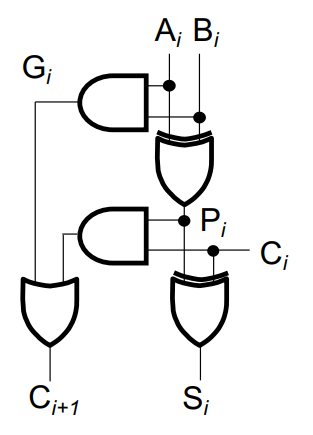
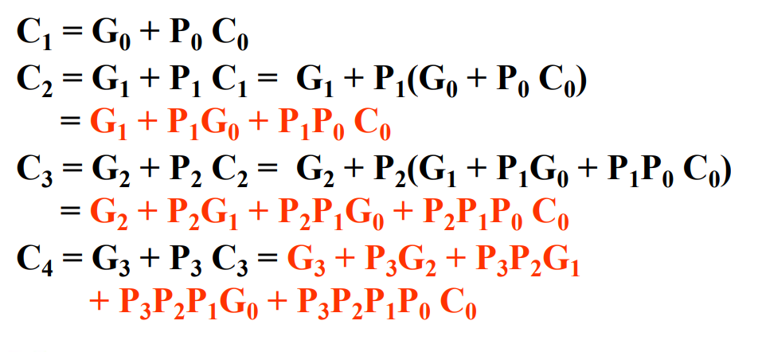
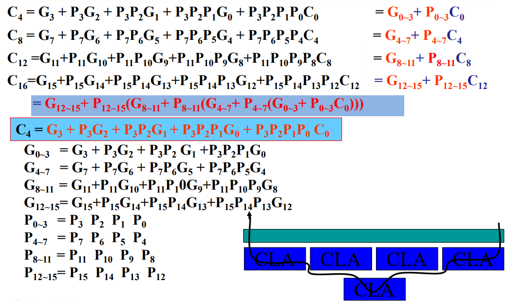
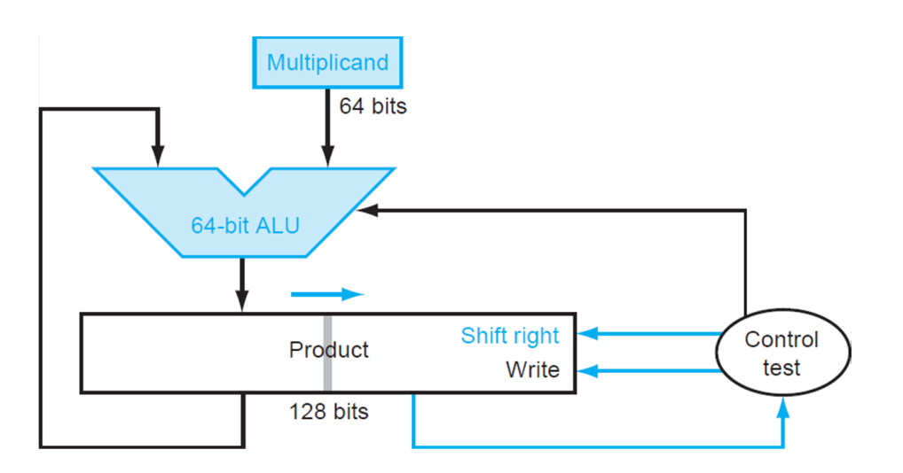
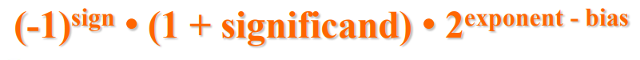
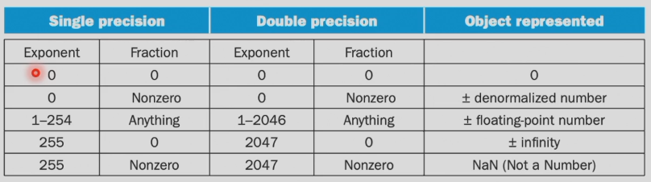

# 第三章 Arithmetic for Computer
## Overflow
对于overflow的检查，我们采用double sign-bits的方法来检测，在两操作数`A[n,0]`和`B[n,0]`最高位前添加一位0，使得`C[n+1,0] = {0,A} + {0,B}`。有以下4种情况：

## ALU
+ 最朴素的ALU
可以实现AND,OR,ADD功能
+ 带减法的ALU
添加1bit的Binvert信号
+ 带comparison的ALU
在MUX中添加接口less进行两个操作数的比大小
> 若A,B同号，则根据A-B的符号位判断大小；否则直接根据符号判断

+ 完整ALU
1. 输入：A、B
2. 控制信号：Binvert、Operation、Carry in
3. 输出：result、overflow、Zero detector
4. 多位输入并行，进位的传播通过行波串行(ripple carry)

+ 缺点：
1. redundancy parallel input
2. ripple carry adder is slow

## Faster adders
### Carry look-ahead adder(CLA)

进位的传播可以分解为`C[i+1]=G[i]+P[i]C[i]`，而`G[i]=A[i]B[i]`，`P[i]=A[i] ^ B[i]`
每4个adder一组，内部采用并行输入，减少进位传播产生的延时

### Group Carry Lookahead Logic
多个4单元CLA之间再用一个CLA来进一步提速

### Carry select adder (CSA)
将进位为0和1的情况同时计算，当上一个单元的进位传播来时直接用选择器进行选择

## Multiplication
以 64bit * 64bit = 128bit 为例

Product左边64bits置零，右边64bits存放multiplier。每次循环若multiplier末位为0，则Product整体右移，若为1则将64bit的multiplicand加到Product左半边，再将Product整体右移
### signed multiplication
+ 基本法：转为绝对值相乘，再转回正确符号
+ Booth's algorithm
对于N位乘数Y，布斯算法检查其2的补码形式的最后一位和一个隐含的低位，命名为y[-1]，初始值为0。对于y[i], i = 0, 1, ..., N - 1，考察y[i]和y[i - 1]。当这两位相同时，存放积的累加器P的值保持不变。当y[i] = 0且y[i - 1] = 1时，被乘数乘以2^i加到P中。当y[i] = 1且y[i - 1] = 0时，从P中减去被乘数乘以2^i的值。算法结束后，P中的数即为乘法结果。

### faster multiplication

## division
+ 64bit_dividend / 64bit_divisor = 64bit_quotient ······ 64bit_remainder
+ 流程：
128bit的remainder左半设为dividend。
每次循环先将remainder左移，然后减去divisor，若结果小于0，加回去，quotient设为0；大于0，quotient末尾设为1。然后quotient左移1位。由于除法是从高位开始减去divisor，所以divisor每次右移<=>dividend每次左移。64次循环后remainder左半为remainder，右半为quotient

> 对于signed division，余数与被除数保持同号

## Floating point numbers
+ single precision
1bit sign + 8bits exponent + 23bits significand
+ double precision
1bit sign + 11bits exponent + 52bits significand

### guard, round, sticky bit
> The guard, round and sticky bits are used to determine if you must round, i.e. if you must remove some trailing bits from a value. The first two of the bits to be removed are the **guard** and **round** bit, respectively. The **sticky** bit is simply 1 if any of the other bits is 1. The combination of these three bits governs if the value of the bits that remain must be incremented by 1 or not. -- stackoverflow