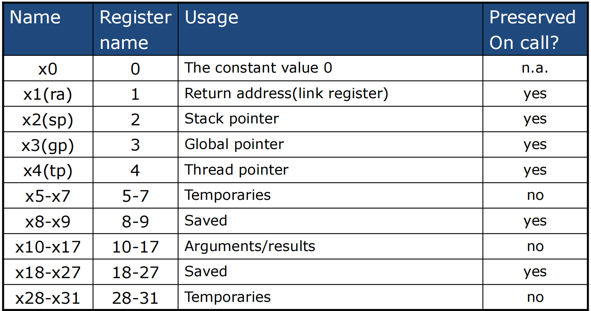

# 第2章 Risc-V ISA
## operation
### arithmetic指令的规则和统一形式
+ 每条指令只能执行1个操作，如add、and、数据存取等
+ Exactly three variables 如`add a,b,c`, a←b+c
## operand
Risc-V的arithmetic指令的操作数必须是register

### register, word (4 Byte)
根据教材的硬件设施，有32个64bit的register，memory中的数据以1个doubleword (8Byte = 64bit) 为一个访问单位，每一次访问memory都是访问一个doubleword块，因此访问起始地址为 0, 8, 16, 24...以此类推
### memory operands
+ 主存(main memory)用于存放复杂数据结构
如Arrays, structures, dynamic data
+ 实施算术需要
    + Load values from memory into registers
    + Store result from register to memory
+ Memory is byte addressed
Each address identifies an 8-bit byte
+ RISC-V is Little Endian
    + 小端法：Least-significant byte at least address of a word
    + 大端法: most-significant byte at least address
+ RISC-V does not require words to be aligned in memory
words align: 一个字是 4 字节，我们要求字的起始地址一定要是 4 的倍数。

### Registers vs. Memory
+ Registers are faster to access than memory
+ Operating on memory data requires loads and stores
+ Compiler must use registers for variables as much as possible
编译器尽量使用寄存器存变量。只有在寄存器不够用时，才会把不太用的值放回内存。

!!! Summary "Risc-V ISA"
    

!!! example "memory operand example"

    === "C"

        ``` c
        A[12] = h + A[8];
        /* assume A is an array of 8Byte elements (a doubleword),
        Base of A is stored in x22, h in x21 */
        ```

    === "asm"

        ``` asm
        ld x9, 64(x22)
        add x9, x21, x9
        sd x9, 96(x22)
        ```