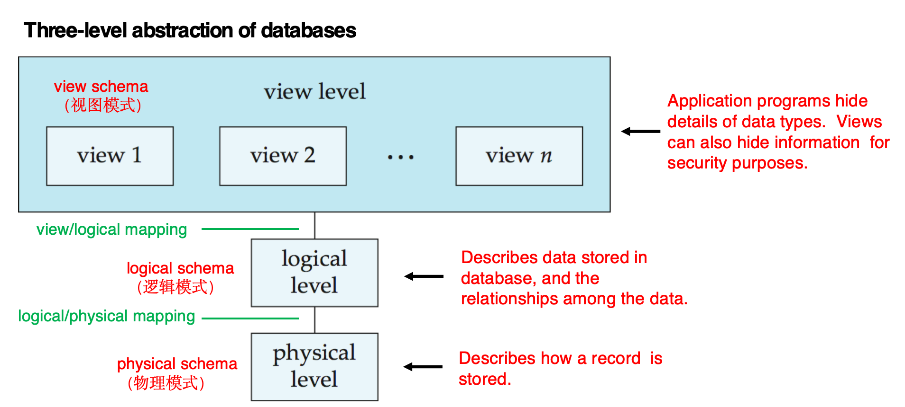
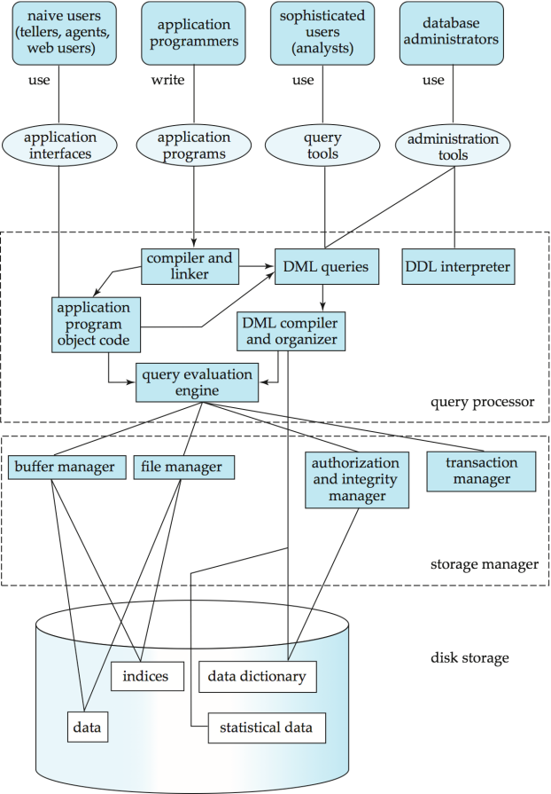

# Database System笔记
# Introduction
## Database system

### DBMS(Database Management System)
数据库管理系统的目的是让存储和访问数据变得方便高效，它包括
+ 定义存储的data structure
+ 提供操作数据的机制
+ 保证database safety，当发生未授权访问或系统故障时
+ 提供并发访问控制的机制

## Purpose of database system
+ 避免文件系统的弊端
    + Data redundancy（数据冗余） and inconsistency（不一致），如格式不同、duplicate现象
    + Data isolation（数据孤立）
    + 存取数据困难
+ Integrity problem，要求便于调整data constraints
+ Atomicity problems（原子性问题），要求在db fail时不会出现partial updates
+ Concurrent access anomalies（并发访问异常），要求支持并发访问
+ Security problems（安全性问题）
database system具有的特征：
+ data persistence(数据持久性)
+ convenience in accessing data(数据访问便利性)
+ data integrity （数据完整性）
+ concurrency control for multiple users(多用户并发控制)
+ failure recovery（故障恢复） 
+ security  control（安全控制）

## Data models
定义：A collection of tools for describing 
+ Data (数据)
+ Data relationships(联系)
+ Data semantics(语义)
+ Data constraints(约束)
类型：
+ Relational model(关系模型)
+ Object-based data models 
    + Object-oriented  (面向对象数据模型)
    + Object-relational(对象-关系模型模型)
+ Semistructured data model  (XML)(半结构化数据模型)
+ Other older models:
    + Network model  (网状模型)
    + Hierarchical model(层次模型)
+ Entity-Relationship model(实体-联系模型) ( mainly for database design )
### Relational model
即表格方式存储数据，它的row叫做tuples，column叫做attributes
### View of data
db的三个抽象层次

### data independence
+ Physical Data Independence（物理数据独立性）：修改physical schema而不需要修改logical schema
+ Logical Data Independence（逻辑数据独立性）：修改logical schema而不需要修改view schema
## database language
1. Data Definition Language (DDL) 
+ 定义了db的schema，如

```sql
create table instructor (
    ID char(5),
    name varchar(5),
    salary numeric(8,2)
)
```

+ DDL compiler generates a set of table templates stored in a **data dictionary（数据字典）**
+ Data dictionary contains metadata (元数据， i.e., data about data),比如
    + Database schema 
    + Integrity constraints（完整性约束）
        + Primary key (ID uniquely identifies instructors)（主健）
        + Referential integrity (references constraint in SQL)（参照完整性）
        e.g. dept_name value in any instructor tuple must appear in department relation
    + Authorization（权限）
2. Data Manipulation Language (DML) 
+ 用于访问和操作data，known as query language
+ two classes: 
    + Procedural（过程式） – user specifies what data is required and how to get those data 
    + Declarative (nonprocedural，陈述式，非过程式) – user specifies what data is required without specifying how to get those data
+ 用得最多的DML是SQL语言
3. SQL Query Language
广泛用于non-procedural language，如

```sql
select name
from instructor
where instructor.ID = ‘22222’
```

4. Application Program Interface （API）
+ 像SQL这样的non-procedural language不是universal Turing machine。它不支持输入输出、网络通信
+ 这些操作必须用host language来写，如python, java, C
+ 应用程序通常有两种方式访问数据库
    1. API（Application program interface） (e.g., ODBC/JDBC) which allow SQL queries to be sent to a database
    2. Language extensions to allow embedded SQL

## Database Design(数据库设计) 
+ Entity Relationship Model （实体-联系模型）   
1. Models an enterprise as a collection of data entities and relationships
2. Represented diagrammatically by an entity-relationship diagram.

+ Normalization Theory（规范化理论） 
最优方式设计db

## Database Engine(数据库引擎)
db system被划分成几个模块，每个模块负责一定功能
+ The storage manager
+ The  query processor  
+ The transaction management component.


## database users
+ Application programmers – interact with system through DML calls
+ Naïve users – invoke one of the permanent application programs that have been written previously Examples, people accessing database over the web, bank tellers, clerical staff
+ Database Administrator - Coordinates all the activities of the database system; the database administrator has a good understanding of the enterprise’s information resources and needs.

## History of Database Systems
+ 1973 Turing Award: Charles W. Bachman, father of databases
+ 1981 Turing Award: Edgar F. Codd
+ 1998 Turing Award: Jim Gray
+ 2014 Turing Award: Michael Stonebraker
