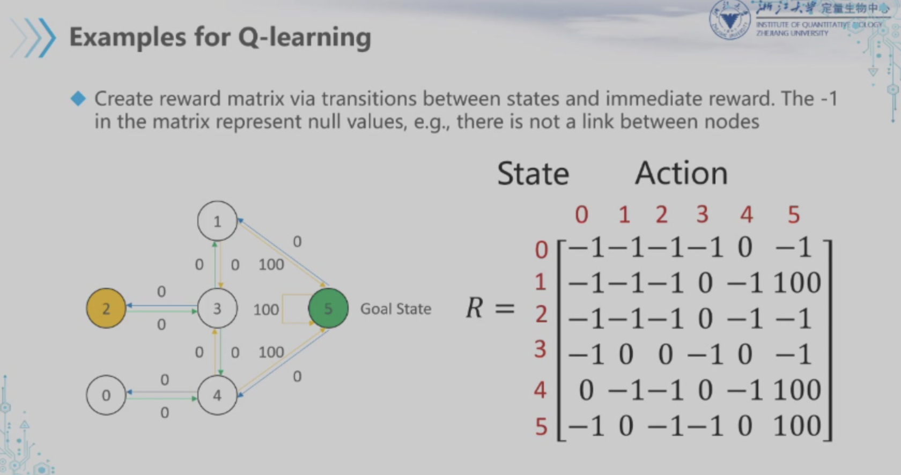

## Overfitting & Underfitting
+ Overfitting
    Model is too complex to be generalized to new data

+ Underfitting
    Model is to simplistic to accurately capture the patterns of the training set, thus fail to generalized to new data

## Unsupervised Learning
### Dimensionality Reduction
+ create new repr of data that are easily understood by computer algo than the original repr of the data

+ is a frequent application of transformation, which identify new ways to represent data and generalizes **important properties** with **fewer features**

#### Algorithm
+ PCA(Principal ...)

    Identify the hyperplane（超平面） closest to data distribution and project the data onto the plane

### Clustering
#### Algorithm
+ K-Means Clustering

    For a give dataset, find k cluster centers based on distances between

## Reinforcement learning
RL is learning what to do, e.g. how to map the current situation into actions to maximize the gain

### Q-Learning

Transition function of Q-Learning could be described as:

$$
Q(state, action) = R(state, action) + Gamma * Max[Q(next state, all actions)]
$$

