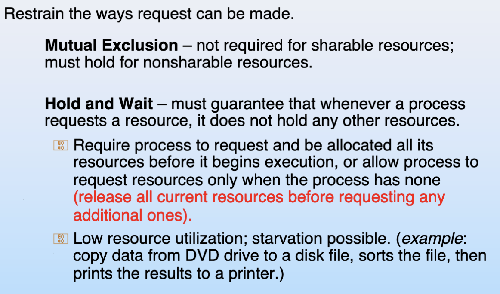
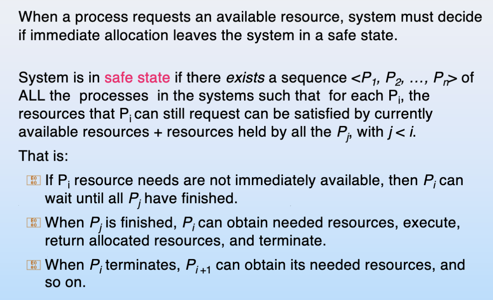

> 考试时间：01月07日(10:30-12:30)
## chap 6
## chap 7 deadlock

### Resource allocation graph


If graph contains a cycle 

+ if only one instance per resource type, then deadlock.

+ if several instances per resource type, possibility of deadlock.

### deadlock handling
+ Ensure that the system will never enter a deadlock state
    + Prevention

    + Avoidance

+ Allow the system to enter a deadlock state and then recover - database

    + Deadlock detection and recovery

+ UNIX: Ignore the problem and pretend that deadlocks never occur in the system;
### deadlock prevention
打破死锁的任一条件

1. How to prevent mutual exclusion

    sharable 的可以，non-sharable 的没办法。

2. How to prevent hold and wait

    whenever a process requests a resource, it doesn’t hold any other resources
    
    require process to request all its resources before it begins execution

    allow process to request resources only when the process has none

    申请资源时不能有其他资源，要一次性申请所有需要的资源。

    low resource utilization; starvation possible

    利用率低，而且可能有进程永远拿不到所有需要的资源，因此无法执行。

3. How to prevent no preemption

    如果得不到想要的资源。就把自己所有的资源释放。

4. How to handle circular wait

    impose a total ordering of all resource types

    给锁一个优先级排序，取锁的时候要求从高往低取锁。

    require that each process requests resources in an increasing order.

    Many operating systems adopt this strategy for some locks.

??? note "ppt"
    
    

### Deadlock Avoidance
#### safe state

If a system is in safe state -> no deadlocks.

If a system is in unsafe state -> possibility of deadlock.

Avoidance is to ensure that a system will never enter an unsafe state. 

#### Avoidance algorithms
+ Single instance of a resource type
    Use a resource allocation graph

+ Multiple instances of a resource type
    Use the banker’s algorithm

##### Single-instance Deadlock Avoidance
Resource-allocation graph can be used for single instance resource deadlock avoidance

+ one new type of edge: claim edge

    + indicates that process may request resource
    
        想要，但还没有 request。

    + claim edge is represented by a dashed line
    + resources must be claimed a priori in the system.

+ Transitions in between edges

    + claim edge converts to request edge when a process requests a resource.
    + request edge converts to an assignment edge when the resource is allocated to the process.
    + assignment edge reconverts to a claim edge when a resource is released by a process.

+ Algorithm

    + Suppose that process Pi requests a resource Rj
    
    + The request can be granted only if:

        + converting the request edge to an assignment edge does not result in the formation of a cycle.
        
        + no cycle  -> safe state

##### Multi-instances deadlock avoidance
Banker’s Algorithm

每个进程事先声明各个资源的最大需求。

通过 available（当前还没有被分配的空闲资源）, max（进程总共所需要的资源）, allocation（已经分配的资源）, need（还需要分配多少资源） 这四个矩阵刻画一个时间内各个进程对各种资源的持有和需求情况。

选取一个 need（的每一项都对应地）小于 available（的对应项）的进程，其运行完后会将 allocation 释放回 work（前面的进程执行完毕后，空闲的资源），以此类推。

若不存在，说明不安全。

### Deadlock detection
#### Single Instance Resources
使用 wait-for graph

Pi->Pj means Pi waiting for Pj
周期性的检查是否成环，成环表明死锁

然而检测算法需要 $O(n^2)$ 复杂度，$n$ 为进程数

#### Multi-Instance Resources
类似于banker's algorithm，如果找不到任何安全序列，则说明系统处于死锁状态。

### deadlock Recovery
#### Terminate deadlocked processes.

+ options:

    abort all deadlocked processes.
    
    abort one process at a time until the deadlock cycle is eliminated.

+ In which order should we choose to abort?

    priority of the process

    how long process has computed, and how much longer to completion

    resources the process has used

    resources process needs to complete

    how many processes will need to be terminated

    is process interactive or batch?

+ Resource preemption

    Select a victim

    Rollback

    Starvation: How could you ensure that the resources do not preempt from the same process?

-------------------------------------

# Chapter 10: basic of file
顺序读写（更快）
随机读写
## Directory structure
A collection of nodes containing (management)  information about all files

+ Single-Level Directory
    A single directory for all users
+ Two-Level Directory
    Separate directory for each user
+ Tree-Structured Directories
+ Acyclic-Graph Directories

## Mount
将disk上的其他文件系统挂载到当前文件系统上
```bash
$ mount /dev/dsk /users
```

## Access Lists and Groups
Three classes of users
+ owner
+ group
+ public

对于elf文件，必须具有x权限，才能执行；
对于目录，必须具有读写权限，才能搜索；

# Chapter 11: File System Implementation
## Data structure
### Disk structure
### In-memory structure
两个进程打开一个文件，有几个进程文件打开表，几个全局文件打开表
一个进程打开一个文件两次，有几个进程文件打开表，几个全局文件打开表

## Virtual File System
虚拟文件系统是不是一个文件系统？是。

## Allocation method
### Contiguous allocation
    Extent-based Allocation
### Linked allocation
Simple-need only starting address
Free-space management system 
no waste of space 
No random access, poor reliability
Mapping
### Indexed allocation

## Dentry and Inode
## Free-Space Management

# Chapter 12: Mass Storage System 
seek time (moving arms to position disk head on track)
rotational delay (waiting for block to rotate under head)
transfer time (actually moving data to/from disk surface)

## Disk scheduling

### SCAN (elevator) Algorithm

### C-SCAN (with look)

## RAID (redundant arrays of inexpensive disks)
### Disk striping
Bit-level Striping
Block-level Striping: different blocks of a file are striped
+ RAID-0
    1. No redundancy
+ RAID-1
    1. Mirroring
    2. 50% utilization
+ RAID-2
    ecc
+ RAID-3
    1. bit-interleaved parity
+ RAID-4
    1. block-interleaved parity
+ RAID-5
+ RAID-6

# Chapter 13: I/O Systems

## Signal and Interrupt
## Direct Memory Access