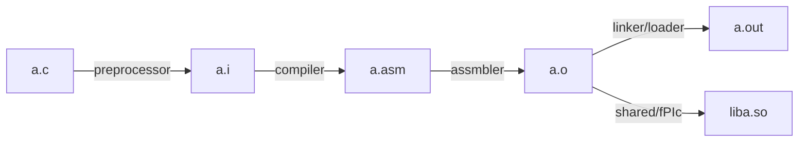

### 编译（asm）
`-c` 代表只编译，不链接。此时生成的 `.o` 文件只有预定义的函数签名，并不知道实际的函数地址

### 编译（bin）
默认
### 链接
`-L/usr/local/cuda/lib64/` 代表在该文件夹下寻找需要链接的库文件

`-lcudart` 代表链接 cudart 这个库，通常是 `libcudart.so`（动态链接）或者 `libcudart.a`（静态链接）

`-L -l` 通常一起使用