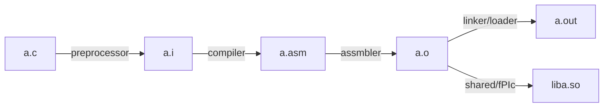

## 编译（asm）
`-c` 代表只编译，不链接。此时生成的 `.o` 文件只有预定义的函数签名，并不知道实际的函数地址

## 编译（bin）
默认
## 链接
`-L/usr/local/cuda/lib64/` 代表在该文件夹下寻找需要链接的库文件

`-lcudart` 代表链接 cudart 这个库，通常是 `libcudart.so`（动态链接）或者 `libcudart.a`（静态链接）

`-L -l` 通常一起使用

## 环境变量

- **头文件**（`.h`）→ 放在 `include/` 目录 → 需要设置 `CPATH` 或 `C_INCLUDE_PATH`
- **库文件**（`.so`, `.a`）→ 放在 `lib/` 目录 → 需要设置 `LIBRARY_PATH` 和 `LD_LIBRARY_PATH`

### 正确的目录结构

NVSHMEM 的典型安装结构应该是：
```
$NVSHMEM_DIR/
├── include/
│   └── nvshmem.h          # 头文件
└── lib/
    ├── libnvshmem.so      # 共享库文件
    └── libnvshmem.a       # 静态库文件
```

### 正确的环境变量设置

```bash
# 假设 NVSHMEM 的根目录（包含 include/ 和 lib/ 的目录）
export NVSHMEM_DIR="/home/ruihan/miniconda3/envs/nvshmem-tutorial/lib/python3.12/site-packages/nvidia/nvshmem"

# 告诉编译器去哪里找头文件（.h）
export CPATH="$NVSHMEM_DIR/include:$CPATH"

# 告诉链接器去哪里找库文件（.so, .a）
export LIBRARY_PATH="$NVSHMEM_DIR/lib:$LIBRARY_PATH"

# 告诉运行时去哪里找共享库（.so）
export LD_LIBRARY_PATH="$NVSHMEM_DIR/lib:$LD_LIBRARY_PATH"
```

### 总结

| 路径类型 | 环境变量 | 应该指向 |
|---------|---------|---------|
| 头文件 (.h) | `CPATH`, `C_INCLUDE_PATH`, `CXX_INCLUDE_PATH` | `$NVSHMEM_DIR/include` |
| 库文件 (.so, .a) | `LIBRARY_PATH` | `$NVSHMEM_DIR/lib` |
| 运行时库 (.so) | `LD_LIBRARY_PATH` | `$NVSHMEM_DIR/lib` |
