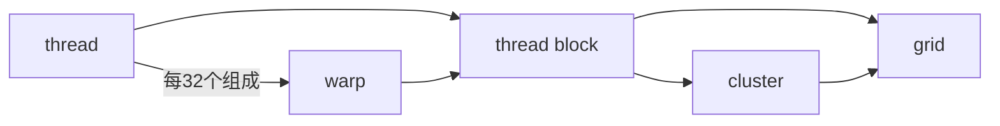
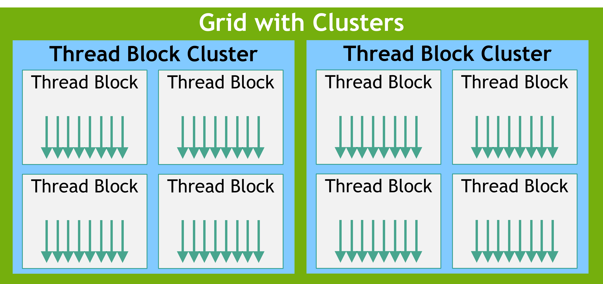

## nvcc 编译选项
`-arch=sm_XX`：为指定的 GPU 架构生成二进制代码（SASS）

`-arch=compute_XX`：生成 PTX 中间代码（可移植性更好）

`-code=sm_XX`：指定要生成哪个架构的二进制代码

`arch=compute_XX,code=sm_XX`：同时生成 PTX 和二进制（最灵活）

`-gencode arch=compute_XX,code=sm_XX`：组合多个生成目标

## cuda programming model
!!! info "source"
    https://docs.nvidia.com/cuda/cuda-programming-guide/01-introduction/programming-model.html
### hardware model
{width=80%}
{width=80%}

### 硬件与编程模型的映射
cuda kernel 由 thread 执行，thread 组成 thread block，thread block 组成 grid；

较新的版本引入了 thread block cluster 的层级，方便相邻的 thread block 共享各自的 shared memory

thread block 和 grid 都可以是一二三维的，方便索引；

thread block 内每 32 个 thread 组织成一个 warp，执行相同的 code，但未必经历同样的控制流路径。这就是 SIMT 范式

---

GPU 由三个部分组成：

+ SM（streaming multiprocessor）：一个 SM 可以并行执行几十到几百个个 thread block。一个 SM 里面包含（两个存储模块访问速度极快）

    + a local register file
    + a unified data cache：可以在运行时动态的分配给 L1 cache 和 shared memory，这两者被一个 thread block 里的所有 thread 共享
    + a number of computational units：计算单元

+ L2 cache：所有 SM 共享
+ global memory：即 GPU DRAM，这是所有 thread block 共享的内存

一个 thread block 中的所有 thread 由一个 SM 执行；SM 同时执行多个 thread block 的任务，但没有调度，各个 block 执行顺序随机，所以各个 thread block 之间不能存在依赖

寄存器分配是以单个 thread 为单位的，而 shared memory 则是以 thread block 为单位分配的

因此，如果在 kernel 代码中分配的 local 变量过多，导致单个 thread 分配的寄存器数量乘上 thread block 的 thread 数量大于 register file 大小，则 kernel 无法发射

---

## 2.1 programming cuda on gpus

### memory management
#### explicit
使用显示内存管理通常性能更好，因为你可以控制何时进行 memory transfer，以便和计算重叠

#### unified memory
系统中的 gpu 和 cpu 内存用同一套虚拟地址编址

cpu 代码只能访问 cpu 内存，cpu 代码只能访问 cpu 内存；但 CUDA 提供接口使得两个设备上的代码都可以分配彼此的内存

---

`cudaMallocManaged` for unified memory API，按此分配的变量内存可以直接传给 cpu 函数，也可以直接传给 cuda kernel；依然使用 `cudaFree` 来释放

`cudaMallocHost` `cudaFreeHost` `cudaMalloc` `cudaFree` for explicit memory management

`cudaMemcpy` 是同步的，异步见 `cudaMemcpyAsync`

`cudaDeviceSynchronize` 在 cpu 和 gpu 间同步，阻塞 cpu 直到 gpu kernel 结束后再继续；如果有多个 stream，会等待所有 stream 完成后再执行接下来的 cpu 代码

`__syncthreads()` syncs all threads in a thread block

### grid 和 block 的用法
```cpp
int main()
{
    ...
    dim3 grid(16,16);
    dim3 block(8,8);
    MatAdd<<<grid, block>>>(A, B, C);
    ...
}
```
几个重要的变量：
+ `threadIdx` 有 `.x` `.y` `.z`，范围在 `0` 到 `blockDim.x-1`, `blockDim.y-1`, `blockDim.z-1`
+ `blockDim` 即 block 在三个维度的 thread 数量
+ `blockIdx` 即 block 在 grid 中的坐标
+ `gridDim` 即 grid 在三个维度的 block 数量

### runtime initialization
不太懂，以后再看 https://docs.nvidia.com/cuda/cuda-programming-guide/02-basics/intro-to-cuda-cpp.html#runtime-initialization

`cudaInitDevice` `cudaSetDevice` `cudaDeviceReset`

### error check
```cpp
#define CUDA_CHECK(expr_to_check) do {            \
    cudaError_t result  = expr_to_check;          \
    if(result != cudaSuccess)                     \
    {                                             \
        fprintf(stderr,                           \
                "CUDA Runtime Error: %s:%i:%d = %s\n", \
                __FILE__,                         \
                __LINE__,                         \
                result,\
                cudaGetErrorString(result));      \
    }                                             \
} while(0)

// use
CUDA_CHECK(cudaMalloc(&devA, vectorLength*sizeof(float)));
```

### error state
每个 cpu thread 都有一个 cuda error 状态量

The CUDA runtime maintains a `cudaError_t` state for each **host thread**. The value defaults to `cudaSuccess` and is overwritten whenever an error occurs. `cudaGetLastError` returns current error state and then resets it to `cudaSuccess`. Alternatively, `cudaPeekLastError` returns error state without resetting it.

!!! note "cudaSuccess 不等于 kernel 顺利执行"
    他只是证明了 kernel launch 的 block/grid 配置，以及传递的参数没问题

因为 cuda kernel 是异步发射的，所以 cudaError 是异步传递的

The CUDA error state is set and overwritten whenever an error occurs. This means that errors which occur during the execution of asynchronous operations will only be reported when the error state is examined next

如果某次 kernel 或者 cuda runtime api 的错误没有调用 `cudaGetLastError` 及时清理错误，之后每一次调用 cuda runtime api 都会返回错误

### error log
通过环境变量 CUDA_LOG_FILE 来更好的检测报错

```bash
$ env CUDA_LOG_FILE=cudaLog.txt ./errlog
CUDA Runtime Error: /home/cuda/intro-cpp/errorLogIllustration.cu:24:1 = invalid argument
$ cat cudaLog.txt
[12:46:23.854][137216133754880][CUDA][E] One or more of block dimensions of (4096,1,1) exceeds corresponding maximum value of (1024,1024,64)
[12:46:23.854][137216133754880][CUDA][E] Returning 1 (CUDA_ERROR_INVALID_VALUE) from cuLaunchKernel
```

### 函数/变量前缀修饰符
#### 函数
+ `__global__` 表示 kernel 入口；

+ `__device__` 表示该函数应该编译为 gpu 二进制码，而且可以被其他 `__device__` 或 `__global__` 修饰函数调用

#### 变量
+ `__device__` 表示变量在 gpu 的 global memory 中
+ `__constant__` 表示变量在 gpu 的 constant memory 中
+ `__managed__` 表示变量在 unified memory 中
+ `__shared__` 表示变量在 gpu 的 shared memory 中

> Constant memory has **a grid scope** and is accessible for the lifetime of the application. The constant memory resides on the device and is **read-only** to the kernel. As such, it must be declared and initialized on the host with the `__constant__` specifier, **outside any function**.

### thread block cluster


thread blocks in a cluster are also guaranteed to be co-scheduled on a GPU Processing Cluster (GPC) in the GPU

Because the thread blocks are scheduled simultaneously and within a single GPC, threads in different blocks but within the same cluster can communicate and synchronize with each other using software interfaces provided by **Cooperative Groups** `cluster.sync()`. Threads in clusters can access the shared memory of all blocks in the cluster, which is referred to as **distributed shared memory**

A thread block cluster can be enabled in a kernel either using a compile-time kernel attribute using `__cluster_dims__(X,Y,Z)` or using the CUDA kernel launch API `cudaLaunchKernelEx`.

The cluster size using kernel attribute is fixed at compile time

```cpp
// Compile time cluster size 2 in X-dimension and 1 in Y and Z dimension
__global__ void __cluster_dims__(2, 1, 1) cluster_kernel(float *input, float* output)
{
    ...
}

int main()
{
    float *input, *output;
    // Kernel invocation with compile time cluster size
    dim3 threadsPerBlock(16, 16);
    dim3 numBlocks(N / threadsPerBlock.x, N / threadsPerBlock.y);

    // The grid dimension is not affected by cluster launch, and is still enumerated
    // using number of blocks.
    // The grid dimension must be a multiple of cluster size.
    cluster_kernel<<<numBlocks, threadsPerBlock>>>(input, output);
}

```