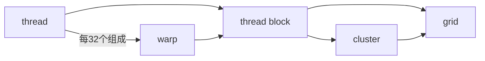

## nvcc 编译选项
`-arch=sm_XX`：为指定的 GPU 架构生成二进制代码（SASS）

`-arch=compute_XX`：生成 PTX 中间代码（可移植性更好）

`-code=sm_XX`：指定要生成哪个架构的二进制代码

`arch=compute_XX,code=sm_XX`：同时生成 PTX 和二进制（最灵活）

`-gencode arch=compute_XX,code=sm_XX`：组合多个生成目标

## cuda programming model
!!! info "source"
    https://docs.nvidia.com/cuda/cuda-programming-guide/01-introduction/programming-model.html
### hardware model
{width=80%}
{width=80%}

### 硬件与编程模型的映射
cuda kernel 由 thread 执行，thread 组成 thread block，thread block 组成 grid；

较新的版本引入了 thread block cluster 的层级，方便相邻的 thread block 共享各自的 shared memory

thread block 和 grid 都可以是一二三维的，方便索引；

thread block 内每 32 个 thread 组织成一个 warp，执行相同的 code，但未必经历同样的控制流路径。这就是 SIMT 范式

---

GPU 由三个部分组成：

+ SM（streaming multiprocessor）：一个 SM 可以并行执行几十到几百个个 thread block。一个 SM 里面包含（两个存储模块访问速度极快）

    + a local register file
    + a unified data cache：可以在运行时动态的分配给 L1 cache 和 shared memory，这两者被一个 thread block 里的所有 thread 共享
    + a number of computational units：计算单元

+ L2 cache：所有 SM 共享
+ global memory：即 GPU DRAM，这是所有 thread block 共享的内存

一个 thread block 中的所有 thread 由一个 SM 执行；SM 同时执行多个 thread block 的任务，但没有调度，各个 block 执行顺序随机，所以各个 thread block 之间不能存在依赖

寄存器分配是以单个 thread 为单位的，而 shared memory 则是以 thread block 为单位分配的

因此，如果在 kernel 代码中分配的 local 变量过多，导致单个 thread 分配的寄存器数量乘上 thread block 的 thread 数量大于 register file 大小，则 kernel 无法发射

---

### unified memory
系统中的 gpu 和 cpu 内存用同一套虚拟地址编址

cpu 代码只能访问 cpu 内存，cpu 代码只能访问 cpu 内存；但 CUDA 提供接口使得两个设备上的代码都可以分配彼此的内存