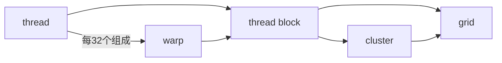
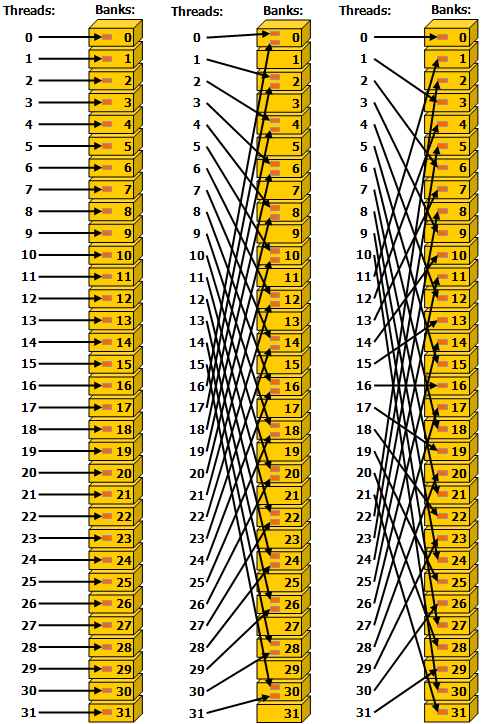

## nvcc 编译选项
`-arch=sm_XX`：为指定的 GPU 架构生成二进制代码（SASS）

`-arch=compute_XX`：生成 PTX 中间代码（可移植性更好）

`-code=sm_XX`：指定要生成哪个架构的二进制代码

`arch=compute_XX,code=sm_XX`：同时生成 PTX 和二进制（最灵活）

`-gencode arch=compute_XX,code=sm_XX`：组合多个生成目标

## 1 cuda programming model
!!! info "source"
    https://docs.nvidia.com/cuda/cuda-programming-guide/01-introduction/programming-model.html
### hardware model
{width=80%}
{width=80%}

### 硬件与编程模型的映射
cuda kernel 由 thread 执行，thread 组成 thread block，thread block 组成 grid；

较新的版本引入了 thread block cluster 的层级，方便相邻的 thread block 共享各自的 shared memory

thread block 和 grid 都可以是一二三维的，方便索引；

thread block 内每 32 个 thread 组织成一个 warp，执行相同的 code，但未必经历同样的控制流路径。这就是 SIMT 范式

---

GPU 由三个部分组成：

+ SM（streaming multiprocessor）：一个 SM 可以并行执行几十到几百个个 thread block。一个 SM 里面包含（两个存储模块访问速度极快）

    + a local register file
    + a unified data cache：可以在运行时动态的分配给 L1 cache 和 shared memory，这两者被一个 thread block 里的所有 thread 共享
    + a number of computational units：计算单元

+ L2 cache：所有 SM 共享
+ global memory：即 GPU DRAM，这是所有 thread block 共享的内存

一个 thread block 中的所有 thread 由一个 SM 执行；SM 同时执行多个 thread block 的任务，但没有调度，各个 block 执行顺序随机，所以各个 thread block 之间不能存在依赖

寄存器分配是以单个 thread 为单位的，而 shared memory 则是以 thread block 为单位分配的

因此，如果在 kernel 代码中分配的 local 变量过多，导致单个 thread 分配的寄存器数量乘上 thread block 的 thread 数量大于 register file 大小，则 kernel 无法发射

---

## 2.1 programming cuda on gpus

### memory management
#### explicit
使用显示内存管理通常性能更好，因为你可以控制何时进行 memory transfer，以便和计算重叠

#### unified memory
系统中的 gpu 和 cpu 内存用同一套虚拟地址编址

cpu 代码只能访问 cpu 内存，cpu 代码只能访问 cpu 内存；但 CUDA 提供接口使得两个设备上的代码都可以分配彼此的内存

---

`cudaMallocManaged` for unified memory API，按此分配的变量内存可以直接传给 cpu 函数，也可以直接传给 cuda kernel；依然使用 `cudaFree` 来释放

`cudaMallocHost` `cudaFreeHost` `cudaMalloc` `cudaFree` for explicit memory management

`cudaMemcpy` 是同步的，异步见 `cudaMemcpyAsync`

`cudaDeviceSynchronize` 在 cpu 和 gpu 间同步，阻塞 cpu 直到 gpu kernel 结束后再继续；如果有多个 stream，会等待所有 stream 完成后再执行接下来的 cpu 代码

`__syncthreads()` syncs all threads in a thread block

### grid 和 block 的用法
```cpp
int main()
{
    ...
    dim3 grid(16,16);
    dim3 block(8,8);
    MatAdd<<<grid, block>>>(A, B, C);
    ...
}
```
几个重要的变量：
+ `threadIdx` 有 `.x` `.y` `.z`，范围在 `0` 到 `blockDim.x-1`, `blockDim.y-1`, `blockDim.z-1`
+ `blockDim` 即 block 在三个维度的 thread 数量
+ `blockIdx` 即 block 在 grid 中的坐标
+ `gridDim` 即 grid 在三个维度的 block 数量

### runtime initialization
不太懂，以后再看 https://docs.nvidia.com/cuda/cuda-programming-guide/02-basics/intro-to-cuda-cpp.html#runtime-initialization

`cudaInitDevice` `cudaSetDevice` `cudaDeviceReset`

### error check
```cpp
#define CUDA_CHECK(expr_to_check) do {            \
    cudaError_t result  = expr_to_check;          \
    if(result != cudaSuccess)                     \
    {                                             \
        fprintf(stderr,                           \
                "CUDA Runtime Error: %s:%i:%d = %s\n", \
                __FILE__,                         \
                __LINE__,                         \
                result,\
                cudaGetErrorString(result));      \
    }                                             \
} while(0)

// use
CUDA_CHECK(cudaMalloc(&devA, vectorLength*sizeof(float)));
```

### error state
每个 cpu thread 都有一个 cuda error 状态量

The CUDA runtime maintains a `cudaError_t` state for each **host thread**. The value defaults to `cudaSuccess` and is overwritten whenever an error occurs. `cudaGetLastError` returns current error state and then resets it to `cudaSuccess`. Alternatively, `cudaPeekLastError` returns error state without resetting it.

!!! note "cudaSuccess 不等于 kernel 顺利执行"
    他只是证明了 kernel launch 的 block/grid 配置，以及传递的参数没问题

因为 cuda kernel 是异步发射的，所以 cudaError 是异步传递的

The CUDA error state is set and overwritten whenever an error occurs. This means that errors which occur during the execution of asynchronous operations will only be reported when the error state is examined next

如果某次 kernel 或者 cuda runtime api 的错误没有调用 `cudaGetLastError` 及时清理错误，之后每一次调用 cuda runtime api 都会返回错误

### error log
通过环境变量 CUDA_LOG_FILE 来更好的检测报错

```bash
$ env CUDA_LOG_FILE=cudaLog.txt ./errlog
CUDA Runtime Error: /home/cuda/intro-cpp/errorLogIllustration.cu:24:1 = invalid argument
$ cat cudaLog.txt
[12:46:23.854][137216133754880][CUDA][E] One or more of block dimensions of (4096,1,1) exceeds corresponding maximum value of (1024,1024,64)
[12:46:23.854][137216133754880][CUDA][E] Returning 1 (CUDA_ERROR_INVALID_VALUE) from cuLaunchKernel
```

### 函数/变量前缀修饰符
#### 函数
+ `__global__` 表示 kernel 入口；

+ `__device__` 表示该函数应该编译为 gpu 二进制码，而且可以被其他 `__device__` 或 `__global__` 修饰函数调用

#### 变量
+ `__device__` 表示变量在 gpu 的 global memory 中
+ `__constant__` 表示变量在 gpu 的 constant memory 中
+ `__managed__` 表示变量在 unified memory 中
+ `__shared__` 表示变量在 gpu 的 shared memory 中

> Constant memory has **a grid scope** and is accessible for the lifetime of the application. The constant memory resides on the device and is **read-only** to the kernel. As such, it must be declared and initialized on the host with the `__constant__` specifier, **outside any function**.

### thread block cluster


thread blocks in a cluster are also guaranteed to be co-scheduled on a GPU Processing Cluster (GPC) in the GPU

Because the thread blocks are scheduled simultaneously and within a single GPC, threads in different blocks but within the same cluster can communicate and synchronize with each other using software interfaces provided by **Cooperative Groups** `cluster.sync()`. Threads in clusters can access the shared memory of all blocks in the cluster, which is referred to as **distributed shared memory**

A thread block cluster can be enabled in a kernel either using a compile-time kernel attribute using `__cluster_dims__(X,Y,Z)` or using the CUDA kernel launch API `cudaLaunchKernelEx`.

The cluster size using kernel attribute is fixed at compile time

```cpp
// Compile time cluster size 2 in X-dimension and 1 in Y and Z dimension
__global__ void __cluster_dims__(2, 1, 1) cluster_kernel(float *input, float* output)
{
    ...
}

int main()
{
    float *input, *output;
    // Kernel invocation with compile time cluster size
    dim3 threadsPerBlock(16, 16);
    dim3 numBlocks(N / threadsPerBlock.x, N / threadsPerBlock.y);

    // The grid dimension is not affected by cluster launch, and is still enumerated
    // using number of blocks.
    // The grid dimension must be a multiple of cluster size.
    cluster_kernel<<<numBlocks, threadsPerBlock>>>(input, output);
}

```

## 2.2 writing cuda kernels
### CUDA Memory Types, Scopes and Lifetimes
| Memory Type | Scope | Lifetime | Location |
| :--- | :--- | :--- | :--- |
| **Global** | Grid | Application | Device |
| **Constant** | Grid | Application | Device |
| **Shared** | Block | Kernel | SM |
| **Local** | Thread | Kernel | Device |
| **Register** | Thread | Kernel | SM |

### global memory
通过 `cudaMalloc` cudaMallocManaged 分配。常见的 kernel 传入的指针都是 global memory pointer

### shared memory
通过在 kernel 中声明 `__shared__` 来分配

shared memory 可以静态和动态的分配：
#### static allocation
static allocation 直接在 kernel 内 `__shared__` 来分配确定大小的内存

#### dynamic allocation
dynamic allocation 通过发射 kernel 时指定运行时配置来分配

+ 发射 kernel 时，在 triple chevron 中传递第三个参数指定 shared memory size `functionName<<<grid, block, sharedMemoryBytes>>>()`

+ kernel 内部，通过 `extern __shared__ float sharedArray[];` 来声明这是一块共享内存

如果要分配多块内存，需要将上述 extern 声明的一块手动划分为多块内存。例如下面的三个 array 需要手动划分 shared memory 来获取

```cpp
// expected
short array0[128];
float array1[64];
int   array2[256];

// actually allocated
extern __shared__ float array[];

short* array0 = (short*)array;
float* array1 = (float*)&array0[128];
int*   array2 =   (int*)&array1[64];
```

> Note that pointers need to be aligned to the type they point to, so the following code, for example, does not work since `array1` is not aligned to 4 bytes.
> ```cpp
> extern __shared__ float array[];
> short* array0 = (short*)array;
> float* array1 = (float*)&array0[127];
> ```

### registers
Registers 在 SM 上，只对单个 thread 可见，它的分配和使用由 nvcc compiler 来控制 

The number of registers per SM and the number of registers per thread block can be queried using the `regsPerMultiprocessor` and `regsPerBlock` device properties of the GPU.

NVCC allows the developer to specify a maximum number of registers to be used by a kernel via the `-maxrregcount` option. Using this option to reduce the number of registers a kernel can use may result in more thread blocks being scheduled on the SM concurrently, but may also result in more register spilling.

### local memory
local memory  的物理位置和 global memory 相同（位于 gpu dram 上），但它只对单个 thread 可见，它的分配和使用由 nvcc compiler 来控制 

Automatic variables that the compiler is likely to place in local memory are:

+ Arrays for which it cannot determine that they are indexed with constant quantities,
+ Large structures or arrays that would consume too much register space,
+ Any variable if the kernel uses more registers than available, that is register spilling.

由于 local memory 在 gpu dram 上，因此其延迟和带宽均和 global memory 相同

### constant memory
Constant memory has a grid scope and is accessible for the lifetime of the application. The constant memory resides on the device and is read-only to the kernel. As such, it must be declared and initialized **on the host** with the `__constant__` specifier, **outside any function**.

The `__constant__` memory space specifier declares a variable that:

+ Resides in constant memory space,
+ Has the lifetime of the CUDA context in which it is created,
+ Has a distinct object per device,
+ Is accessible from all the threads within the grid and from the host through the runtime library (`cudaGetSymbolAddress()` / `cudaGetSymbolSize()` / `cudaMemcpyToSymbol()` / `cudaMemcpyFromSymbol()`).

> Constant memory is useful for small amounts of data that each thread will use in a read-only fashion. Constant memory is small relative to other memories, typically 64KB per device.

```cpp
// In your .cu file
__constant__ float coeffs[4];

__global__ void compute(float *out) {
    int idx = threadIdx.x;
    out[idx] = coeffs[0] * idx + coeffs[1];
}

// In your host code
float h_coeffs[4] = {1.0f, 2.0f, 3.0f, 4.0f};
cudaMemcpyToSymbol(coeffs, h_coeffs, sizeof(h_coeffs));
compute<<<1, 10>>>(device_out);
```

### distributed shared memory
在一个 cluster 中，所有 block 的 shared memory 组成 distributed shared memory；所有 block 都可以互相访问各自的 shared memory；

在本地 block，直接索引即可访问 `smem[i]`；在其他 block，则需要通过 `cluster.map_shared_rank` 来获取该 block 的 shared memory 地址，然后加上其本地 offset 进行访问

```cpp
int *dst_smem = cluster.map_shared_rank(smem, dst_block_rank);
//Perform atomic update of the histogram bin
atomicAdd(dst_smem + dst_offset, 1);
```

#### example using distributed shared memory
??? note "histogram program"

    ```cpp
    #include <cooperative_groups.h>

    // Distributed Shared memory histogram kernel
    __global__ void clusterHist_kernel(int *bins, const int nbins, const int bins_per_block, const int *__restrict__ input,
                                    size_t array_size)
    {
        extern __shared__ int smem[];
        namespace cg = cooperative_groups;
        int tid = cg::this_grid().thread_rank();

        // Cluster initialization, size and calculating local bin offsets.
        cg::cluster_group cluster = cg::this_cluster();
        unsigned int clusterBlockRank = cluster.block_rank();
        int cluster_size = cluster.dim_blocks().x;

        for (int i = threadIdx.x; i < bins_per_block; i += blockDim.x)
        {
            smem[i] = 0; //Initialize shared memory histogram to zeros
        }

        // cluster synchronization ensures that shared memory is initialized to zero in
        // all thread blocks in the cluster. It also ensures that all thread blocks
        // have started executing and they exist concurrently.
        cluster.sync();

        for (int i = tid; i < array_size; i += blockDim.x * gridDim.x)
        {
            int ldata = input[i];

            //Find the right histogram bin.
            int binid = ldata;
            if (ldata < 0)
            binid = 0;
            else if (ldata >= nbins)
            binid = nbins - 1;

            //Find destination block rank and offset for computing
            //distributed shared memory histogram
            int dst_block_rank = (int)(binid / bins_per_block);
            int dst_offset = binid % bins_per_block;

            //Pointer to target block shared memory
            int *dst_smem = cluster.map_shared_rank(smem, dst_block_rank);

            //Perform atomic update of the histogram bin
            atomicAdd(dst_smem + dst_offset, 1);
        }

        // cluster synchronization is required to ensure all distributed shared
        // memory operations are completed and no thread block exits while
        // other thread blocks are still accessing distributed shared memory
        cluster.sync();

        // Perform global memory histogram, using the local distributed memory histogram
        int *lbins = bins + cluster.block_rank() * bins_per_block;
        for (int i = threadIdx.x; i < bins_per_block; i += blockDim.x)
        {
            atomicAdd(&lbins[i], smem[i]);
        }
    }
    ```

默认的 shared memory 有时会太小，可以在 runtime 自定义 shared memory 的大小

??? note "configure shared memory"

    ```cpp
    // Launch via extensible launch
    {
        cudaLaunchConfig_t config = {0};
        config.gridDim = array_size / threads_per_block;
        config.blockDim = threads_per_block;

        // cluster_size depends on the histogram size.
        // ( cluster_size == 1 ) implies no distributed shared memory, just thread block local shared memory
        int cluster_size = 2; // size 2 is an example here
        int nbins_per_block = nbins / cluster_size;

        //dynamic shared memory size is per block.
        //Distributed shared memory size =  cluster_size * nbins_per_block * sizeof(int)
        config.dynamicSmemBytes = nbins_per_block * sizeof(int);

        CUDA_CHECK(::cudaFuncSetAttribute((void *)clusterHist_kernel, cudaFuncAttributeMaxDynamicSharedMemorySize, config.dynamicSmemBytes));

        cudaLaunchAttribute attribute[1];
        attribute[0].id = cudaLaunchAttributeClusterDimension;
        attribute[0].val.clusterDim.x = cluster_size;
        attribute[0].val.clusterDim.y = 1;
        attribute[0].val.clusterDim.z = 1;

        config.numAttrs = 1;
        config.attrs = attribute;

        cudaLaunchKernelEx(&config, clusterHist_kernel, bins, nbins, nbins_per_block, input, array_size);
    }
    ```


### memory performance
不同的 memory access pattern 会影响程序性能。对于 global memory，即有效访存利用率；对于 shared memory，即访问不同 bank 的均匀程度

#### Coalesced Global Memory Access
对 global memory 的访问是以 transaction 为单位的；每个 memory transaction 会读/写 32bytes 的内存；所以如果一个 thread 需要加载 4byte 数据，其相邻的 thread 最好能够加载相邻的 4byte 数据，而不是加载相隔 32byte 的位置；否则会产生更多的 transaction；

最好的情况下，同一个 warp 中的 32 个 thread 访问的数据都挨在一起，那么只需要 4 个 transaction 访问连续的 128bytes 数据，每个 bytes 都被利用到了，利用率为 100%；最坏的情况下，同一个 warp 中的 thread 每个访问的位置都相隔至少 32bytes，那么每个 transaction 实际上用到的只有 4bytes，利用率只有 12.5%；

所以，最常见的利用 coalesced global memory access 的做法就是保证相邻 thread 访问相邻的 global memory

> Ensuring proper coalescing of global memory accesses is one of the most important performance considerations for writing performant CUDA kernels. It is imperative that applications use the memory system as efficiently as possible. 

> 保证高效访问 HBM 是最重要的优化内核手段之一哦～

#### Shared Memory Access Patterns
shared memory 在设计上不同，被分为 32 个 bank，相邻的 32-bit (4-byte) 对应着相邻的 bank，所以 byte0-3 属于 bank0、byte4-7 属于 bank1、...、byte124-127 属于 bank31、byte128-131 又属于 bank0；

每次访问一个 bank 只能访问 32bit 的数据，所以如果多个线程访问一个 bank 的不同位置，就会导致 access serialization，需要排队访问，这会导致**性能损失**；而如果多个线程访问一个 bank 的相同位置则没有损失，但是如果多个线程尝试写，那么会发生 data race，无法保证哪个 thread 最终写入该位置；

因此，访问 shared memory，需要尽可能避免访问同一 bank 的不同位置，尽量将访问位置分散到不同的 bank；由于 bank 的数量固定是 32 个，所以相邻的 thread 的起始访问地址 (base address) 应该尽量相隔 与 32 互质的数，比如 1（即相邻）、3 等，如下图：

???+ note "不同步长的 shared memory 访问模式"
    <figure markdown="span">
    { width="300" }
    <figcaption>
        Left<br>
            stride: one 32-bit word (no bank conflict). <br>
        Middle<br>
            stride: two 32-bit words (two-way bank conflict). <br>
        Right<br>
            stride: three 32-bit words (no bank conflict). <br>
    </figcaption>
    </figure>

#### example utilizing memory performance
```cpp
/* definitions of thread block size in X and Y directions */

#define THREADS_PER_BLOCK_X 32
#define THREADS_PER_BLOCK_Y 32

/* macro to index a 1D memory array with 2D indices in row-major order */
/* ld is the leading dimension, i.e. the number of columns in the matrix     */

#define INDX( row, col, ld ) ( ( (row) * (ld) ) + (col) )

/* CUDA kernel for shared memory matrix transpose */

__global__ void smem_cuda_transpose(int m, float *a, float *c )
{

    /* declare a statically allocated shared memory array */
    /* THREADS_PER_BLOCK_Y+1 is to avoid bank conflicts */
    __shared__ float smemArray[THREADS_PER_BLOCK_X][THREADS_PER_BLOCK_Y+1];

    /* determine my row tile and column tile index */

    const int tileCol = blockDim.x * blockIdx.x;
    const int tileRow = blockDim.y * blockIdx.y;

    /* read from global memory into shared memory array */
    smemArray[threadIdx.x][threadIdx.y] = a[INDX( tileRow + threadIdx.y, tileCol + threadIdx.x, m )];

    /* synchronize the threads in the thread block */
    __syncthreads();

    /* write the result from shared memory to global memory */
    c[INDX( tileCol + threadIdx.y, tileRow + threadIdx.x, m )] = smemArray[threadIdx.y][threadIdx.x];
    return;

} /* end smem_cuda_transpose */
```

### atomics
同个 thread block 内的 thread 可以通过 `__syncthreads()` 同步，但是同个 grid 内的 thread 没有这样的机制。如果需要避免访问 global memory 的竞争，需要通过 `cuda::std::atomic` `cuda::std::atomic_ref`，或者 `cuda::atomic` `cuda::atomic_ref`

```cpp
__global__ void sumReduction(int n, float *array, float *result) {
   ...
   tid = threadIdx.x + blockIdx.x * blockDim.x;

   cuda::atomic_ref<float, cuda::thread_scope_device> result_ref(result);
   result_ref.fetch_add(array[tid]);
   ...
}
```

### Cooperative Groups
block 或者 cluster 内的线程可以进行同步；grid 之内的线程没有同步的语法，但是可以创建跨 block 和 cluster 的 thread group

### Kernel Launch and Occupancy
TBD

