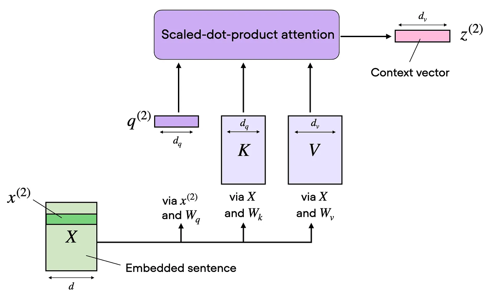
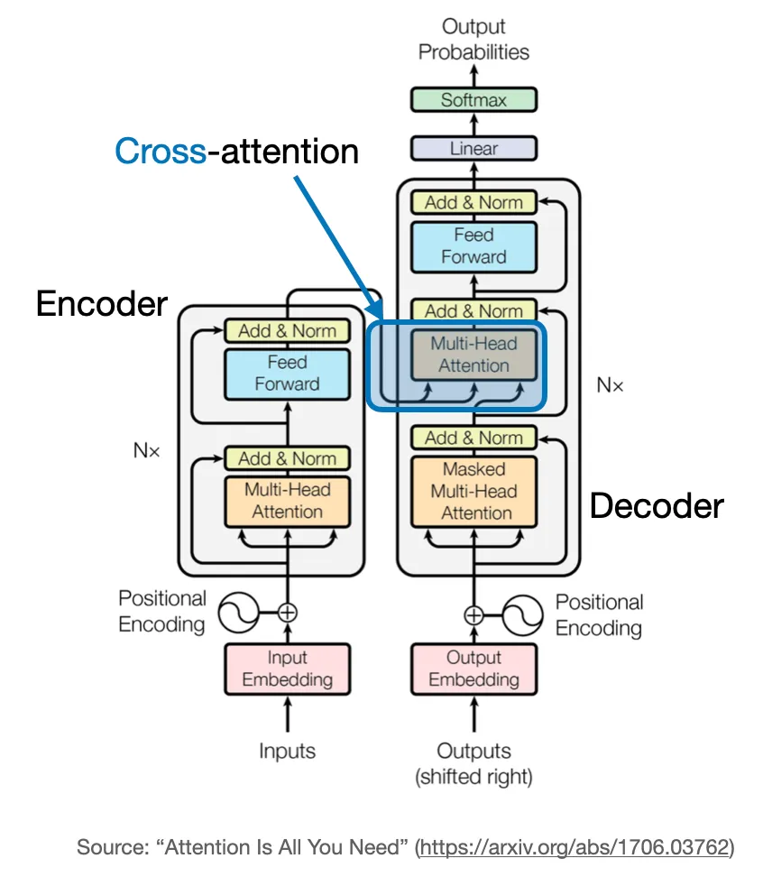
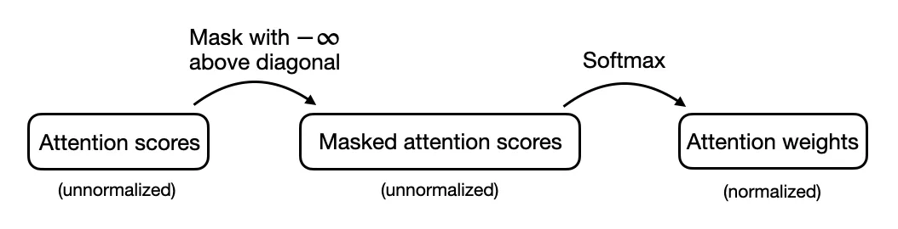

The concept of "attention" in deep learning has its roots in the effort to improve Recurrent Neural Networks (RNNs) for handling longer sequences or sentences. 

Translating a sentence word-by-word is usually not an option because it ignores the complex grammatical structures and idiomatic expressions unique to each language, leading to inaccurate or nonsensical translations.

To overcome this issue, attention mechanisms were introduced to give access to all sequence elements at each time step. The key is to be selective and determine which words are most important in a specific context.

# Self Attention
## Embedding an Input Sentence
## Defining the Weight Matrices
+ Query sequence: q(i) = x(i)Wq for i in sequence 1 … T

+ Key sequence: k(i) = x(i)Wk for i in sequence 1 … T

+ Value sequence: v(i) = x(i)Wv for i in sequence 1 … T

The index i refers to the token index position in the input sequence, which has length T.

Here, both q(i) and k(i) are vectors of dimension dk. The projection matrices Wq and Wk have a shape of d × dk , while Wv has the shape d × dv .

## Computing the Unnormalized Attention Weights and the Context Vector

```python
class SelfAttention(nn.Module):
​
    def __init__(self, d_in, d_out_kq, d_out_v):
        super().__init__()
        self.d_out_kq = d_out_kq
        self.W_query = nn.Parameter(torch.rand(d_in, d_out_kq))
        self.W_key   = nn.Parameter(torch.rand(d_in, d_out_kq))
        self.W_value = nn.Parameter(torch.rand(d_in, d_out_v))
​
    def forward(self, x):
        keys = x @ self.W_key
        queries = x @ self.W_query
        values = x @ self.W_value
        
        attn_scores = queries @ keys.T  # unnormalized attention weights    
        attn_weights = torch.softmax(
            attn_scores / self.d_out_kq**0.5, dim=-1
        )
        
        context_vec = attn_weights @ values
        return context_vec
```

# Multi-Head Attention

|single-head|muti-head|
|:-------:|:-------:|
|||


```python
class MultiHeadAttentionWrapper(nn.Module):
​
    def __init__(self, d_in, d_out_kq, d_out_v, num_heads):
        super().__init__()
        self.heads = nn.ModuleList(
            [SelfAttention(d_in, d_out_kq, d_out_v) 
             for _ in range(num_heads)]
        )
​
    def forward(self, x):
        return torch.cat([head(x) for head in self.heads], dim=-1)
```

> each attention head in multi-head attention can potentially learn to focus on different parts of the input sequence, capturing various aspects or relationships within the data. This diversity in representation is key to the success of multi-head attention.

# Cross-Attention

|self attn|cross attn|
|:-------:|:-------:|
|||


> k, v uses the output of encoder; while q uses the output of decoder

```python
class CrossAttention(nn.Module):
​
    def __init__(self, d_in, d_out_kq, d_out_v):
        super().__init__()
        self.d_out_kq = d_out_kq
        self.W_query = nn.Parameter(torch.rand(d_in, d_out_kq))
        self.W_key   = nn.Parameter(torch.rand(d_in, d_out_kq))
        self.W_value = nn.Parameter(torch.rand(d_in, d_out_v))
​
    def forward(self, x_1, x_2):           # x_2 is new
        queries_1 = x_1 @ self.W_query
        
        keys_2 = x_2 @ self.W_key          # new
        values_2 = x_2 @ self.W_value      # new
        
        attn_scores = queries_1 @ keys_2.T # new 
        attn_weights = torch.softmax(
            attn_scores / self.d_out_kq**0.5, dim=-1)
        
        context_vec = attn_weights @ values_2
        return context_vec
```

# Causal Self-Attention

Causal self-attention ensures that the outputs for a certain position in a sequence is based only on the known outputs at previous positions and not on future positions. 

In simpler terms, it ensures that the prediction for each next word should only depend on the preceding words. To achieve this in GPT-like LLMs, for each token processed, we mask out the future tokens, which come after the current token in the input text.

??? note "mask process"
    

|cross attn in transformer|masked MHA|
|:-------:|:-------:|
|||

## More efficient masking without renormalization

|original causal attn|efficient causal attn|
|:-------:|:-------:|
|||


