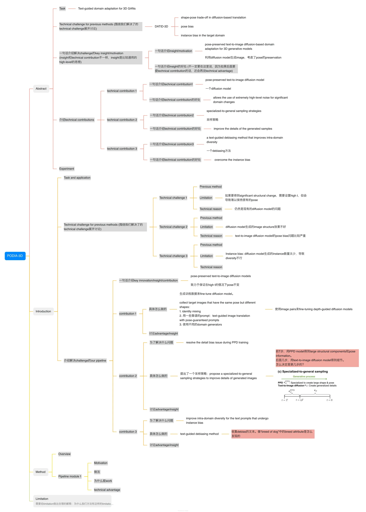

+ [RNN](https://arxiv.org/abs/2102.04906#)
+ [LoRA](https://arxiv.org/pdf/2106.09685)
+ [FlashAttention](https://arxiv.org/abs/2205.14135)
+ [LLaVA](https://github.com/haotian-liu/LLaVA)
+ [SSM/Mamba](https://github.com/state-spaces/mamba)

!!! info "tips"

    多关注related work

    多找找国外的优质blog

    大方向看代表作1，2篇

    llava是最basic的模型一定要熟悉

    可以在google scholar里搜topic

    看完一篇paper，要知道 它干了什么，novelty在哪里，效果如何

    paper分为两类：开山之作，做得好的工作。前者要精读，后者大致看创新点

    一般而言，做实验用开山作的参数，否则自己调参成本比较高

