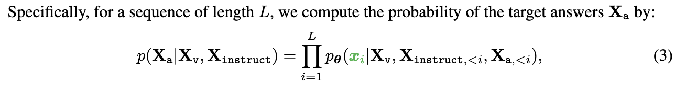

# Architecture

+ LLM
    
    we choose Vicuna [9] as our LLM  $f_\phi(\cdot)$  parameterized by $\phi$ , as it has the best instruction following capabilities in language tasks among publicly available checkpoints

+ vision encoder
    
    For an input image $X_v$, we consider the pre-trained CLIP visual encoder ViT-L/14 [ 40 ], which provides the visual feature $Z_v=g(X_v)$. The grid features **before the last Transformer layer** are adopted in our experiments

+ linear projection
    
    We consider a simple linear layer to connect image features into the word embedding space. Specifically, we apply a trainable projection matrix $W$ to convert $Z_v$ into **language embedding tokens** $H_v$ , which have the same dimensionality as the word embedding space in the language model:

    $$
    H_v=W \cdot Z_v;\ Z_v=g(X_v)
    $$

# Training
For each image $X_v$ , we generate multi-turn conversation data $(X^1_q,X^1_a,...,X^T_q,X^T_a)$, where $T$ is the total number of turns. We organize them as a sequence, by treating all answers as the assistant’s response, and the instruction $X^t_{instruct}$ at the $t$-th turn as:

## Stage 1: Pre-training for Feature Alignment
In training, we keep both the **visual encoder** and **LLM weights** frozen, and maximize the likelihood of (3) with trainable parameters $\theta=W$ (the projection matrix)
only. In this way, the image features $H_v$ can be aligned with the pre-trained LLM word embedding.
This stage can be understood as training a compatible visual tokenizer for the frozen LLM.

## Stage 2: Fine-tuning End-to-End
We always keep the **visual encoder weights** frozen, and continue to update both the pre-trained weights of the **projection layer** and **LLM** in LLaVA; i.e., the trainable parameters are $\theta=\{ W,\phi \}$ in (3). We consider two specific use case scenarios:

+ Multimodal Chatbot

    We develop a Chatbot by fine-tuning on the 158K language-image instruction-following data in Section 3. Among the three types of responses, conversation is multi-turn while the other two are single-turn. They are uniformly sampled in training.

    !!! note "training template box"
        

+ Science QA

    We study our method on the ScienceQA benchmark [34], the first large-scale multimodal science question dataset that annotates the answers with detailed lectures and explanations. 
    
    Each question is provided a context in the form of natural language or an image.
    
    The assistant provides the reasoning process in natural language and selects the answer among multiple choices. For training in (2), we organize the data as a single turn conversation, the question & context as $X_{instruct}$, and reasoning & answer as $X_a$.