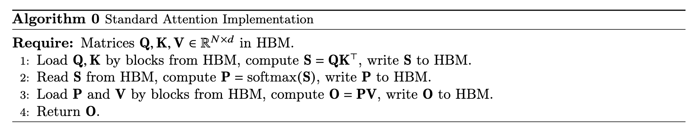
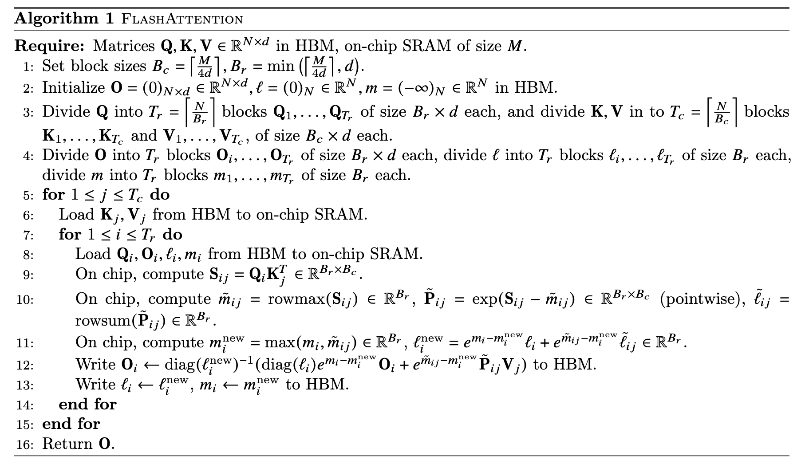

## FlashAttention

FlashAttention 与传统 attention 的核心区别在于没有将 `S = Q @ K.T` 和 `P = Softmax(S)`两个 NxN 的中间结果矩阵实体化存储到 HBM 中，从而使得 memory footprint 变成 $O(N)$；

除了 memory footprint 减少，HBM access 次数也减少，从 $O(N^2+Nd)$ 到 $(N^2d^2M^{-1})$，其中 M 为 SRAM 大小。

## FlashAttention-2
在 FlashAttention 的基础上，优化了 inner loop 的计算；

## FlashAttention-3