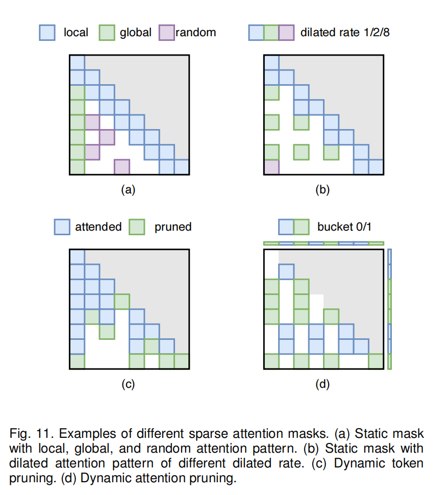

主要围绕"A Survey on Efficient Inference for Large Language Models"这篇文章展开，另一篇关于multimodal language model的survey还没有开始看。。。

这两周主要熟悉了transformer的原理，以及从data、model和system从层面对LLM的各种优化方法。

# Transformer ("Attention Is All You Need")
对于transformer，目前比较困惑的点是每一个layer内部如何处理输入的token和positional encodings，包括attention layer和FFN layer。

特别是attention layer的Q、K、V矩阵，分别是query、key、value的缩写，它们和input prompt之间是什么关系？query和key向量是如何由input prompt得到的？

最重要的是，既然都是采用Auto-Regressive的方法，为什么transformer相较于RNN的并行性好很多，也就是positional encoding的优势体现在哪里？

## KV cache
为了节省频繁出现的token的计算时间，引入了KV cache存储这些token的key和value。KV cache出现在层与层之间，在prefilling阶段存储input token的K、V值，在decoding阶段generation时进行更新。

## planning
目前思路是，由于每个layer内部都是基于神经网络的基本原理，所以可以考虑先看看cs231n的lecture notes了解一下（一周之内），然后再精读attention is all you need这篇文章。

# Survey on Efficient LLMs
目前大致了解了data-optimization和model-optimization，system level的还没细看。

## data-level
主要通过input compression和output organization来优化。

其中input compression通过各种计算方式，将input中不重要的token进行pruning；或者summarize input；或者是RAG(Retrieval-Augmented Generation)，即通过调用外部知识库来进行答案生成

而output organization则是观察到传统的generation是token by token线性的，因此希望通过parallelize generation来加速。根据这个现象，很多方法采用了SoT的思想，通过分析得到没有dependency的output token（关键词），然后以这些token为骨架进行并行生成

这个方面，咱们lab应该做的不多？我在想是不是可以先跳过这部分的reference paper不看

## model-level
这个层面的优化主要有model arch的优化，以及data representation的优化。

### model arch/structure
这个方向根据transformer的组成部件，主要分为efficient FFN和efficient Attention
#### efficient FFN
目前看来用的方法都是MoE(Mixture of Expert)化，之前看到在ZIP lab群里面好像有提及。

具体而言，引入多个FFN，也即多个expert，在这种transformer中，通过routing module的控制，每次只会activate某些expert

#### efficient Attention
##### Multi-Query Attention (MQA)
在不同的attention head之间共享KV cache

进一步有Grouped-query attention(GQA)，先将attention head分为多组，每一组attention heads公用KV cache

##### Low-Complexity Attention
原来的attention layer计算公式为

$$
{\rm {Softmax}} (QK^T)V,\ \ Q,K,V \in \R^{n \times d}
$$

其中n为input sequence length，d为model dimension

于是该公式的计算就需要 $O(n^2d)$ 复杂度。此类方法则通过各种projection(linear...)得到更小的矩阵，将此计算近似，得到 $O(n)$ 复杂度

+ Kernel-based Attention

$$
{\rm {Softmax}} (QK^T)V \approx \phi(Q)(\phi(K)^TV) \ \ ,\phi(Q),\phi(V) \in \R^{n \times d}
$$

其中 $\phi$ 函数有很多版本

+ Low-Rank Attention

将context matrix，即K, V matrix通过linear projection变成

$$
X \in \R^{n \times d} \rightarrow X' \in \R^{k \times d}
$$

其中X为K或V矩阵

#### Transformer Alternates
目前没有仔细看reference paper，但我认为都是基于 HiPPO 这篇论文，以及SSM(State Space Model)的sequence modeling。

目前很有名的 Mamba 好像就是这个领域的工作。

### data representation
这个我觉得比较好理解，最常用的量化(quantization)方法就是将LLM的亿万级规模参数的精度降低，从而节省存储空间和计算时间。但实际上，量化的方法非常多，很多都非常detail，甚至需要我没学过一些线性代数的知识。

####

问题：

+ Q1 
    之前只是浏览了一下LLaVA的github仓库，由于没接触过，有点无从下手，打算接下来请教一下学长该怎么跑代码。但是还是想问一下老师，为什么要跑这两个大模型的代码？是需要理解它们的源代码吗，还是通过调参来测试性能？

+ Q2
    这一篇survey里就有300+的reference papers，有没有比较好的方法筛选需要细看的paper呢。比如citation，有没有方便点的方法看一篇paper的citation？

+ Q3
    这几天看下来，感觉能做的东西好多，而且要学的东西也很多。所以感觉有点迷茫。。。

Specifically, we focus on two widely-used large language models (LLMs), LLaMA-2-7B and LLaMA-2-13B, and quantize their weights to 4-bit using the AWQ [194] algorithm. Subsequently, we deploy these quantized models on a single NVIDIA A100 GPU using two different inference
frameworks: TensorRT-LLM [222] and LMDeploy [223].

为什么在prefilling阶段的主要latent来自于GEMM computation，而在decoding阶段的latent主要来自于weight loading？

