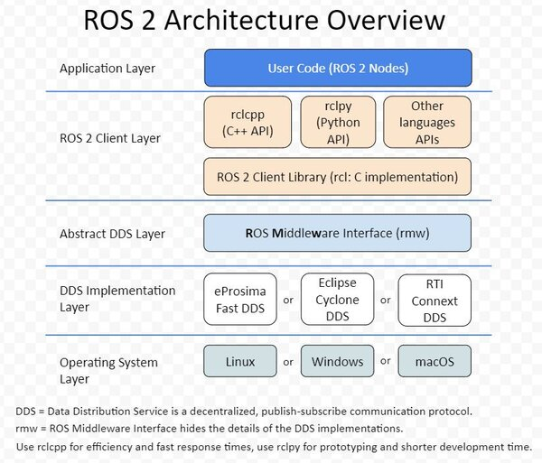

## 开发ROS功能包
使用 colcon 构建工具构建多个功能包，每个包中都包含若干节点（node），每个节点对应一个.cpp/.py源文件。

对于cpp文件，使用CMake构建系统；对于python文件，使用setuptools构建系统。

一般的ros项目根目录为workspace，根目录下组织形式如下：

```bash
.
├── build
├── install
├── log
└── src
```

+ `build` 目录存储的是中间文件。对于每个包，将创建一个子文件夹，在其中调用例如CMake
+ `install` 目录是每个软件包将安装到的位置。默认情况下，每个包都将安装到单独的子目录中
+ `log` 目录包含有关每个colcon调用的各种日志信息

其中，install 目录结构一般会有 setup 脚本、每个包的子文件夹（其中包含 lib 和 share 目录）

### 使用 rclcpp 编写节点
#### 第一步
进入src目录，创建功能包，编译类型选择 `ament-cmake`

```bash
cd chapt2_ws/src
ros2 pkg create example_cpp --build-type ament_cmake --dependencies rclcpp
```

#### 第二步
在包目录的src目录下，创建节点源文件 `node_01.cpp`，实现节点逻辑

```bash
└── src
    └── example_cpp
        ├── CMakeLists.txt
        ├── include
        │   └── example_cpp
        ├── package.xml
        └── src
            └── node_01.cpp
```

```cpp
#include "rclcpp/rclcpp.hpp"

int main(int argc, char **argv)
{
    rclcpp::init(argc, argv);
    auto node = std::make_shared<rclcpp::Node>("node_01");
    RCLCPP_INFO(node->get_logger(), "node_01节点已经启动.");
    rclcpp::spin(node);
    rclcpp::shutdown();
    return 0;
}
```

#### 第三步

修改 `CmakeLists.txt`

> ament_cmake 编写文档说明 https://docs.ros.org/en/lyrical/How-To-Guides/Ament-CMake-Documentation.html

cmake 文件整体结构如下

```c
cmake_minimum_required(VERSION 3.20)
project(examples_cpp)

find_package(ament_cmake REQUIRED)
find_package(rclcpp REQUIRED)
// 其他ros依赖库
find_package(rclcpp_action REQUIRED)
find_package(example_interfaces REQUIRED)

// node_01示例
add_executable(node_01 src/node_01.cpp)
target_link_libraries(node_01
  PRIVATE rclcpp::rclcpp
)

// 其余node以此类推
add_executable(...)
target_link_libraries(...
  PRIVATE rclcpp::rclcpp
)

if(BUILD_TESTING)
  find_package(ament_lint_auto REQUIRED)
  ament_lint_auto_find_test_dependencies()
endif()

install(TARGETS
  node_01
  node_02
  ...
  DESTINATION lib/${PROJECT_NAME})

ament_package()

```
### 使用 rclpy 编写节点

```bash
cd chapt2/chapt2_ws/src/
ros2 pkg create example_py  --build-type ament_python --dependencies rclpy
```

目录如下
```bash
.
├── example_py
│   └── __init__.py
├── package.xml
├── resource
│   └── example_py
├── setup.cfg
├── setup.py
└── test
    ├── test_copyright.py
    ├── test_flake8.py
    └── test_pep257.py

```

在 `example_py` 目录实现节点逻辑

```python
import rclpy
from rclpy.node import Node

def main(args=None):
    rclpy.init(args=args)
    node = Node("node_02")
    node.get_logger().info("大家好，我是node_02.")
    rclpy.spin(node)
    rclpy.shutdown()
```

在 setup.py 中添加 entry

```python
    entry_points={
        'console_scripts': [
            "node_02 = example_py.node_02:main"
        ],
    },
```

### 编译节点
使用colcon编译节点，并source setup文件后，该节点就会注册到ros系统中，可以在ros cli中使用