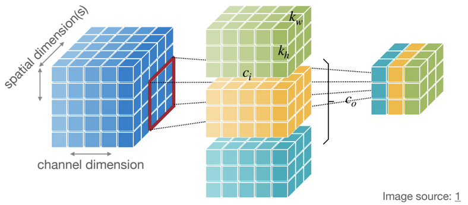
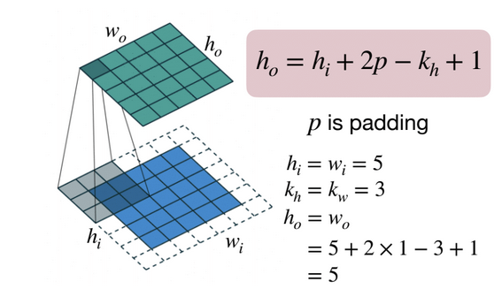
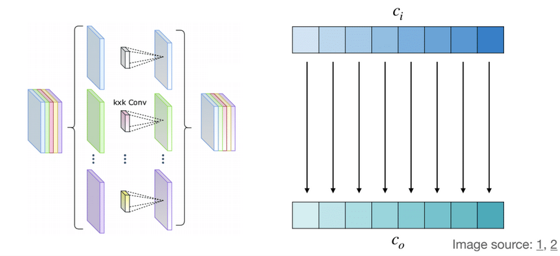

# Linear Layer (Fully-Connected Layer)
output neuron is connected to all input neurons

+ shape of tensors:

    + Input Features **X**: $(n,c_i)$

    + Output Features **Y**: $(n,c_o)$

    + Weights **W**: $(c_o,c_i)$

    + Bias **b**: $(c_o,)$

    |notations|meanings|
    |:--:|:--:|
    |n|batch size|
    |$c_i$|input channels|
    |$c_o$|output channels|

# Convolution Layer
output neuron is connected to input neurons in the receptive field

+ shape of tensors:

    ||1D conv|2D conv|
    |:--:|:--:|:--:|
    |Input Features **X**|$(n,c_i,w_i)$|$(n,c_i,h_i,w_i)$|
    |Output Features **Y**|$(n,c_o,w_o)$|$(n,c_o,h_o,w_o)$|
    |Weights **W**|$(c_o,c_i,k_w)$|$(c_o,c_i,k_h,k_w)$|
    |Bias **b**|$(c_o,)$|$(c_o,)$|

    ??? note "conv3d"
        

        $$
        h_o=h_i-k_h+1 \\
        w_o=w_i-k_w+1
        $$
    |notations|meanings|
    |:--:|:--:|
    |n|batch size|
    |$c_i$|input channels|
    |$c_o$|output channels|
    |$h_i,h_o$|input/output height|
    |$w_i,w_o$|input/output width|
    |$k_h$|kernel height|
    |$k_w$|kernel width|

## Padding Layer
Padding can be used to keep the output feature map size is the same as input feature map size

??? note "padding"
    

## Strided Convolution Layer
$$
h_o=\frac{h_i+2p-k_h}{s}+1
$$

$s$ for stride, $p$ for padding

## Grouped Convolution Layer
A group of narrower convolutions

+ shape of tensors:

    + Input Features **X**: $(n,c_i,h_i,w_i)$

    + Output Features **Y**: $(n,c_o,h_o,w_o)$

    + Weights **W**: $(g \cdot c_o/g,c_i/g, k_h,k_w)$

    + Bias **b**: $(c_o,)$

    ??? note "group convolution"
        

## Depthwise Convolution Layer
Independent filter for each channel: $g=c_i=c_o$ in grouped convolution

+ shape of tensors:

    + Input Features **X**: $(n,c_i,h_i,w_i)$

    + Output Features **Y**: $(n,c_o,h_o,w_o)$

    + Weights **W**: $(c,k_h,k_w)$

    + Bias **b**: $(c_o,)$

    ??? note "depthwise convolution"
        

## Pooling Layer
Downsample the feature map to a smaller size

+ The output neuron pools the features in the receptive field, similar to convolution
    + Usually, the stride is the same as the kernel size: $s=k$

+ Pooling operates over each channel independently.
    + No learnable parameters

??? note "pooling"
    

## Normalization Layer
Normalizing the features makes optimization faster

??? note "normalization"
    

## Activation Function
typically non-linear functions

??? note "the last layer of a neural network"
    

!!! note "different activation funcs"
    

# Transformers
[understand the keys, queries, and values in attention mechanisms?](https://stats.stackexchange.com/questions/421935/what-exactly-are-keys-queries-and-values-in-attention-mechanisms)
