## Quantization
### SmoothQuant
### AWQ/TinyChat
### QServe

## Pruning
### Wanda: pruning by considering weights and activations
+ 与AWQ相比，剪枝也有类似的想法：在修剪权重时，我们也应该考虑激活分布，而不只是权重的幅度。
    + 因此，剪枝标准就变成了权重x激活值。
    + 例如下图中，左图为原剪枝，右图为Wanda，重要性=权重×激活，因此左右图的剪枝结果不同。

        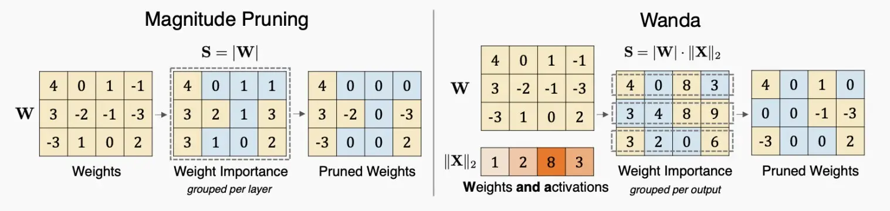

+ 下图结果表示，Wanda始终优于基于幅度的剪枝

    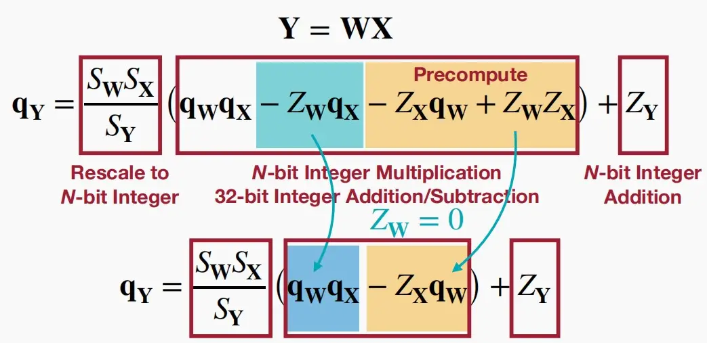

## Sparsity
### DejaVu (input dependent sparsity)
+ 如下图静态和动态稀疏性关于参数与延迟的对比图
    + 静态稀疏性(static sparsity)：提供中高程度的稀疏性，但随着移除更多参数，准确度下降极为迅速。
    + 上下文稀疏度(contextual sparsity)：小的、依赖于输入的冗余头和特征集，即使进行大量压缩，也很好的保持准确度。

        

+ 《Deja Vu: Contextual Sparsity for Efficient LLMs at Inference Time 》(Liu et al., 2023)

    + 引入了一种利用当前特征图预测下一层所需注意力的预测器，它能够与注意力层或MLP层的计算并行运行，从而使预测器与通信过程得以重叠，最终带来显著的加速。

        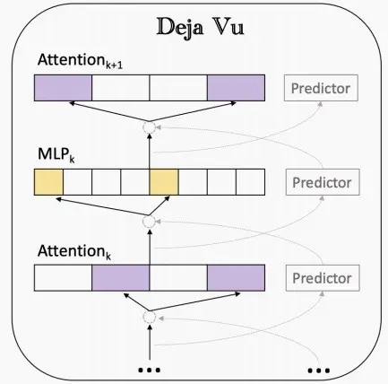

### Mixture-of-Experts (MoE)
+ 什么是MoE？
    + 混合专家模型（MoE）是一种稀疏门控制的深度学习模型，它主要由一组专家模型和一个门控模型组成。MoE的基本理念是将输入数据根据任务类型分割成多个区域，并将每个区域的数据分配一个或多个专家模型。每个专家模型可以专注于处理输入这部分数据，从而提高模型的整体性能。

+ 《Switch Transformers: Scaling to Trillion Parameter Models with Simple and Efficient Sparsity》
    + 论文将MoE思想应用到Transformer中，提出了Switch Transformers架构如下图，使用一个稀疏的Switch前馈网络层(FFN)替换原本的密集FFN层，该层独立的对序列中的标记进行操作，然后路由到多个FFN专家中。
    + 在MoE中，针对每个输入token，不需要激活整个网络。

        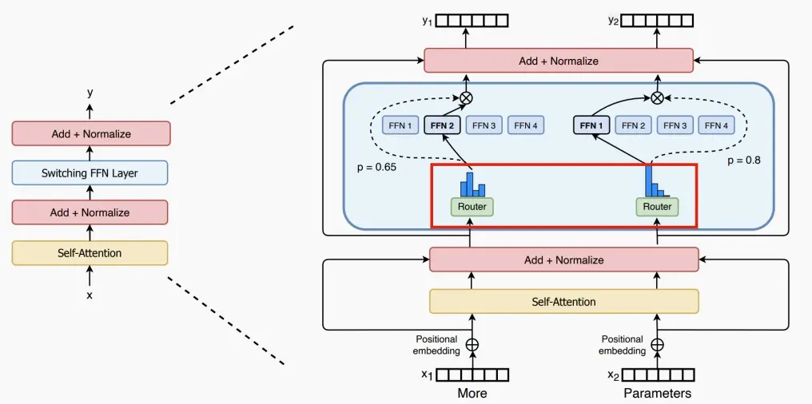

+ 每个专家可处理的token大小=（总token数 / 专家数量）× 容量因子。如果token分配不均匀，那么某些专家会溢出（用虚线红线表示），导致这些token不会被该层处理。较大的扩容因子(capacity factor)可以减轻这种溢出问题，但也会增加计算和通信成本（由填充的白色/空白插槽表示）。

+ 如下图，容量因子Capacity Factor分别为1.0和1.5时路由图。

    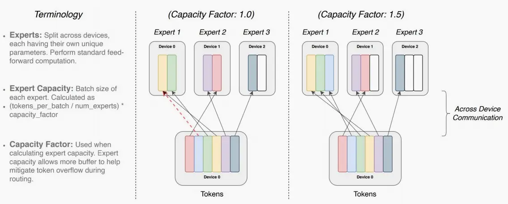

+ 如图，Switch Transformers提出了不同的路由机制，第一种从专家维度上对每个token取前K个，第二种从token维度上对每个专家取前K个，第三种从全局决定分配。

    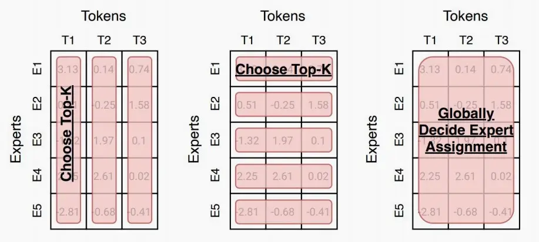

### SpAtten：token pruning & head pruning
+ 《SpAtten: Efficient Sparse Attention Architecture with Cascade Token and Head Pruning》 (Wang et al., 2020)

+ SpAtten中提出串联 (cascade) token和head pruning，对不重要的token和head进行剪枝 (注意区别: 传统的剪枝算法，减掉的是权重，这里减掉的是token和head)。cascade的含义是，一旦一个token或head被减掉了，在之后的层中，这个token或head也都不复存在。
    + 如下图，逐层剪枝，并且在一层里剪去的token和head不在考虑。

        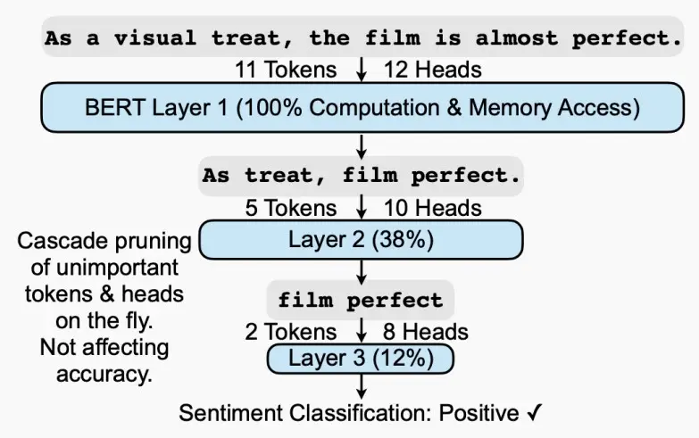

+ 重要性衡量：SpAtten提出了累计重要性得分，如下图中11个token的注意力图，每个token的重要性为**该列**的注意力累计和，较低的累计重要性分数的token将被剪枝。
    
    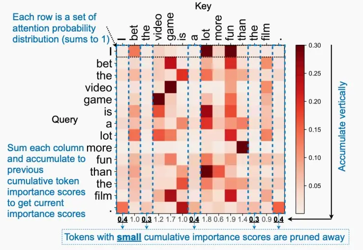

+ 除此以外，SpAtten还提出了两点
    + V剪枝：如果QK矩阵较小，则不存取V矩阵。
    + 渐进式量化：从低精度开始量化，如果模型不够自信（即softmax分布平缓柔和），则逐渐提高量化精度。

### H​2​O：token pruning in KV cache
+ 基于attention的观察，即在计算attention分数时，一小部分token贡献了大部分价值。我们将这些token称为heavy Hitter Tokens($​H_2$​)。通过全面的调查，我们发现 $​H_2$ 的出现是自然的，并且与文本中标记的频繁共现密切相关，删除它们会导致性能显着下降。
+ 基于这些见解，提出了 Heavy Hitter Oracle ($​H_2O$)，这是一种 KV 缓存驱逐策略（贪婪算法），可动态保持最近token和 $​H_2$​ token的平衡。

    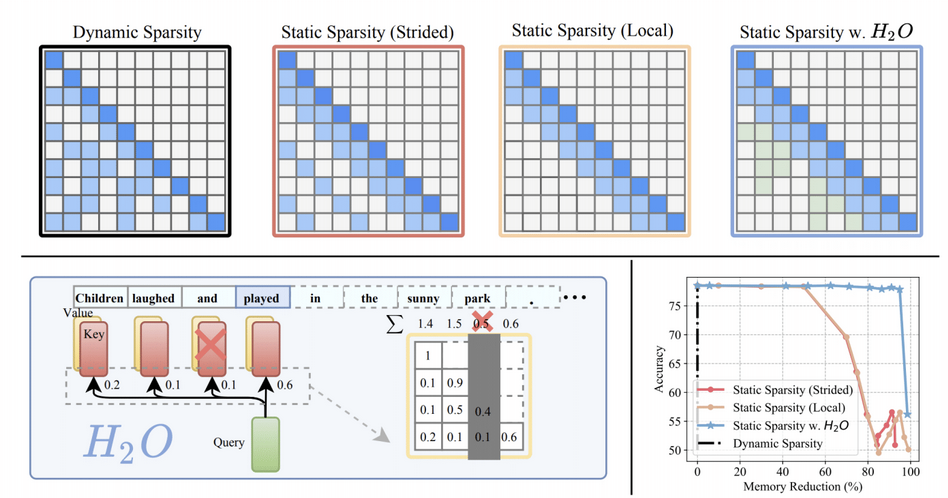

## Efficient inference systems for LLMs
??? info "Important Metrics for LLM Serving"
    + **Time To First Token (TTFT)**

        Measures how quickly users begin to see model output after submitting a query.

        - Crucial for real-time interactions.
        - Driven by prompt processing time and the generation of the first token.

    + **Time Per Output Token (TPOT)**

        Time taken to generate each output token.

        - Impacts user perception of speed (e.g., 100 ms/token = 10 tokens/second, ~450 words/minute).

    + **Latency**

        Latency = (TTFT) + (TPOT * the number of tokens to be generated).

        - Total time to generate the complete response.

    + **Throughput**

        Number of tokens generated per second across all requests by the inference server.

### vLLM
+ 分析KV高速缓存使用情况中的浪费：
    + 内部碎片：由于未知的输出长度而过度分配。
    + 保留：未在当前步骤中使用，但将在将来使用。
    + 外部碎片：由于不同的序列长度。

        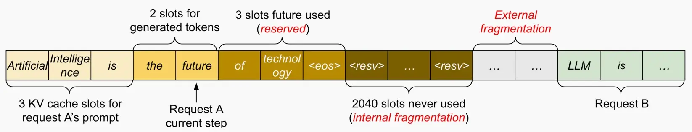
    
+ vLLM提出了Paged Attention，来自操作系统（OS）的灵感来源：虚拟内存和分页功能！
    + 我们可以通过在此处设置一层间接寻址，类似于页表的机制，并利用这个block table，实现动态分配。每次分配块时，产生的最大浪费即为块的大小，而非在KV缓存中大量浪费内存，尤其是在为请求长度各异的多个用户提供服务时。

        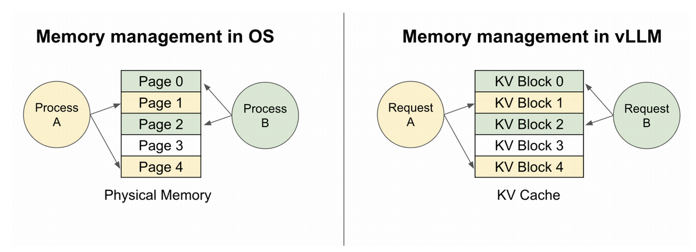

        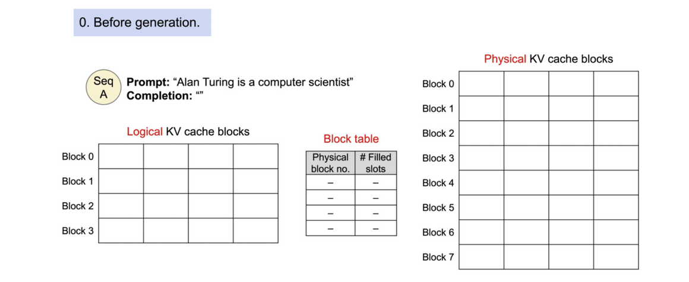
+ Paged Attention是如何工作的？
    + 与OS类似，有一个逻辑KV缓存块，一个块表，一个物理KV缓存块，与OS的虚拟内存几乎一致，块表负责从逻辑到物理的映射，每个块可以存储4个token。
        + 对一个Prompt，它在逻辑地址上是连续的，而在物理地址上是可以不连续的。
        + 动态块映射支持在并行采样中进行即时共享，如下图。
            + 并行采样：指在给定提示的情况下预测未来，这些预测可以在不同的序列间共享。

        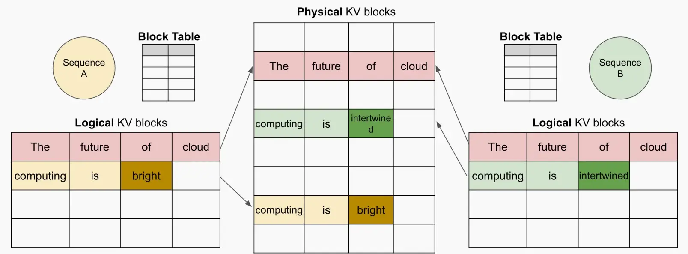

### StreamingLLM
+ 在流媒体应用程序中迫切需要llm，如多轮对话，其中需要长时间的交互。
    + 挑战：首先，在解码阶段，缓存先前tokens的键和值状态（KV）会消耗大量内存。其次，流行的LLMs无法泛化到超出训练序列长度的更长文本。

+ 三种现有方法的不足之处

    + 密集注意力：具有O(T2)的时间复杂度和不断增加的缓存大小。当预测文本T远远大于预训练文本长度L（T>>L）,困惑度上升性能下降。深蓝色方块是不停新增token计算注意力，重新计算softmax, 然后cache到内存中(浅蓝色方块)。直达达到L是新一个token就会开始效果变差。简单思想可以理解只需要计算深蓝色score所在行，cache浅蓝色后，softmax重新更新当前token向量(最后一行)
    + 窗口注意力：只维护最新的token的KV状态的固定大小的滑动窗口。问题很明显虽然在缓存最初填满后确保了恒定的内存使用和解码速度，但一旦序列长度超过缓存大小，即使只是逐出第一个token的KV，模型也会崩溃。
    + 重新计算滑动窗口：发放为每个生成的token重建最新token的KV状态（这样一直保持有初始token）。虽然它在长文本上表现良好，但它的O(T*L2)复杂性(源于上下文重新计算中的二次注意力)使得它相当慢（流应用时不行）。
        
        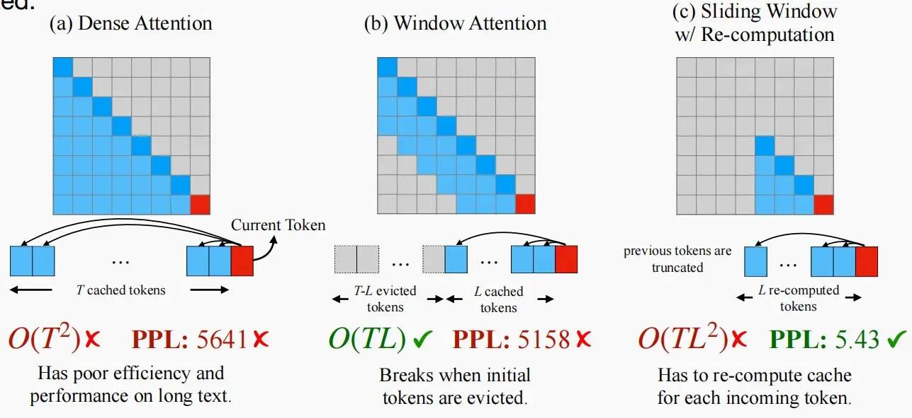

+ Attention Sink注意力汇聚现象
    + 初始token有很大的注意力分数，即使它们在语义上并不显著，我们称其为注意力汇聚点。
    + 背后的原理--Softmax
        + SoftMax操作在创建Attention Sink方面的作用——所有上下文令牌的注意力分数必须合计为1。
        + 初始token对于sink现象的推动，是由于它们对后续标记的可见性，根源于自回归语言建模，导致后续所有token都会关注第一个token。
        + 由于softmax必须求和为1，如果某个部分不太相关，神经网络就会决定将所有注意力分数集中到第一个标记上。
        + 初始token的重要性是来自于它们的位置还是它们的语义？
            + 我们发现在前面添加初始四个“\n”，也会有很大的注意力分数。
            + 因此，它们的位置更重要，语义无关。

            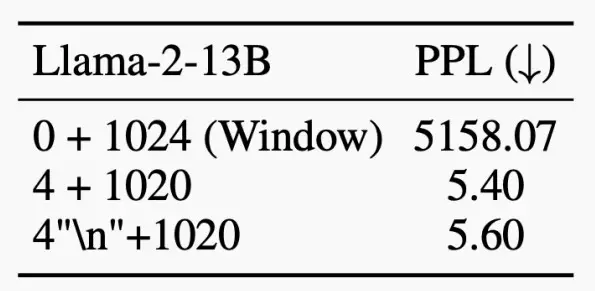

+ StreamingLLM关键思想：始终如一地重新添加第一列，始终保持注意力同步，随后再对注意力进行窗口化处理。

    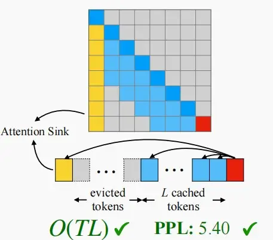

+ 由于固定了初始token在高速缓存中，因此需要重新进行位置编码。
    + 使用高速缓存中的位置，而不是原始文本中的位置（绝对位置）。

    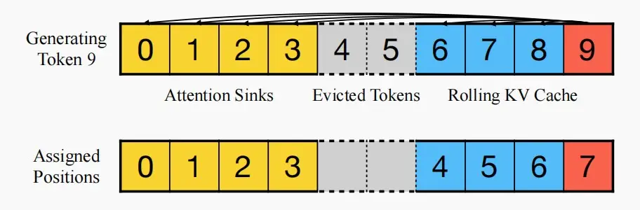

+ 性能比较
    + 比较dense attention, window attention, and sliding window w/ re-computation。
    + StreamingLLM显示出稳定的性能；困惑接近滑动窗口与重新计算基线。
    + 从第一幅图可以看出sliding window w/ re-computation和StreamingLLM都有不错的困惑度，但是sliding window w/ re-computation计算复杂度很高，从第二幅图可以看出延迟提高了22.2×。

        

        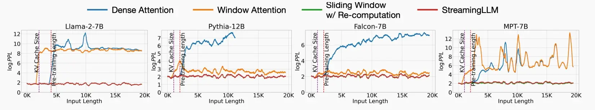

+ Why 4 attention sinks?
    + 在所有训练样本开始时引入一个额外的可学习token，作为一个专门的attention sink。
    + 这个预先训练过的模型在只使用这个单个sink token的流媒体情况下保持了性能，这与需要多个初始令牌的普通模型形成了对比。

        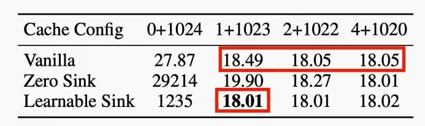

### FlashAttention
+ 使用平铺来防止大型𝑁×𝑁注意矩阵的物化（指实际存储在HBM中），从而避免使用缓慢的HBM；内核融合。
+ 如下图中，将QKV实时计算部分在SRAM中执行，而绿色部分的数据存储在HBM中，且输出到HBM中。它可以显著的提高速度。

    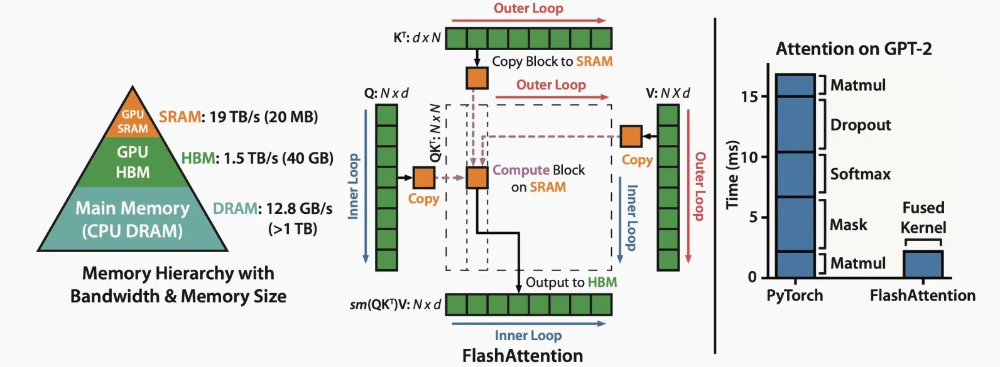

+ 下图展示了无因果掩码和有因果掩码时的速度对比。

    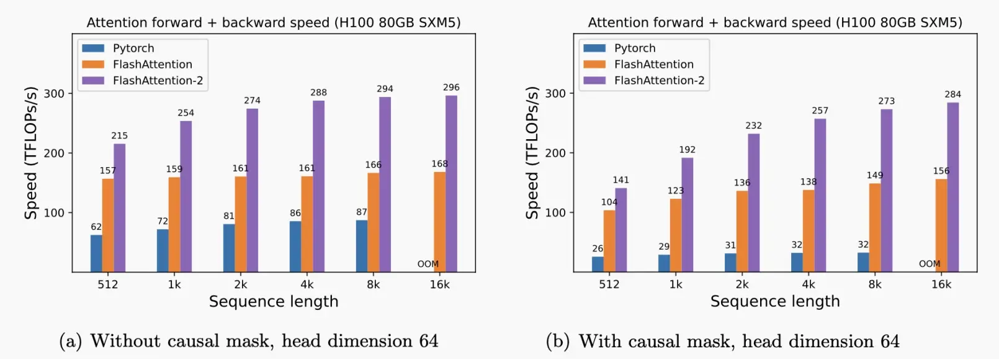

### Speculative decoding随机采样
+ LLM的解码阶段通过令牌生成输出令牌，这是高度内存限制(memory bound)的（特别是在小批处理大小时）。
+ 在推测解码中有两种模型：
    + Draft模型：一个小型LLM（例如，7B，比原始目标模型小得多的近似模型）
    + Target模型：一个大型LLM（例如，175B，我们正在试图加速的那个原始目标模型）
+ 过程：
    + 草案模型将自动回归解码token。
    + 将生成的token并行输入目标模型，并得到每个位置的预测概率。
    + 决定我们是想保留令牌还是拒绝它们。

        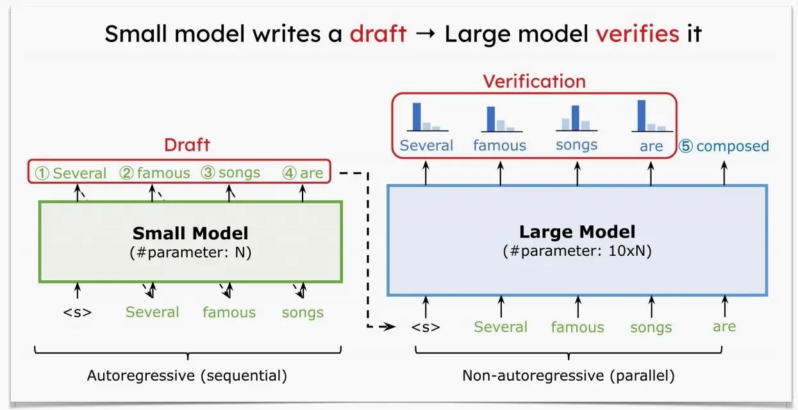

+ 下图展示随机采样的工作方式。下图中，每一行代表一次迭代。绿色的标记是由近似模型提出的token建议，而目标模型判断是否接受了这些token生成的建议。红色和蓝色的标记分别表示被拒绝和其修正。

    + 例如第一行，小模型生成的'bond'被大模型拒绝，并给出建议'n'。
    + 第二行中，小模型生成'nikkei 22'，被大模型接受。
    + 以此类推，由于用大模型对输入序列并行地执行，大模型只forward了9次，就生成了37个tokens。尽管总的大模型的计算量不变，但是大模型推理一个1个token和5个token延迟类似，这还是比大模型一个一个蹦词的速度要快很多。

        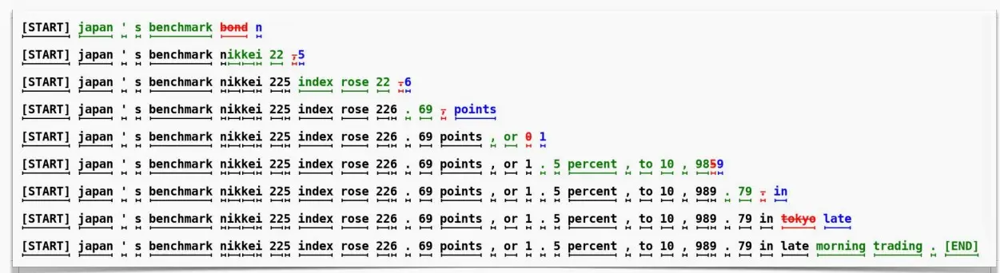
### Batching
+ Why Batching?
    Running multiple inputs simultaneously maximizes throughput by fully utilizing the GPU resources, avoiding idle time.

#### No Batching
- Each request processed individually.
- Leads to underutilization of GPU resources.

#### Static Batching
- Waits for a full batch of requests before processing.
- Good for scheduled tasks (can be processed offline).
- Increases the latency for online tasks.

#### Dynamic Batching
- Batches are processed when full or after a set time delay.
- Balances throughput and latency.

    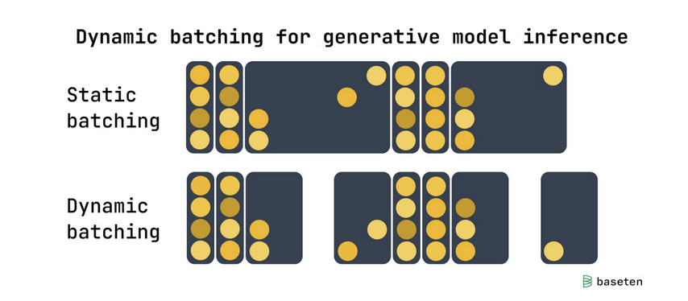

#### Continuous Batching (a.k.a., In-Flight Batching)
- Processes requests token-by-token.
- Ideal for LLMs.
- Improves GPU utilization by eliminating idle time waiting for the longest response.

    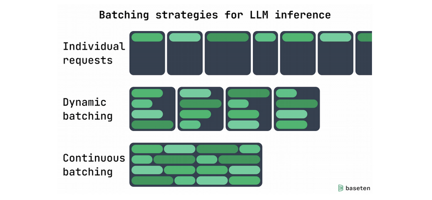

> 有点类似于流水线

## Efficient fine-tuning for LLMs
### LoRA
+ 《LoRA: Low-Rank Adaptation of Large Language Models》 (Hu et al., 2021)

+ 大型语言模型/扩散模型的低秩自适应（Low-rank adaptation）

+ 核心思想：与其更新完整的模型权重，不如更新一个小的低秩组件。

+ 优势：
    + 通过跳过梯度计算来加快微调速度。
    + 通过减少optimizer的状态来节省微调内存。
    + 防止灾难性遗忘。
    + 低秩的权值可以被融合。

+ 下图为对GPT-3使用几种微调方法后，参数大小和准确性的效果图：

    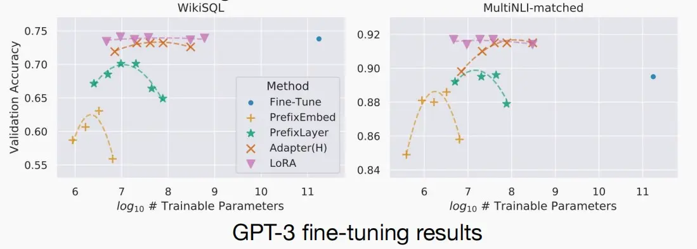

### QLoRA
+ 《QLORA: Efficient Finetuning of Quantized LLMs》 (Dettmers et al., 2023)

+ QLoRA是一种新的微调大型语言模型（LLM）的方法，它能够在节省内存的同时保持速度。其工作原理是首先将LLM进行4位量化，从而显著减少模型的内存占用。接着，使用低阶适配器（LoRA）方法对量化的LLM进行微调。LoRA使得改进后的模型能够保留原始LLM的大部分准确性，同时具有更小的体积和更快的速度。

    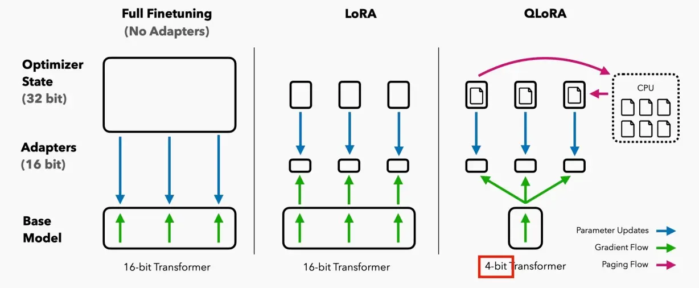

### Adapter

## Real implementation: TensorRT-LLM Public Release
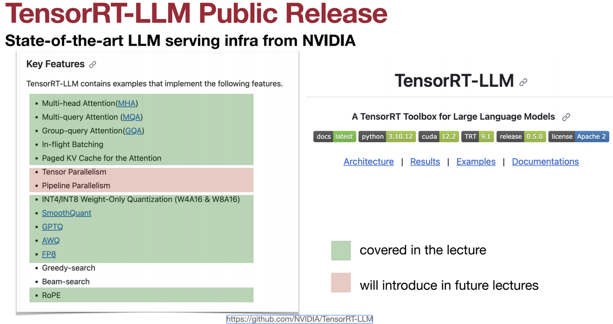
