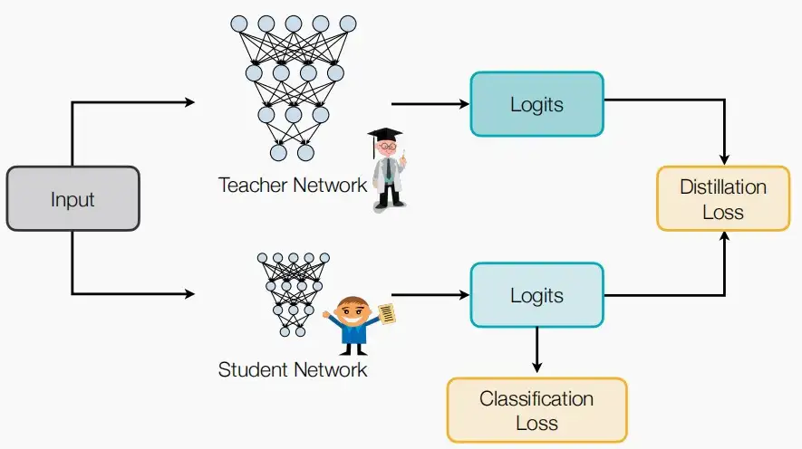
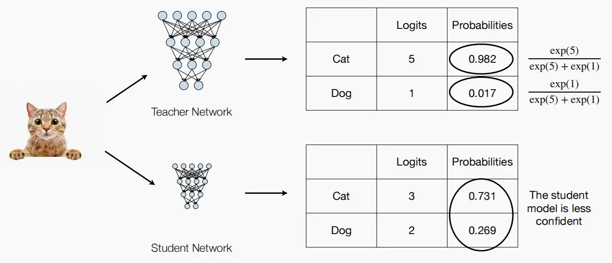

## 定义
+ 定义：知识蒸馏是一种从一个更大的模型中学习的过程，旨在将多个模型的知识蒸馏到一个更小的模型中。这种方法的关键是将大模型的知识传递给小模型，从而创建可以在边缘设备上使用的更小模型。

+ 更大更复杂的模型作为教师网络，而更小更简单的模型作为学生模型。学生模型通过知识蒸馏来学习教师模型的逻辑，接近其类概率分布，以达到在准确性上接近教师模型。

+ 知识蒸馏中引入了温度T的概念

    + 原本逻辑和分类概率的关系如下 $​p(z_i​)=exp(z_i​)/\sum_j​exp(z_j​)$
    + 引入温度T后，$​p(z_i​,T)=exp(z_i​/T)/\sum_j​exp(z_j​/T)$
    + 温度T通常设置为1。

        