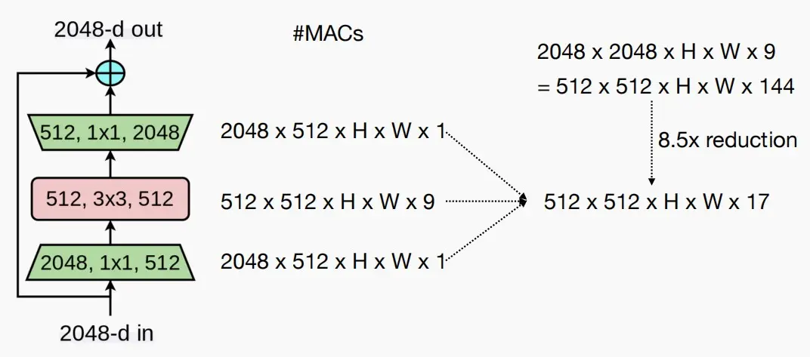
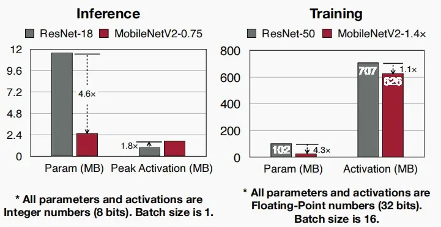
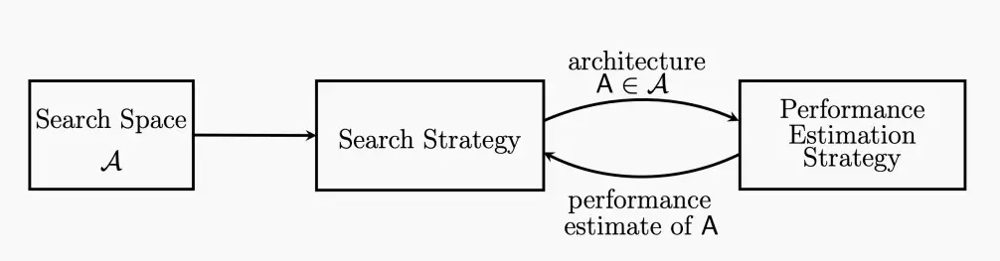
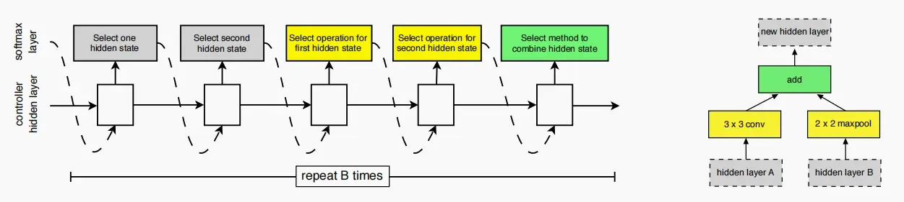
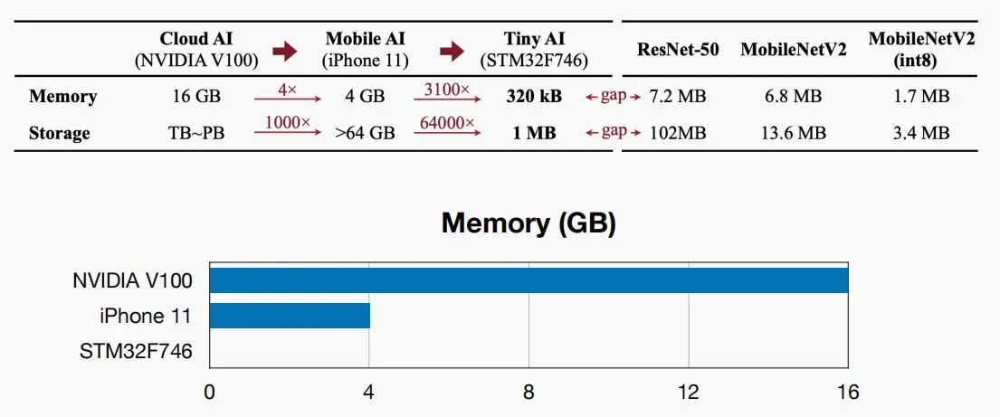
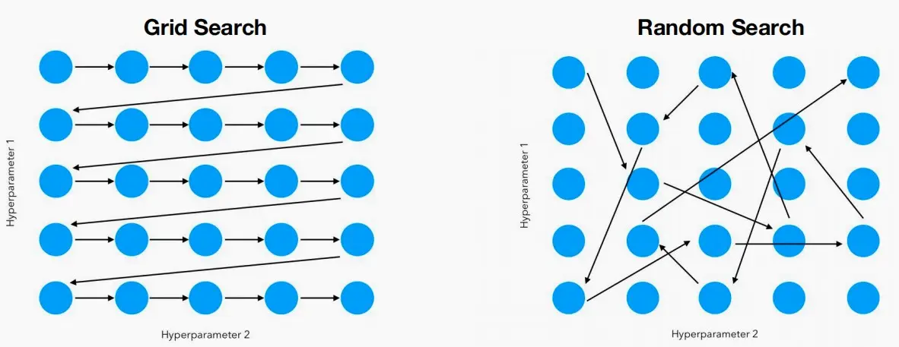
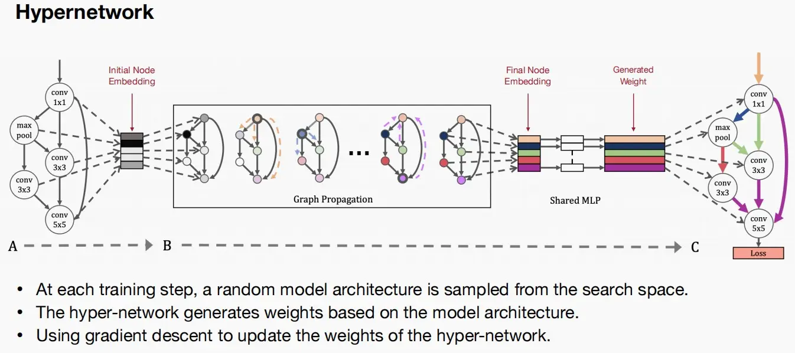
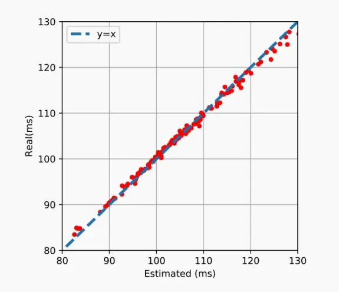
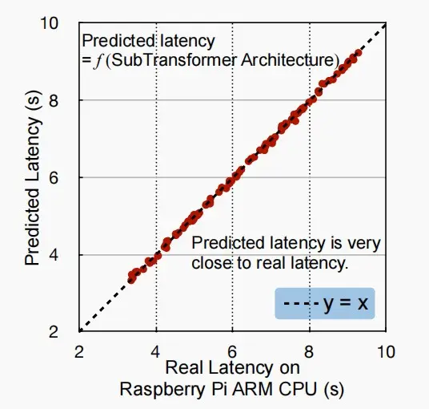
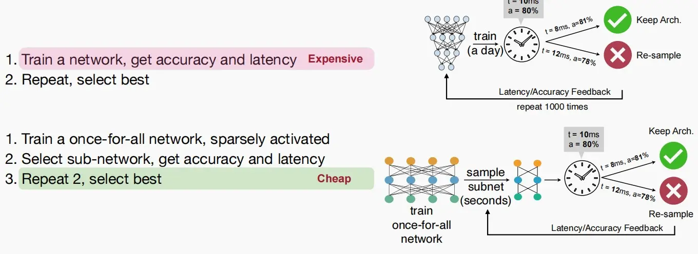

## Primitive operations
不同层的MAC(multiply accumulation)计算

## Classic Building Blocks
构建模块由若干层组成，人们巧妙地将它们组合起来，以平衡准确性与计算量。
### ResNet50: bottleneck block
+ ResNet50由三层构成，首尾两个 $1\times1$ 层和中间一个 $3\times3$ 层。

> 问：为什么不直接使用一个 3×3 就行？
> 答：相同通道数的 1×1 层和一个 3×3 层，FLOPs相差九倍。因此使用两个 1×1 层在首尾可以减少通道数，以降低MAC数量。如下图计算，这种设计相比直接使用一个 3×3 层计算量可以减小8.5倍。

### ResNeXt: grouped convolution
+ 用 3×3 分组卷积替换 3×3 卷积。
+ ResNeXt的关键思想是用一个称为**“基数瓶颈”的新模块替换ResNet中的瓶颈设计**。该模块引入了一个名为“基数”的新维度，表示网络中的并行路径数量。
+ 基数瓶颈模块包含多个并行的路径，每个路径由一组卷积层组成。这些并行路径捕捉输入数据的不同方面，并使模型能够学习更多样化和细粒度的特征。然后，通过求和或连接这些路径的输出，提供更全面的输入表示

### MobileNet: depthwise-separable block
+ 人们设计了MobileNet，旨在将这些神经网络部署在手机和移动设备上，其中要求模型参数数量较少。
+ MobileNet引入了深度可分离卷积，这是分组卷积的一种极端情况，即分组数等于输入通道的数量。
+ MobileNet通过将标准的卷积操作分解为两个独立的步骤来减少参数量和计算量：
    + 深度卷积（depthwise convolution）：在每个输入通道上应用一个独立的卷积核，这样可以有效地捕捉输入数据的空间特征。这一步骤在不引入额外参数的情况下，实现了参数共享和特征提取。
    + 逐点卷积（pointwise convolution）：在每个位置上应用一个1x1的卷积核，用来将深度卷积的输出特征进行线性组合，得到最终的输出特征。逐点卷积主要用来进行特征融合和降低特征的维度。

    

### MobileNetV2: inverted bottleneck block
+ 由于 3×3 的深度卷积容量不足，为了补偿容量，必须增加通道数量，因此MobileNetV2采用一个扩张卷积。
+ MobileNetV2的各层如下：
    + Expansion layer（扩张层）：该层使用 $1\times1$ 的逐点卷积来扩展通道数量。这个步骤有助于增加模型的表达能力和非线性能力。
    + Depthwise convolution layer（深度卷积层）：该层使用depthwise convolution来对特征进行空间上的卷积，以减少计算量。depthwise convolution会**对每个输入通道单独进行卷积操作**，然后再通过逐点卷积将通道进行整合。
    + Pointwise convolution layer（逐点卷积层）：该层使用 $1\times1$ 的逐点卷积来进行通道的降维。这个步骤有助于减少计算量和模型参数的数量。
+ 与仅使用一层 $3\times3$ 卷积的情况进行比较，MACs和Params数量都有所增加(1 : 1.37)。因此人们发现与其使用三层结构，需要记忆三种不同的激活函数，不如仅采用一个单一的密集层，即常规的 $3\times3$ 卷积。

+ 随着GPU或DSP等高并行硬件的发展，深度卷积的使用越来越少。常规的 3×3 卷积有时更加高效，它能更好地利用硬件中的并行性，同时计算更为规则，并非总是MobileNet才高效。
+ 如图中对ResNet和MobileNetV2的推理和训练比较，首先将MobileNetV2归约至3/4使得两者在数据集ImageNet准确度相同。可以看出，虽然MobileNetV2的模型参数大幅减小，但是峰值激活并没有明显降低，激活成为了模型部署到设备的瓶颈。

### ShuffleNet: 1x1 group convolution & channel shuffle
+ ShuffleNet与MobileNetV2所做的工作非常类似，首尾使用 1×1 卷积，并且都采用了分组卷积旨在减少成本。
+ MobileNetV2中不同分组之间从不进行信息交流，而ShuffleNet通过**通道重排(channel shuffle)**在不同的组之间交换信息。
    + 通道重排是ShuffleNet的重要组件，它的作用是在逐通道分组卷积之后，将不同组的特征进行混洗。这样做的目的是为了增加特征之间的交流和信息传递，从而提升模型的表示能力。
    + 通道重排需要高效实现，以避免数据移动，需要注意的是，重排不涉及到计算，不增加MAC。

### Transformer: Multi-Head Self-Attention (MHSA)
+ MHSA核心思想：是将输入序列分别映射为多个查询、键和值向量，然后通过计算它们之间的相似度得到注意力权重，并将值向量加权求和得到输出。这样的操作可以理解为模型在对输入序列进行处理时，通过关注不同的语义信息来提升模型的表达能力。
+ 每个头都有自己的查询、键和值映射。每个头都可以关注输入序列中不同的局部结构和语义，通过并行计算多个头的注意力权重，模型可以更全面地捕捉输入序列的信息并提升表示能力。

## Introduction to neural architecture search (NAS)
### What is NAS?
+ 在神经网络中，我们需要设计众多维度，例如层数、核数量、核大小、通道数、连接性和分辨率。因此我们希望利用机器来自动设计神经网络模型。
+ 如下图是不同模型在ImageNet上的准确性-效率权衡，带星号的是使用自动机器学习AutoML设计的模型，显然优于人工设计的模型，因其具备更小的计算量和更高的准确性。

+ NAS的目标是在搜索空间中找到最佳的神经网络结构，最大化特定目标函数。

### Search space
+ 搜索空间是一组候选神经网络结构。
+ 搜索空间分为下列两种：
    + Cell-level单元级搜索空间
    + Network-level网络级搜索空间

1. 单元级搜索空间
    + 在单元级搜索空间中，神经网络被划分为一个个基本单元（cell），每个基本单元由一些预定义的操作组成，例如卷积、池化、残差连接等。搜索算法会在这些预定义的操作中选择合适的组合方式，以构建出更高效和强大的神经网络结构。
    + 如下图，使用一个RNN控制器来生成候选单元格，通过循环执行以下三步：
        + 选择两个输入隐藏状态（例如，来自前一层/更前一层）
        + 选择两个输入转换操作（例如，卷积/池化/标识）
        + 最后选择整合结果的方法（例如，加法操作/拼接）
    + 图的左侧是生成过程示意，右侧是作为生成示例。

    

    > 问题：假设我们有两个候选输入，M个候选操作来转换输入，N个潜在操作来组合隐藏状态，如果我们有B层，NASNet中搜索空间的大小是多少？
    > 答案：$(2\times2\times M\times M\times N)^B=4^BM^{2B}N^B$

2. 网络级搜索空间
    + 在找到每个单独的模块后，我们希望构建这个网络层级的搜索空间。
    + 网络层面的搜索空间包括：核大小、深度、宽度、分辨率和拓扑连接。
    + 对于拓扑连接代表为论文《Auto-DeepLab: Hierarchical Neural Architecture Search for Semantic Image Segmentation》。论文提出了一种通过层次化的神经架构搜索来进行语义图像分割的方法。
        + 如下图中，左侧是网络级搜索空间图，右侧是使用该方法来表示代表性的手工设计模型。
        + 网络的开始是一个两层的“stem”结构，之后是L层未知的空间分辨率。
        + 每一次以幅度2×来改变空间分辨率，下一层的分辨率要么是2×大，2×小，或者不变。最小的空间分辨率为下采样32×。
        + 沿着蓝色节点的每条path都对应于搜索空间中的一个网络架构，我们的目标是找到一个较好的path。

        

### Design the search space
+ 根据前面可以知道这是一个相当庞大的搜索空间，我们希望利用一些启发式或更巧妙的方法缩小搜索空间，以便在资源约束下的执行模型专业化。
+ 动机：对于手机、微控制器、物联网设备等边缘设备，具有延迟、能耗和内存限制。尤其是物联网设备，不同于手机4GB/8GB的内存，物联网设备的内存和存储极小，资源限制更加严重。

+ 如何为TinyML设计搜索空间？
+ 训练成本高昂，应该将训练成本纳入考虑，因此仅凭准确率评估模型优劣是不够的。
    + 在模型训练过程中，计算是廉价的，而内存数据移动是昂贵的。
    + 因此假设内存不变，即保证模型数据移动相同的前提下，若模型能够拥有更多的FLOPs->则表明更大的模型容量->更有可能达到更高的准确率。
    + 假设存在内存限制，比较不同设计空间能够容纳的最大浮点运算次数
+ 《MCUNet: Tiny Deep Learning on IoT Devices》中统计了不同的宽度和分辨率设计空间，在相同内存限制的条件下的FLOPs次数。并绘制了如下图曲线，FLOPs次数的CDF累计分布函数。
    + 可以看出红色实线优于黑色实线，同一内存下，红色设计空间能够达到更高的FLOPs次数。红色前20%的模型FLOPs大于50.3M，最高准确率78.7%；而黑色前20%的模型FLOPs大于32.3M，最高准确率仅74.2%。

    

### Search strategy
+ 搜索策略包括：网格搜索、随机搜索、强化学习、梯度下降以及进化研究。

#### 网格搜索
+ 网格搜索是一种传统的超参数优化方法。整个设计空间表示为单维设计空间的笛卡尔积。
+ 基本思想：将参数空间划分为一个网格，然后遍历网格中的每个点来评估模型的性能。对于每个参数组合，都会进行一次模型训练和评估，然后根据定义的性能指标选择最佳的参数组合。

#### 随机搜索
+ 通过在参数空间内随机选择参数组合来寻找最佳模型配置的方法。与网格搜索不同，随机搜索不需要穷举所有可能的参数组合，而是在给定的参数范围内随机选择一组参数进行模型训练和评估。

#### 强化学习
+ 模型神经结构设计作为一个顺序决策问题，可以使用强化学习来训练用RNN实现的控制器。
+ 这种方法较缓慢，因为需要迭代获得奖励进行训练。
+ 如下图，按照概率p采样架构，训练这个试验网络获得准确率R，接着计算概率p的梯度并将其乘以R以更新控制器。

#### 梯度下降法
+ 这种方法无需过多迭代，计算效率更高。
+ 缺点：需要将所有选项保存在内存中，大幅增加GPU内存占用。
+ 如下图，对于基于梯度的搜索，也可以考虑延迟。
    + F是一个延迟预测模型（通常是一个回归变量或一个查找表），可以预先预测每个构建块的延迟。
    + 位于块内的 $\alpha,\beta,\gamma$ 参数，代表采样每条路径的概率。
    + 因此可以计算出延迟的期望值 $\text{E}[latency]$。
    + 有了损失函数，我们就可以从延迟惩罚项中计算出体系结构参数的附加梯度。

#### 演化搜索(Evolutionary search)
+ 构建大型网络，选取一个子网络样本，检验其速度是否足够快，如果效果良好就保留，否则通过变异和交叉重新采样，重复此过程直至找到最佳个体。
+ 如何变异？
    + 在深度上变异（如深度变大变小）、对算子变异（如5×5卷积变异成3×3卷积）。
+ 如何交叉？
    + 在每一层的两个选择中（父选项中）中随机选择一个算子。
+ 经过变异交叉后，我们可以选择最合适者作为下一代的亲本重复上述过程，直至找到最佳模型。

## Efficient and Hardware-aware NAS
### Accuracy estimation strategy
+ 准确度估计策略 (Accuracy estimation strategy) 定义了如何在设计空间中估计/预测一个给定的神经网络体系结构的准确度。
+ Train from scratch(从头训练)
    + 在训练集上从头开始训练给定的模型。
    + 在验证集上评估训练后的模型，得到准确度R。
    + 缺点：高昂的培训成本，例如对于CIFAR10数据集需要训练12800个模型架构。

    

+ Inherit weight(继承权重)
    + 从父模型中继承权重，以降低训练成本，而不是从头开始进行训练。
    + 论文Net2Wider中：为了扩展宽度，可以将参数f拆分为两个f/2，使得神经元数量裂变，窄网络变成宽网络。
    + 论文Net2Deeper中：为了扩展深度，可以插入一个Identity Mapping(恒等层)，浅网络变成深网络。
    + 通过采用这种继承权重的方式，我们不再每次提出新架构时都要涉及众多参数，而是生成从net-to-net的变换更新操作。

    

+ Hypernetwork超网络
    + 超网络由共享MLP构成，用于预测目标网络的权重。
    + 预测器基于模型的架构嵌入构建，如参数NCHW格式、不同尺寸等，通过多层图神经网络将初始架构嵌入转换为最终架构嵌入。
    + 如何训练超网络？利用梯度下降法更新超网络的权值。

    

### Zero-shot NAS
+ 零样本(Zero-shot)允许模型在没有对特定任务进行任何训练或学习样本的情况下，通过解决相关任务的方法来进行模型预测。简而言之，Zero-shot学习让模型能够利用已有的知识，对从未见过的“未知”样本进行预测或分类，即使这些样本在训练阶段从未出现过。
+ 对于NAS问题，零样本神经架构搜索(Zero-shot NAS)仅通过目测分析架构来估算准确度，不进行训练。
+ ZenNAS
    + ZenNAS试图表达的是，希望对输入施加一点微小的扰动，一个好的模型应该能够感受这种变化，并给出变化明显的输出，即对扰动敏感。
    + ZenNAS中使用Zen-score来代替准确度预测器，因此其不预测模型准确度，而是直接确定网络的模型复杂度，并且不需要训练其参数。其计算方法如下图所示：

    

+ GradSign
    + 一个好的模型应该具有更密集的样本级局部极小值，即不同的局部最小值之间的距离应该更接近。

        

    + 一个优秀的模型应当对输入扰动敏感，但是对输入扰动敏感的模型不一定就是好模型。

### Hardware-aware NAS
+ 准确度仅仅是NAS的一部分，我们需要使其具备硬件感知能力，不仅要获取准确性信息，还要获取延迟等。

#### ProxylessNAS
+ 以前的神经结构搜索（NAS）是非常昂贵的。因此，以前的工作必须利用代理任务，例如：小型数据集、较小的架构搜索空间、较少的训练周期和参数流。
+ 而ProxylessNAS直接训练真实的数据集、解锁所有层、直接对其进行搜索，并采用延迟而非FLOPs作为反馈，直接在目标硬件上学习目标任务。
    + 首先构建一个过参数化网络，包含众多不同选择，即所有候选类别。
    + 我们希望将其简化为单一训练过程，相较于你训练模型、评估准确度、再次训练模型、评估准确度、训练另一个模型等多种训练迭代过程，现在我们希望将其简化为一个过参数化网络的单一训练过程。
    + 这种网络拥有两类参数，一是权重参数，另一个是架构参数。我们可以迭代地更新权重参数和架构参数。我们可以通过不同路径表示不同架构，而参数表示选择概率。
    + 在推理阶段，我们可采样最大概率，并根据这些架构参数证明那些冗余路径。
    + 最终确定了架构后，为确保内存中仅有一条激活路径处于活动状态，使用二值化参数即仅含0和1。

#### MACs==真实的硬件效率？
+ 下图中MobileNetV2的MACs更大，但是延迟更低；而AmoebaNet-A的MACs更小，但是延迟更高。
    + 因此那些传统的NAS方法尽管与人工设计相比具有相似的MACs，但实际上却引入了更高的延迟。
    + 因此我们可以知道，MACs 不等于真实的硬件效率。

    

+ 如图为分别对隐藏层维度和层数进行缩放时，延迟与MACs的变化情况。

    + 两者具有相同起点，但是随着MACs的增大，延迟变化情况分化。
    + 当扩展神经网络的维度时，实际上延迟并不会显著增加，因为GPU具有极高的并行性，即使增加工作负载扩大通道数，延迟也不会明显上升。

    

#### 延迟预测
+ 由于MACs不能很好的反应硬件效率，因此延迟的反馈极为关键。而在设备上直接测量延迟速度较慢且成本昂贵，因此可以构建一个延迟模型，通过首先收集延迟数据集来预测延迟，输入为架构表示，输出为预测的延迟时间。
+ 延迟预测可以分为以下类别
    1. 分层延迟分析：延迟查找表
        + 分层延迟分析的前提：对于神经网络，延迟基本上是各层延迟的总和，即是可加的。
        + 基于前提可知，该方法并不适用于任意网络，例如多个层同时进行部分推理时无法直接相加。
        + 神经网络具有不同的层，不同层具有不同且有限的选择。我们可以预先计算并测量每个选择的延迟，构建一个查找表。对于查找表，可以使用操作符与延迟一一对应，更快预测延迟。
        + 下图展示了使用延迟查找表进行预测的效果，实际结果与预测十分接近。

        

    2. 网络级延迟分析：延迟预测模型 
        + 更通用的模型，从网络架构层级预测。
        + 输入特征包含卷积核大小、宽度、分辨率等绝大部分超参数，通过多层的感知机MLP作为连接层，输出+ 预测的延迟时间。其中MLP也可以换成更加复杂的图神经网络等。
        + 下图展示了网络级延迟预测模型的效果，来自《HAT: Hardware-Aware Transformers for Efficient Natural Language Processing》[Wang et al., ACL 2020]。

        

#### 不同硬件的专用模型
+ 通过迅速结合预测延迟和准确度测量，我们可以找到专业化的模型(Specialized Models)。
+ 如图，针对不同硬件进行专业化后的模型，在不同硬件上运行速度也不一样，但是在对应硬件上延迟最低，因此我们需要针对不同硬件进行专业化NAS。

#### Once-for-All Network(OFA网络)
+ 对于每一次从头开始训练一个网络并获取延迟和准确性，成本较昂贵。
+ 因此可以训练一个OFA网络，OFA网络包含许多被稀疏激活的子网络，迭代从中挑选子网络以及权重（通常随机采样），再获取延迟和准确性进行训练，成本较便宜。
+ 关键思路是：一次训练，多重利用，以降低设计成本，适应不同的硬件约束，从而为新型硬件平台获取更大的子网络，为旧/性能较弱的硬件平台获取更小的子网络。

+ 如何训练OFA网络呢？
    + 我们可以采用渐进式收缩的方法。对于不同的硬件平台，对应于OFA网络中的不同子网络，每一个子网络的卷积核大小、层数、通道数都不一样，采用渐进式收缩的方法，每一次收缩后对应于一个更小的子网络。
    + 例如图中，对于O1是四层，而对于O3是两层。

    

+ 如下图，OFA网络用于各种设备时，延迟与Top-1准确率之间的关系。

### Neural-hardware architecture co-search
TBD

## NAS applications
TBD