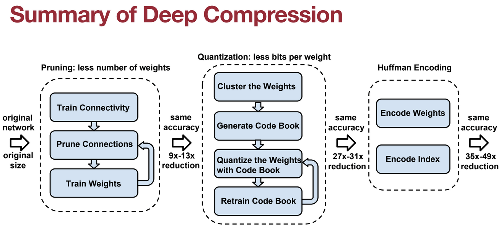

# K-Means-based Quantization

## Fine-tuning Quantized Weights

## Huffman Encoding
+ infrequent weights: use more bits to represent
+ frequent weights: use less bits to represent

> **K-Means-based Quantization** only saves storage cost, All the computation and memory access are still floating-point

# Summary of deep compression

# Linear Quantization
Linear Quantization is an affine mapping of integers to real numbers

$$
r=S(q-Z)\\
S=\frac{r_{\max}-r_{\min}}{q_{\max}-q_{\min}}\\
\\
r_{\min}=S(q_{\min}-Z) \\
Z={\rm{round}}(q_{\min}-\frac{r_{\min}}{S})
$$