## K-Means-based Quantization
将权重存储为

### Fine-tuning Quantized Weights

### Huffman Encoding
+ infrequent weights: use more bits to represent
+ frequent weights: use less bits to represent

> **K-Means-based Quantization** only saves storage cost, All the computation and memory access are still floating-point

## Summary of deep compression

## Linear Quantization
Linear Quantization is an affine mapping of integers to real numbers

+ 如何确定两个未知数Z和S？

    + 已知 $​r_{\min}$, $r_{\max}$​（原始数据）与 $​q_{\min}$, $q_{\max}$（量化数据）​，以及映射关系。

    + 可以得到 $​S=(r_{\max}​−r_{\min}​)/(q_{\max}​−q_{\min}​)$ 与 $​Z={\rm{round}}(q_{\min}​−r_{\min​}/S)$

    ??? example "计算Z和S"
         

    
    + 考虑下面的矩阵乘法 $​Y=WX$
    + 根据经验，缩放因子 ​$S_W​S_X​/S_Y$​ 总是在区间 (0,1) 内。
    + $​Z_W$​是中心对称分布的，因此可以认为是0，将 $​Z_W$​ 消去。

    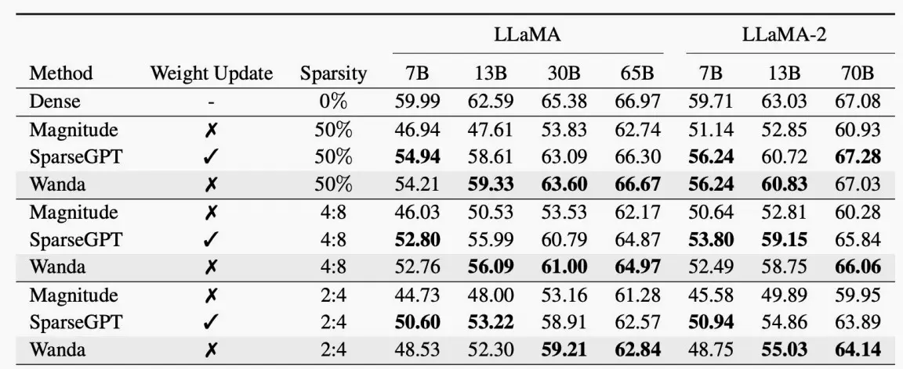

    + 对于带偏置的全连接层进行线性量化 $​Y=W_X+b$

        + 由于权重对称和偏置对称，为了简化式子同样可设 $​Z_W​=0$ 和 $​Z_b​=0$ ,并令 $​S_b​=S_W​S_X​$
        + 再令 $​q_{bias}​=q_b​−Z_X​q_W$

        
    
    + 对于卷积层中线性量化， $​Y={\rm{Conv}}(W,X)+b$ ，简化过程类似

        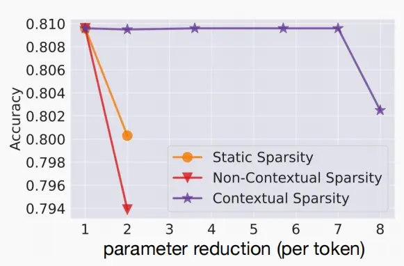

## Post-Training Quantization(PTQ)
### Quantization Granlularity 量化粒度
有以下量化粒度可选

+ Per-Tensor Quantization逐向量量化
+ Per-Channel Quantization逐通道量化
+ Group Quantization分组量化
    + Pre-Vector Quantization逐向量量化
    + Shared Micro-exponent (MX) data type共享微指数

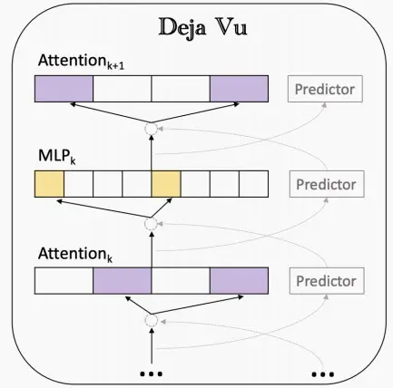

1. Per-Tensor Quantization逐张量量化

    + 张量量化中，取权重的最大绝对值为 $​|r|_{\max}​$， 因此 $​|r|_{\max}=W_{\max}​$​。
    
    + 对于整个张量使用同一个缩放因子S，对于大模型比较适用，但是对于小模型会精度下降。
    
    + 造成上述失败的原因通常是：不同输出通道的权重范围的大差异（超过100倍）。
    
    + 解决：使用逐通道量化Per-Channel Quantization，即每个通道使用单独的缩放因子。

2. Per-Channel Quantization逐通道量化

    + 每个通道使用单独的缩放因子。
    + 优点：相比于Per-Tensor Quantization更细粒度，量化误差更小，在视觉模型中表现出色。
    + 缺点：需要额外的内存来存储每个通道的缩放因子。

    （注意：下图中两个Quantization矩阵有一处不一样，因为缩放因子不一样。

    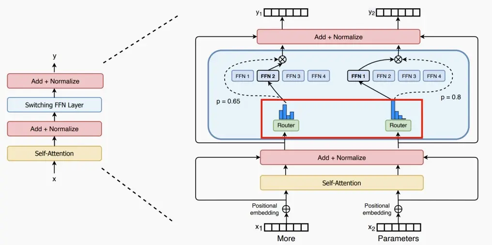

3. VS-Quant: Per-vector Scaled Quantization逐向量量化

    + 分组量化是更细粒度的量化，对同一个通道里每多少个元素分组做相同的量化处理。

    + 原方程 $​r=S(q−Z)$ 变为 $​r=\gamma∗S_q​(q−z)$

        ​$\gamma$ 是一个浮点数粗粒度缩放因子，一个张量（矩阵）共享一个 ​$\gamma$ ；
        ​$S_q$​ 是一个整数缩放因子，每个向量都有一个单独的 $​S_q$​。

    + 细粒度采用更便宜的整数缩放因子，而粗粒度使用更昂贵的浮点数缩放因子，以此实现精确率和硬件效率的平衡。

    + 例子：如何计算存储凯开销？
        
        给定一个4位量化，即每个量化数据元素有4位宽度。每16个元素为一组共享一个4位的缩放因子，则有效位宽度为 ​4+4/16=4.25 位。
    
    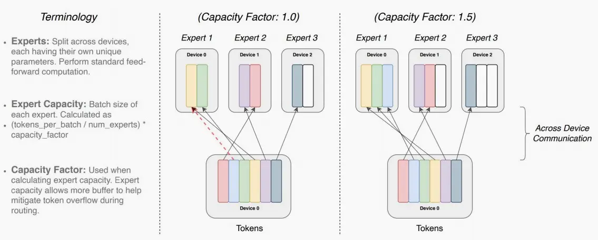

4. Shared Micro-exponent (MX) data type共享微指数

    + 微软使用MX Data Type用于分组量化，分为MX4、MX6和MX9三种，三者尾数位不同拥有不同的精度。
    + 如下图五种分组量化：
        + Per-Channel Quant：使用INT4编码量化后的权重；​L0 分组按通道分组且缩放因子用FP16编码。
        + VSQ：使用INT4编码量化后的权重；​L0 按每16个元素分组，使用UNIT4编码缩放因子；​L1按通道分组，使用FP16编码缩放因子。
        + MX：使用S1M2/S1M4/S1M7编码量化后的权重，其中S是符号位，M是尾数位；​L0 按每2个元素分组，使用E1M0分组；​L1按每16个元素分组，使用E8M0分组。
            + 注意 ​L0 和 ​L1 只有指数位，​L1 使用16位指数位拥有更高的动态范围。
            + MX后面的数字表示有效位宽，具体计算见下图。

    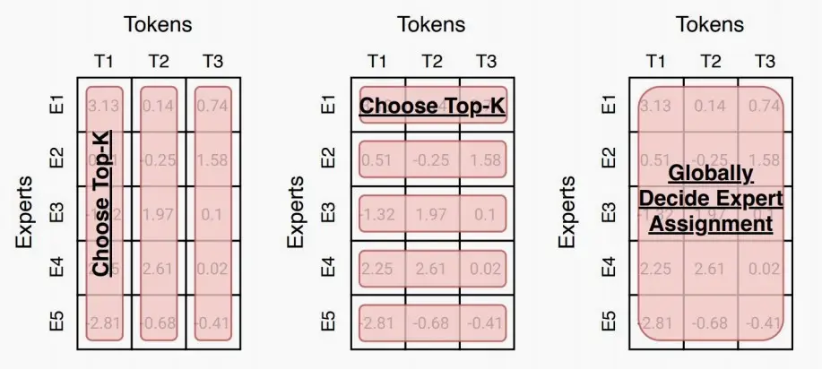

### Dynamic Range Clipping动态范围裁剪
+ 与权重不同，激活范围因输入而异。
+ 要确定浮点范围，将在部署模型之前收集激活统计信息。
+ 采用激活量化的时刻分为两种：
    + 类型一：训练期间
        + 在训练过程中跟踪指数移动平均值。
        + 例如：在每个epoch结束后，检查该特定批次的 ​$R_{\min}​$ 和 $​R_{\max}$​，按照下列公式进行更新。经过数千个epoch后变得范围稳定平滑。

        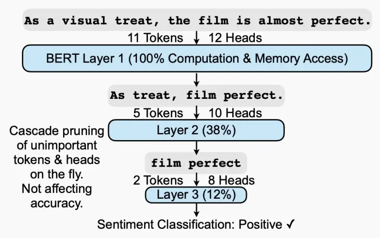

    + 类型二：在运行时

        + 使用少量校准数据集来确定R的最大值最小值，这种方式不需要大量的训练.
        + 第一种假设激活值遵循高斯或拉普拉斯函数分布规律。最小化均方误差 $​\min_{|r|_{\max}}​​E[(X−Q(X))^2]$。例如对于拉普拉斯 ​(0，b) 分布，最佳削波值可以数值求解为：设为 $​|r|_{\max}​=2.83b,3.89b,5.03b$ 以适配 ​2,3,4bits 的量化。

            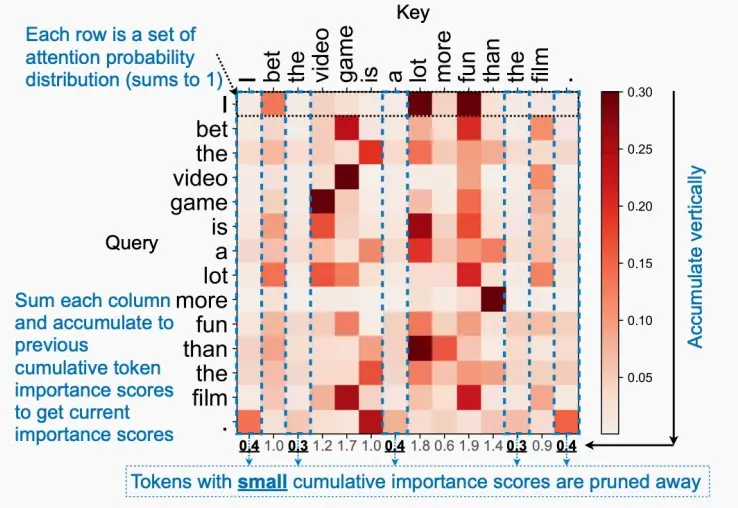

        + 第二种若激活值不遵循函数分布规律。为了最小化信息损失，可以利用KL散度，因为KL散度可以测量在近似给定编码时丢失的信息量，以此来确定最佳的剪枝位置。使用KL散度进行裁剪激活量化的效果如下图：

            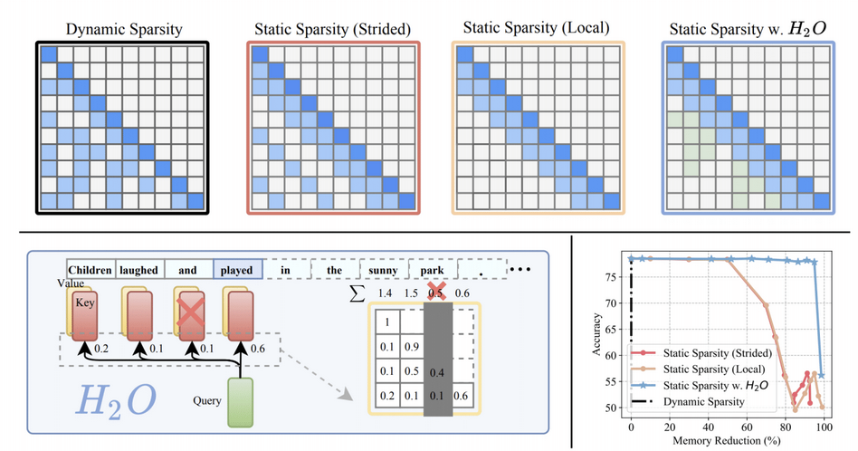

        + 第三种使用Newton-Raphson方法最小化均方误差。定义MSE为目标函数，迭代不同的裁剪力度，寻找最小的均方误差。可以看到图中，随着裁剪标量的增大，MSE先减后增。

            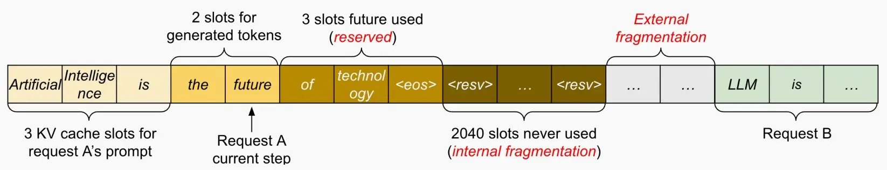

### Rounding舍入
+ 四舍五入(Rounding-to-nearest)
    + 权重是相互关联的。对每个权值四舍五入没有考虑其他张量，因此不是整个张量的最佳舍入

+ 自适应舍入(Adaptive Rounding)
    + 不同于四舍五入的$\lfloor w \rceil$，AdaRound学习从$\{ \lfloor w \rfloor,  \lceil w \rceil\}$​中进行选择，以得到最好的重建效果。
    + 采用一种基于学习的方法来寻找量化的值，$\tilde w=\lfloor\lfloor w \rfloor+\delta\rceil, \delta\in[0,1]$
    + 在自适应舍入中，不在意单个权重，通过权重输出的差异来衡量舍入的影响设计了以下方程：
        + 其中x是该层的输入，V是相同形状的随机变量。
        + h()是一个映射到(0,1)的函数，类似于sigmoid函数。
        + ​freg​(V) 是正则化项，鼓励 ​h(V) 二分，即鼓励 ​h(V) 输出0或1。

    $$
    \arg\min​_V||W_x−\lfloor\lfloor W\rfloor+h(V)\rceil x||^2_F​+\lambda f_{reg}​(V)
    $$

    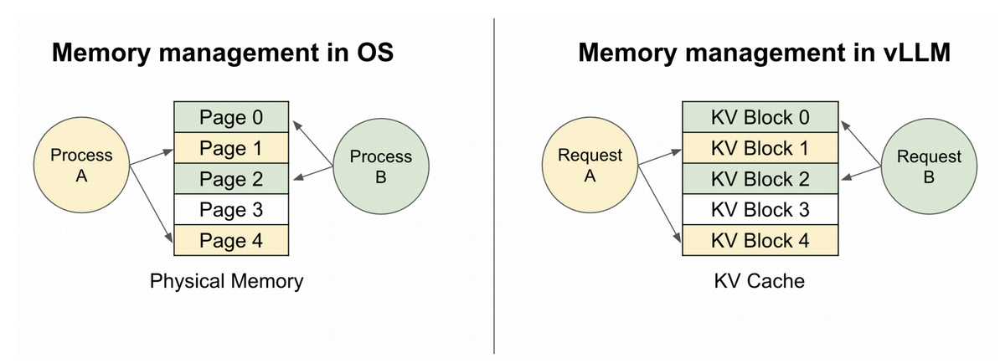

## Quantization-Aware Training (QAT)量化感知训练
+ 通常情况下，如果直接量化一个模型，其精度将会下降。QAT在训练过程中模拟量化的效果（伪量化因子），使得模型能够适应量化带来的信息损失，恢复精度损失。

+ 对预先训练的浮点模型进行微调比从头开始训练提供更好的精度。

> “又可称之为在线量化。QAT和PTQ最大的区别是QAT需要数据训练，可以理解为拿着训练好的模型又做了一次微调。而PTQ只是拿少量校准数据调整一些参数。PTQ的优点就是很快，缺点就是还是有一些精度损失，效果不如QAT算法。为了降低量化后准确率的损失，不少方法会在训练时引入量化操作，让量化之后的权重和激活值去参与网络的训练，这种方式称之为量化感知训练即QAT。”

+ 模拟量化：在模型的前向传播过程中，将权重和激活值通过量化和反量化的过程，模拟量化在实际部署中的效果，即权重和激活值先被量化到低位宽的整数表示，然后再被反量化回浮点数。在前向传播时权重会被量化为8位整数，但在反向传播时仍然使用原始的浮点数进行梯度计算，使得模型在训练过程中**“感知”到量化**所带来的误差。
    
+ 反向传播调整：在反向传播过程中，假量化节点会计算量化误差，并将其纳入到梯度计算中。这样，模型的权重会逐渐调整，以适应量化后的表现。

### Straight-Through Estimator (STE)

+ 在神经网络训练中，反向传播算法依赖于链式法则，需要对损失函数相对于每一层参数进行梯度计算。然而，量化函数通常是不可微的（例如取整函数），这就使得直接计算梯度变得困难。因此，STE 被引入来解决这个问题。
+ STE 的核心思想：在前向传播过程中使用实际的量化函数，而在反向传播过程中，通过一种近似方法来计算梯度，从而使训练过程能够顺利进行。
+ 在反向传播过程中，STE 近似地将量化函数的梯度视为恒等函数的梯度（原本量化函数的梯度应该是恒为0）。这意味着，虽然前向传播使用了量化函数，但在反向传播时，我们假设量化函数对输入的梯度为1。

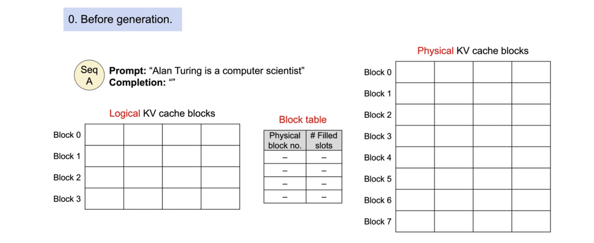

$$
g_w=\frac{\partial L}{\partial W}=\frac{\partial L}{\partial Q(W)}\cdot\frac{\partial Q(W)}{\partial W}=\frac{\partial L}{\partial Q(W)}
$$

如下图，经过QAT后准确率提升效果显著。尤其是对于Per-Tensor经过QAT后准确率从0.1%提升至70%。

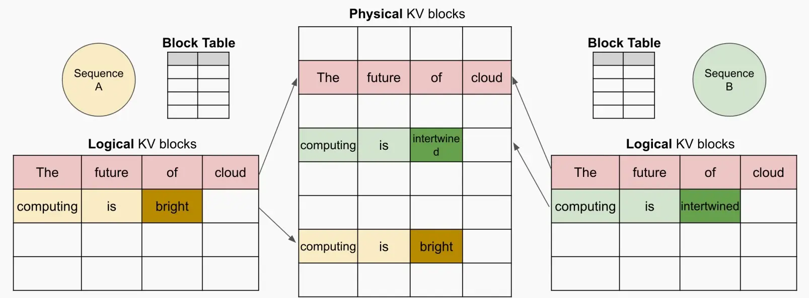