## TinyML
### TinyML的挑战
+ 权重和激活在内存方面的约束条件是什么？
    + 输入激活和输出激活，我们必须将其存储在可读写的内存（SRAM）中
    + 但对于核和权重，我们可以将它们存储在闪存中（也可以在DRAM，但是微控制器通常没有DRAM）

        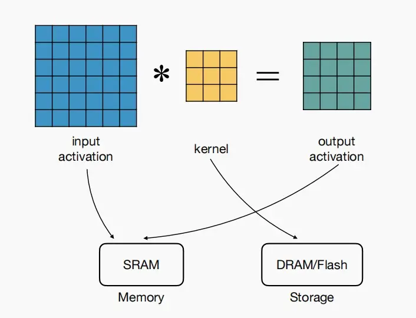

+ Flash用途
    + =模型大小
    + 静态的，需要保持整个模型
+ SRAM用途
    + =输入激活+输出激活
    + 动态的，每一层大小都不同
    + 由于每一层都需要计算新的激活值，因此关注峰值SRAM
    + 权重不计算，因为它们可以部分存取
+ 因此，我们不仅希望减小模型大小，也希望减小激活大小。
    + 两者并不是同一个问题，如图中模型大小减小4.6×，但是激活大小反而增加了1.8×
    + 本lecture即将介绍的MCUNet不仅减少模型大小，而且减少激活大小。

    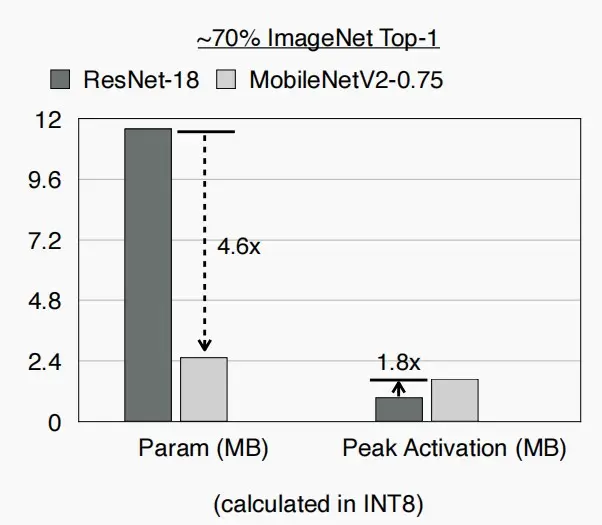

### 微型神经网络设计
#### MCUNet: System-Algorithm Co-design
+ 三个研究方向
    1. 在给定的推理库基础上，目标寻找能够快速运行的最佳模型架构(NAS)。
    2. 针对给定神经网络，目标开发设计推理库与推理引擎。
    3. 神经架构搜索和推理引擎共同设计。
        + 神经架构搜索为推理引擎提供高效的神经架构。
        + 推理引擎为神经架构搜索提供非常高效的编译器与运行时环境，以支持这些高效模型的运行。

    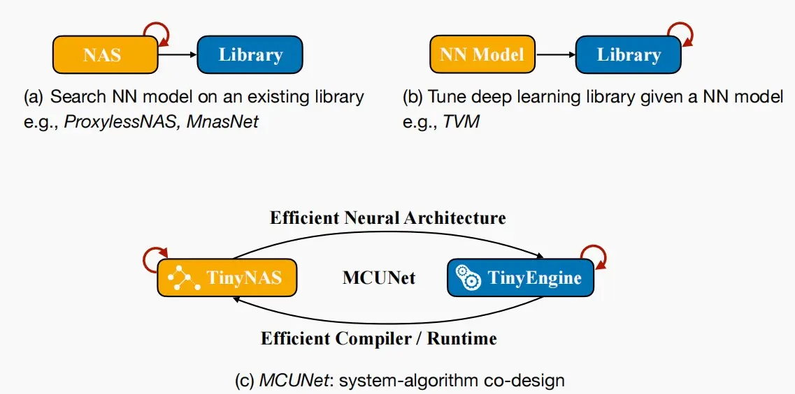

#### TinyNAS: Two-Stage NAS for Tiny Memory Constraints
+ 问题：什么是正确的搜索空间？
    + 搜索空间的质量在很大程度上决定了搜索模型的性能。在完整的网络空间中，可能存在多个更优的子空间。
    1. 选项1：重复利用曾经为移动AI（例：MobileNet、MnasNet）精心设计的搜索空间。
        + 搜索空间中最小的子网络由于巨大的差距而无法适应硬件。
    2. 选项2：为物联网设备选择一个搜索空间（更明智的选择）

+ 问题：如何扩展类似于MBNet-alike的搜索空间？

    + 我们可以通过使用不同的width multiplier宽度因子W和resolution multiplier分辨率因子R来缩放类似mbnet的搜索空间。
        + width multiplier主要是按比例减少输入输出通道数，resolution multiplier主要是按比例降低特征图的大小。来自[Efficient Convolutional Neural Networks for Mobile Vision Applications](https://arxiv.org/abs/1704.04861)
        + 一个特定的R和W会得到一个子搜索空间。
        + 例如：智能手机适合R=224,W=1.0；GPUs适合R=224,W=1.4。

## TinyEngine
### Introduction to Edge AI
+ 边缘设备在我们的日常生活中是无处不在的和功率广泛的应用：智能手机、机器人、车辆、办公设备、无线电收发器、自动售货机及家庭电器等。
+ 从云计算到边缘计算，这一转变凸显了资源有限的挑战。如下图对比了云计算与边缘计算常见设备的资源量。

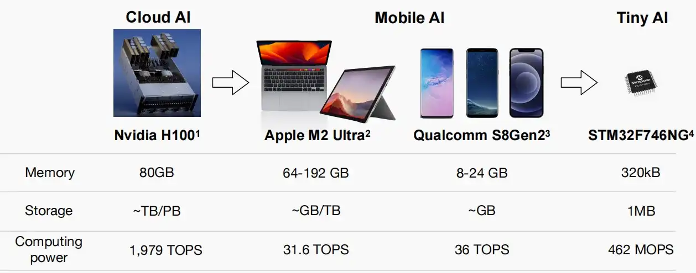

### Parallel computing techniques
+ 并行计算技术有利于边缘设备利用有限的资源进行机器学习。
    + 并行计算技术不仅有助于小型机器学习，也有助于大型机器学习。对于大型机器学习模型，我们有许多空间在不同维度上并行化计算。
    + 并行计算技术对于推理和训练都很重要。

+ 第二章将介绍四种广泛应用于小型和大型机器学习的并行计算技术
    + Loop optimization循环优化
    + SIMD(single instruction, multiple data) programming
    + Multithreading多线程
    + CUDA programming

#### Loop optimization
+ Loop optimization主要涵盖以下三个子概念
    + Loop reordering循环重排
    + Loop tiling循环整理
    + Loop unrolling循环展开

##### Loop reordering循环重排
+ 定义：通过重新排序循环的序列来优化局部性。
+ 局部性：在操作系统课程中，我们知道系统会将最近访问的块从磁盘装入主存中，以便下一次快速读取，而数组中相邻的数往往存储在同一个块中，一起被装入主存。
+ 对于机器学习中，存在大量卷积和矩阵乘法，都涉及到张量的运算。因此考虑循环中的局部性影响，有利于优化运行速度和开销。
+ 如下图中，对于矩阵乘法 $C=A*B$，有两种循环方式 $(i,j,k)$ 和 $(i,k,j)$，明显后者的局部性更好。
    + 对于 $(i,j,k)$ 的循环方式，矩阵B局部性较差，每一次访问几乎都会导致缺页中断，降低运行速度。
    + 对于 $(i,k,j)$ 的循环方式，矩阵A和B的局部性都很好，但是矩阵C的局部性相对较差，但是仍是一行一行访问，权衡之下局部性更好。

        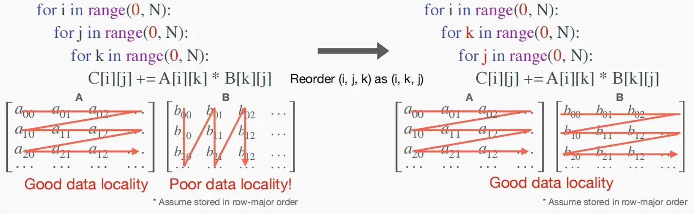

    + 从实验数据可以看出，改进后的运行时间从24296ms降低至1979ms。可见Loop reordering对程序局部性的提升效果显著。

        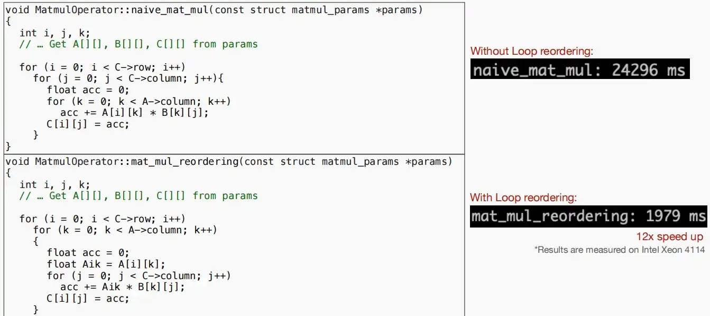

##### Loop tiling循环整理
+ 定义：通过划分循环的迭代空间来减少内存访问。
+ 如果数据比缓存大小大很多会怎么样？
    + 缓存中的数据被再次使用前被释放，导致缺页中断次数增加。
+ Loop tiling循环整理如何减小缺页中断
    + 分区循环迭代空间
    + 使得循环中的访存数据适应缓存大小
    + 确保数据在被再次使用前留在缓存中

+ 如下三张图，对 $(i,k,j)$ 依次循环进一步优化，依次对 $(j,k,i)$ 进行分块处理，划分为大小为 $TILE\_SIZE$ 的块，使得每次访问的大小满足小于缓存大小，减少缺页中断。
    + 对j进行分块处理，划分为每次遍历大小为 $TILE\_SIZE$，则矩阵B每次访问的大小从N2变为 $N*TILE\_SIZE$
    + 对k也进行分块处理。则矩阵B每次访问的大小变为 $TILE\_SIZE2$，矩阵A每次访问的大小变为 $N*TILE\_SIZE$
    + 对i进行分块处理，则矩阵A每次访问的大小变为 $TILE\_SIZE2$，且矩阵C每次访问的大小也变为 $TILE\_SIZE2$。

        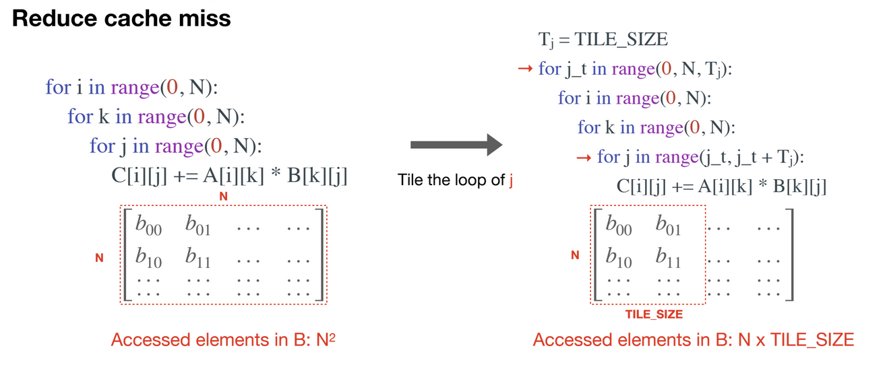

        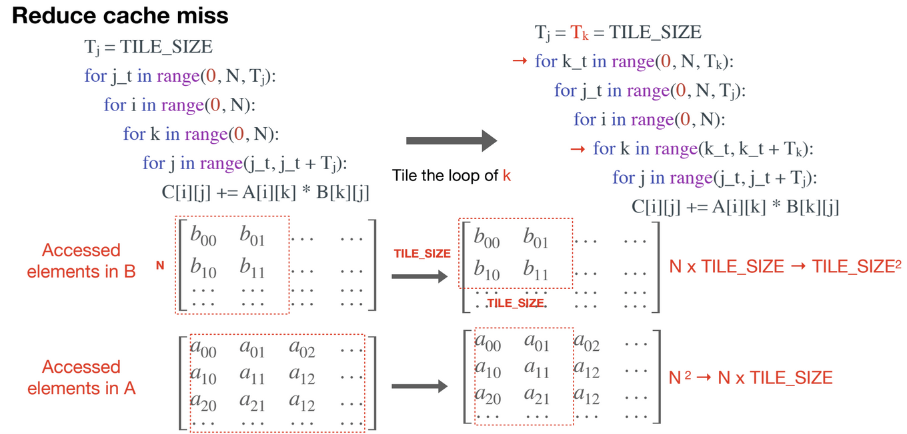

        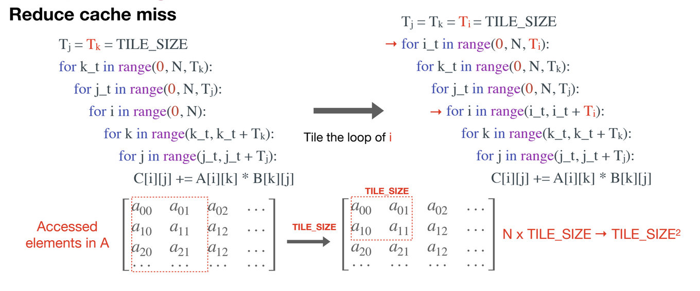

        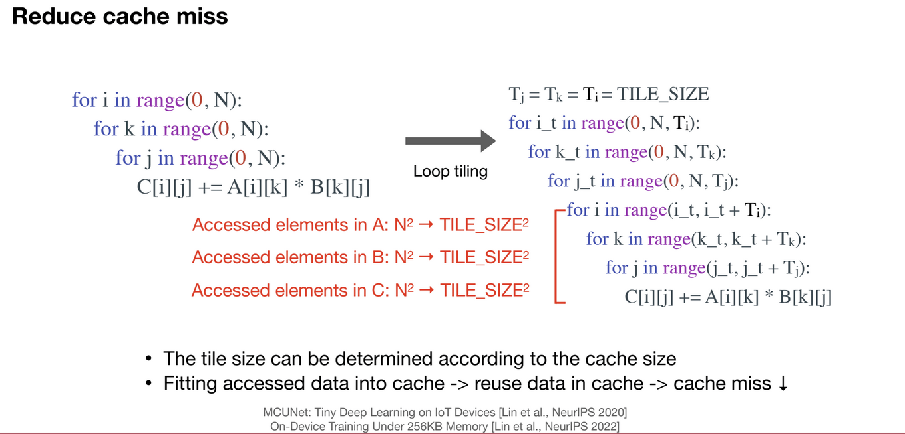
        
    + $TILE\_SIZE$ 的大小可以根据高速缓存的大小来确定。
    + 每次访问的数据大小适配缓存大小->重用缓存中的数据数增加->缓存缺失数下降。

+ Multilevel tiling

对于存在多级缓存的平台，还可以进一步考虑各级缓存的大小，例如下图中进一步划分j，使得最小的三个循环即每次访问的数据大小等于L1 Cache，最小的四个循环访问数据大小等于L2 Cache。

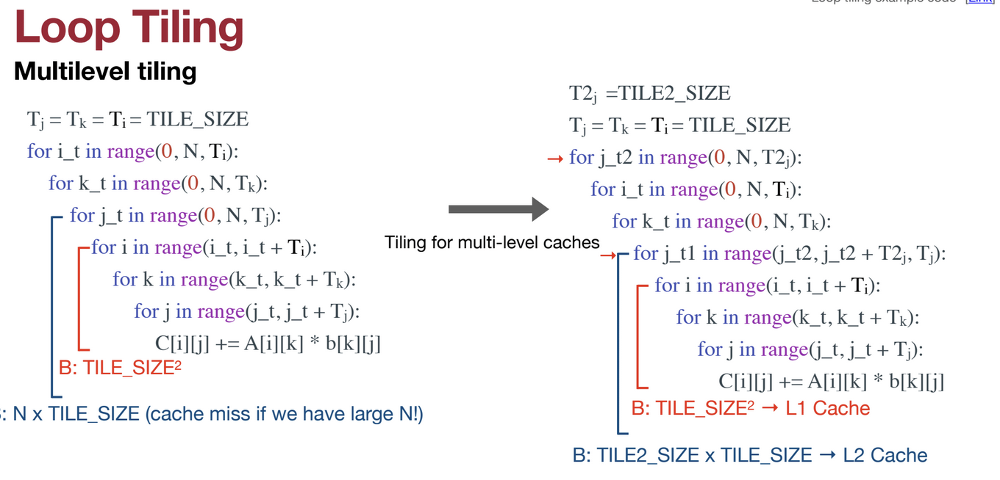

如下图通过六个循环进行循环整理后，运行时间从24296ms降低到1269ms。

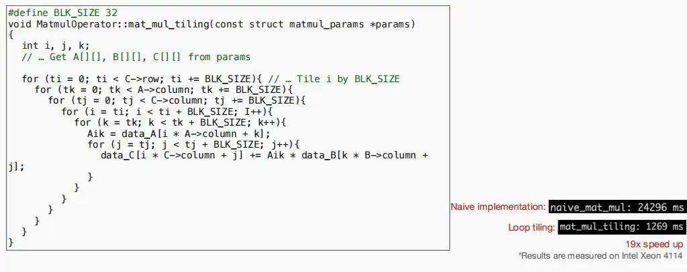

##### Loop unrolling循环展开
+ 定义：以牺牲其二进制文件的大小为代价来减少分支开销。
+ 循环控制造成的开销
    + 指针的算术操作
    + 循环结束条件测试
    + 分支预测
+ 通过循环展开减小的开销
    + 每次重复循环体
    + 权衡二进制大小和减小的开销

+ 如图，对原循环进行改进，每一次循环执行四个步长的k
    + 对指针的算术操作：$N^3−>1/4N^3$
    + 循环结束条件测试：$N^3−>1/4N^3$
    + 最内部循环的代码大小：$1\rightarrow4$

#### SIMD programming
+ 定义：对多个数据点同时执行相同的操作。通过将同一指令应用于多个数据，使得它们相互同步，避免控制开销和指令开销。
+ 关键特点
    + 向量寄存器：可以保存和处理多个数据元素的专用寄存器。
    + 向量操作：用于整个向量的算术和逻辑运算。
+ 优点
    + 提高计算吞吐量和速度
    + 提高能效

??? example "Intel的SSE指令集 & ARM的Neon指令集"

    + SSE和Neon都是SIMD类型的指令集，它们都有类似指令可以一次性处理四个32位操作数的运算。
    + SSE
        + `_mm_load_ps`、`_mm_mul_ps`：mm代表多媒体，load代表加载到寄存器，ps代表压缩单精度。
    + Neon
        + `vld1q_f32`、`vmulq_f32`：v代表向量、ld表示load，mul表示乘法，1表示向量数，q表示quadword四字。

    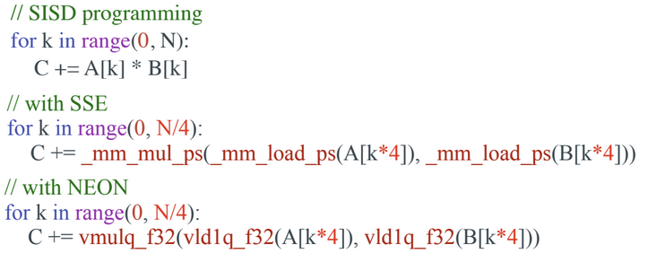

    ----

    + 下图是使用SSE和Neon指令进行矩阵乘法的示例代码，需要注意的是transpose_tmp是矩阵B的转置，以实现loop reordering的同样效果。

    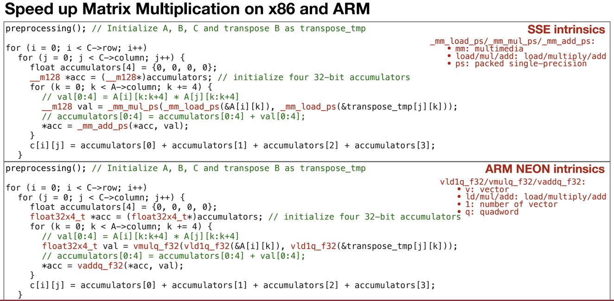

#### Multithreading
+ 定义：多线程是指在单个进程中并发执行多个线程。
+ 线程
    + 最小的执行单元是线程，最小的资源分配单元是进程，线程共享进程中的资源。
    + 线程共享相同的内存空间和资源，但它们有自己的堆栈和程序计数器。
    + 不同的线程可以在不同的CPU核心上运行，从而提高性能并允许并行性

+ 多线程的优点
    + 改进的性能：多个线程可以同时执行任务，提高总体程序速度。
    + 响应性：一个程序可以对用户的输入保持响应而不受阻塞。
    + 资源利用率：线程可以共享资源，减少了创建多个进程的开销。
    + 简化的程序结构：多线程可以帮助将复杂的问题分解为更简单、更小的任务。

+ 介绍两种实用的用于编写多线程程序的库-Pthreads和OpenMP
+ 使用多线程时加速矩阵乘法，需要将矩阵分割成若干部分，每个线程负责其中一部分。通常按照行分割矩阵A，减少线程间通信，使其工作相互独立。

+ 如下图，通过Pthreads库来设计多线程，加速矩阵乘法的代码示例。优化后运行时间从24296ms降低到5864ms。
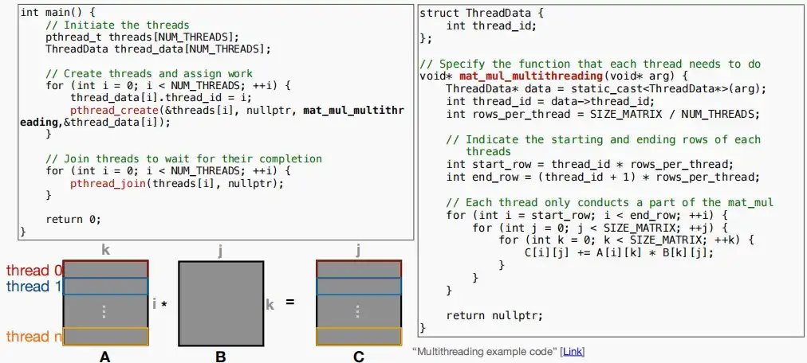

+ OpenMP
    + 特点
        + 一个共享内存的并行编程模型
        + 适用于C,C++,Fortran
        + 可跨不同平台和操作系统
        + 易于与现有代码集成
        + 适用于各种处理器
    + 如下图，通过OpenMP库来设计多线程，加速矩阵乘法的代码示例，相比于Pthreads代码更加简洁，仅需两行即可实现并行。

        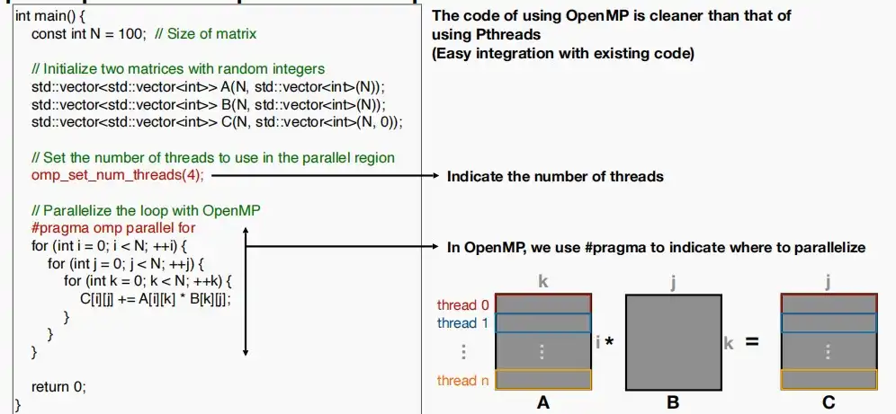

#### CUDA programming
+ 定义：使用gpu来加速计算。
+ 介绍
    + 图形处理单元（GPU）提供了更高的指令吞吐量和内存带宽。
    + CUDA是由英伟达在2006年推出的，作为一个通用的并行计算平台和编程模型，它利用了Nvidia gpu中的并行计算引擎。
    + CUDA类似C语言，用来表示使用计算模式的硬件接口在gpu上运行的程序。
+ 如图为CUDA线程的层次结构
    + 绿色的为线程块，大小为2×3；橙色的为其中一个线程块中的线程，大小为3×4。因此总共有72个cuda线程。

    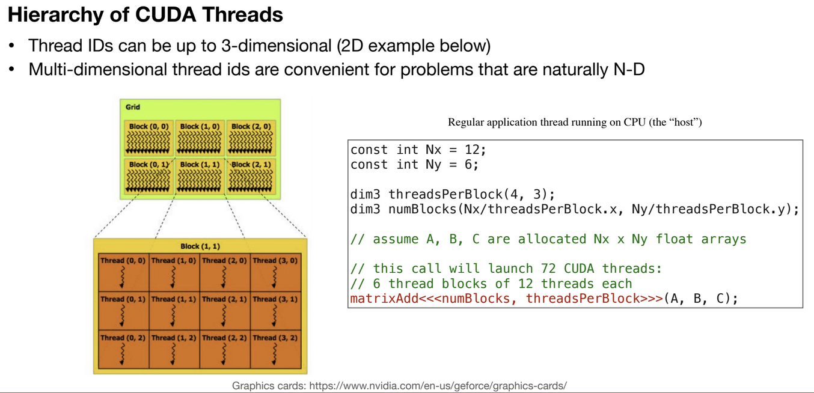

+ 如下图是CUDA编程示例代码
    + 上方代码为主机代码，在CPU上串行执行。负责为矩阵ABC分配内存，并启动CUDA线程。
    + 下方代码为CUDA内核代码，在GPU上执并行执行。每个线程从其在块中的位置（threadIdx）和其块在网格中的位置（blockIdx）计算其整体网格线程id。

    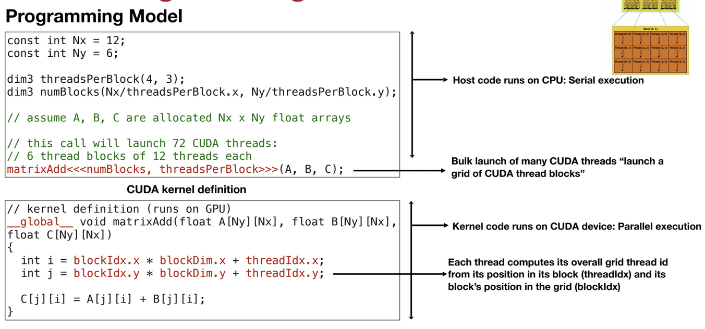

+ 先前我们假设矩阵ABC均已分配，现在重新来了解它们的分配方式。
    + CUDA编程中有两个地址，一个是主机地址即CPU内存地址空间，另一个是设备内存地址。数据可以在两个地址空间内移动，但我们希望尽量减少移动。注意，我们无法从主机CPU代码段访问GPU内存。
    + 下图代码中

        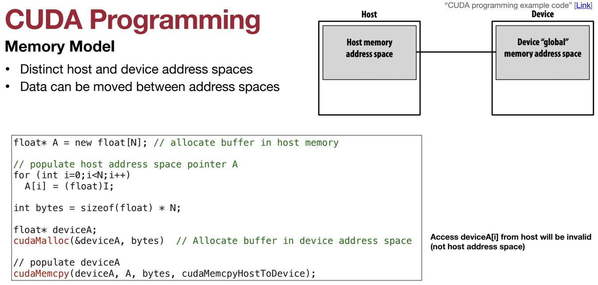

        + `A[i] = (float)I;`是填充主机地址空间指针A。
        + `cudaMalloc(&deviceA, bytes);`是在设备GPU地址空间中分配缓冲区。
        + `cudaMemcpy(deviceA, A, bytes, cudaMemcpyHostToDevice);`是将数据从CPU复制到GPU。

+ 对内核可见的三种不同类型的地址空间
    + 私有内存（每个线程）、共享内存（每个块）、全局内存
        + 私有内存访存最快，空间最小；全局内存访存最慢，空间最大。
    + 不同的地址空间->不同的位置->不同的负载/存储开销

+ 如下图，使用CUDA算法加速矩阵乘法，原运行时间24296ms，优化后在GPU运行时间258ms，CUDA内核运行时间6.796ms。
    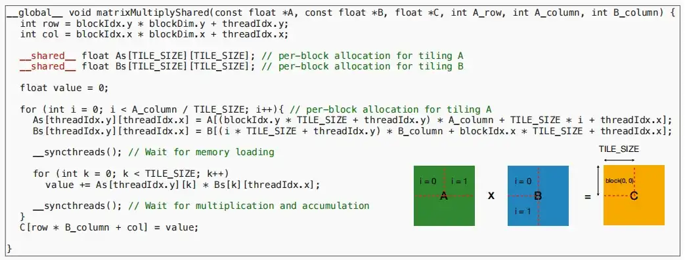

### Inference optimizations
+ 推理优化目的：提高计算速度，减少内存使用
+ 本章介绍以下四种技术：
    + pics/tinyml/image to Column (Im2col) convolution
    + In-place depth-wise convolution
    + NHWC for point-wise convolution, and NCHW for depth-wise convolution
    + Winograd convolution

#### pics/tinyml/image to Column (Im2col) convolution
+ 定义：重新排列输入数据以直接利用矩阵乘法核。
+ Im2col是一种通过广义矩阵乘法（GEMM）实现卷积的技术。
+ 下图是原本的卷积操作

    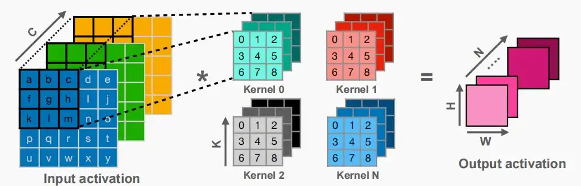

+ 利用Im2col技术将输入和内核都变化为矩阵，实际上就是将每次参与运算的两个矩阵展开成一个一维的向量，两个矩阵的乘法变成一维向量的点积，则整个输入和内核的卷积变成两个矩阵的乘法，类似于降维。参考im2col可以更好理解。

    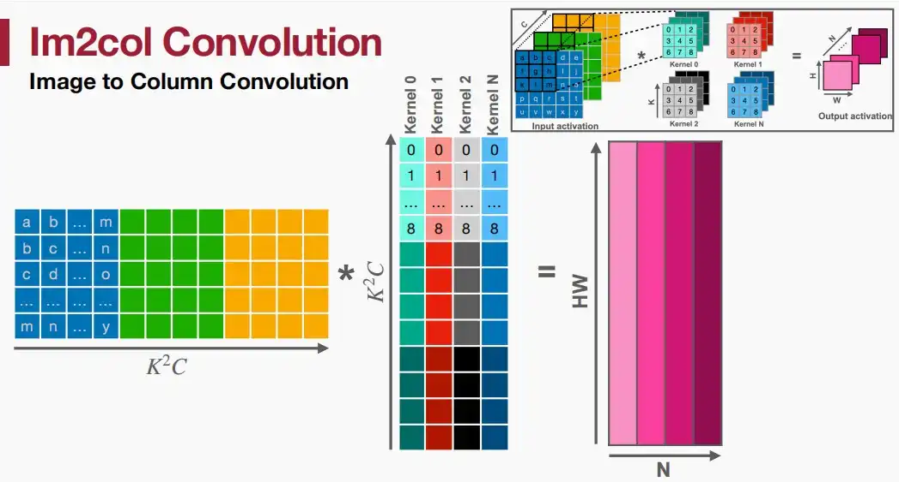

+ 优点：利用经过良好优化的GEMM进行卷积。
+ 缺点：增加额外的内存使用（从上图也可以看出，输入激活的大小明显增大，大约2/3的内存重复），隐式GEMM可以解决额外的内存使用问题。

#### In-place depth-wise convolution
+ 定义：重用输入缓冲区写入输出数据，以减少峰值SRAM内存。
+ 许多流行的神经网络模型，如MobileNetV2，都具有深度卷积的“反向残差块”，减少了模型大小和FLOPs，但显著增加了峰值内存。
+ 为了减少深度卷积的峰值内存，我们使用了带有临时缓冲区的“就位”更新策略。

    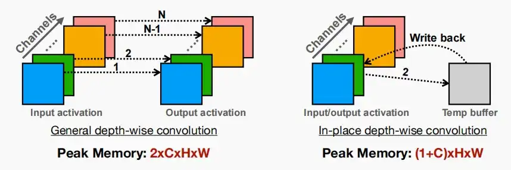

#### How to Choose the Appropriate Data Layout (NCHW/NHWC)
+ 针对不同类型的卷积，利用适当的数据布局。
+ Use NHWC for Point-wise Convolution
    + 一般来说，由于有更多的顺序访问，NHWC比NCHW在point-wise卷积方面具有更好的局部性。
    + 如下图右框中的权重数据访问顺序，NHWC和NCHW具有不同的存储顺序，对于point-wise卷积显然NHWC连续访问更好。

        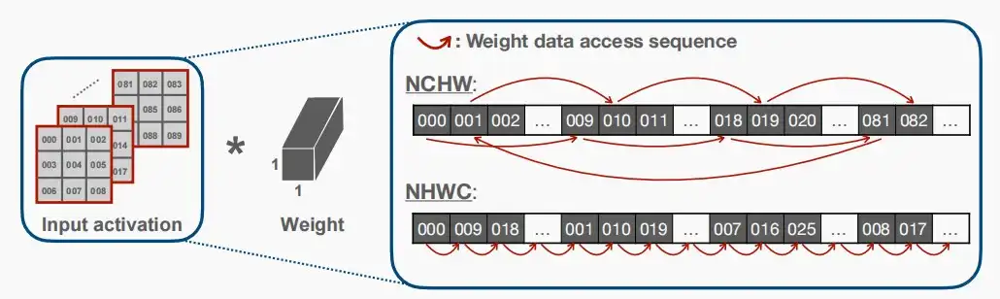

+ Use NCHW for Depth-wise Convolution
    + 我们将访问激活，并在NCHW序列中进行深度卷积。
    + 由于有更多的顺序访问，NCHW在深度卷积方面比NHWC具有更好的局部性。

        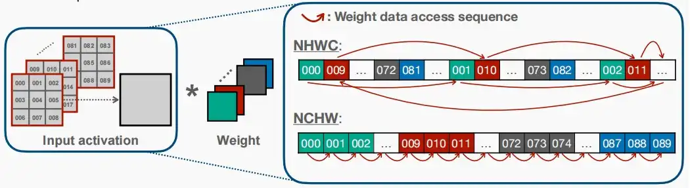

#### Winograd convolution
+ Direct convolution need 9xCx4 MACs for 4 outputs

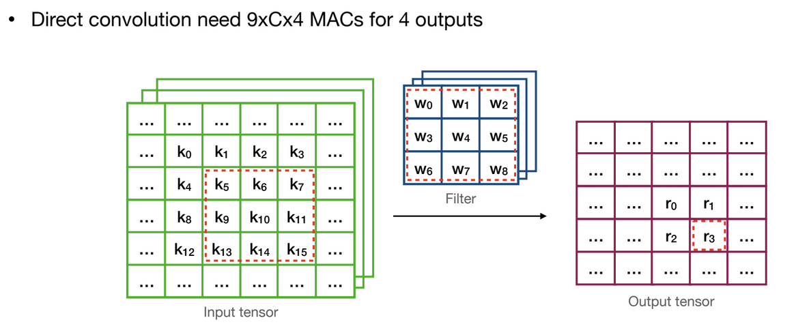

+ Winograd convolution need only 16xC MACs for 4 outputs -> 2.25x fewer MACs

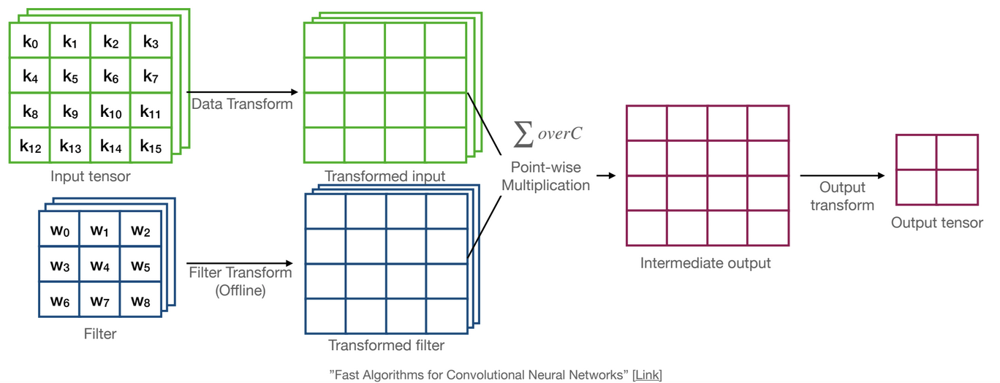

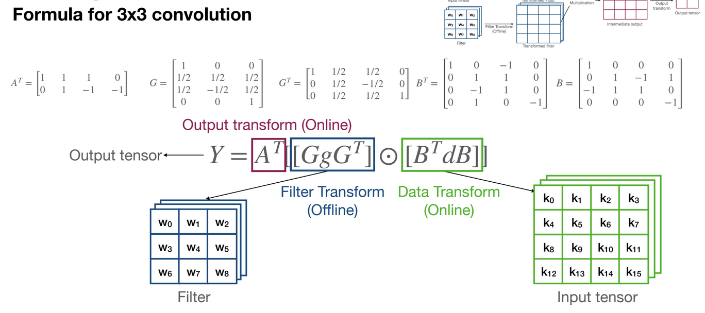