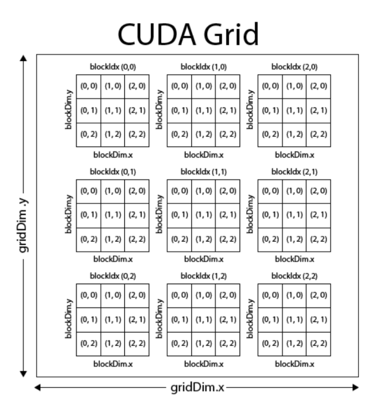
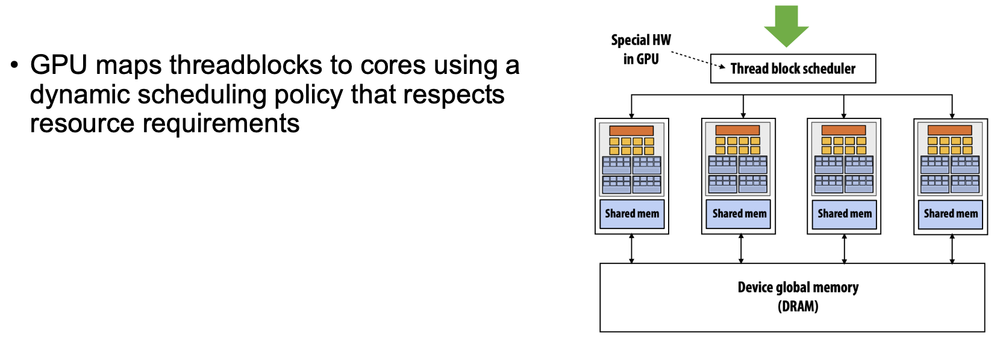
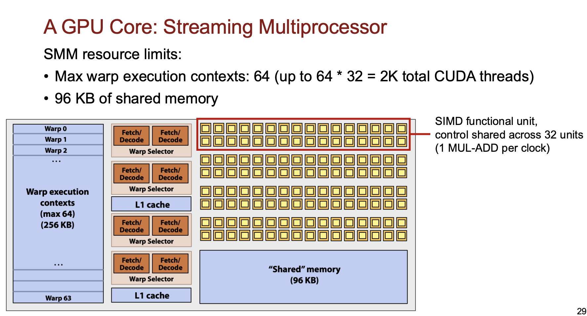
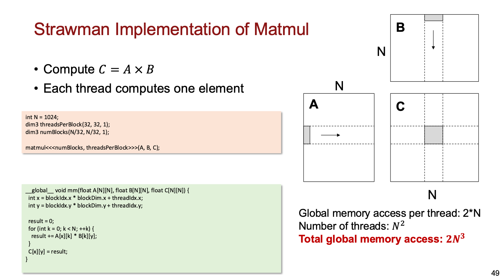
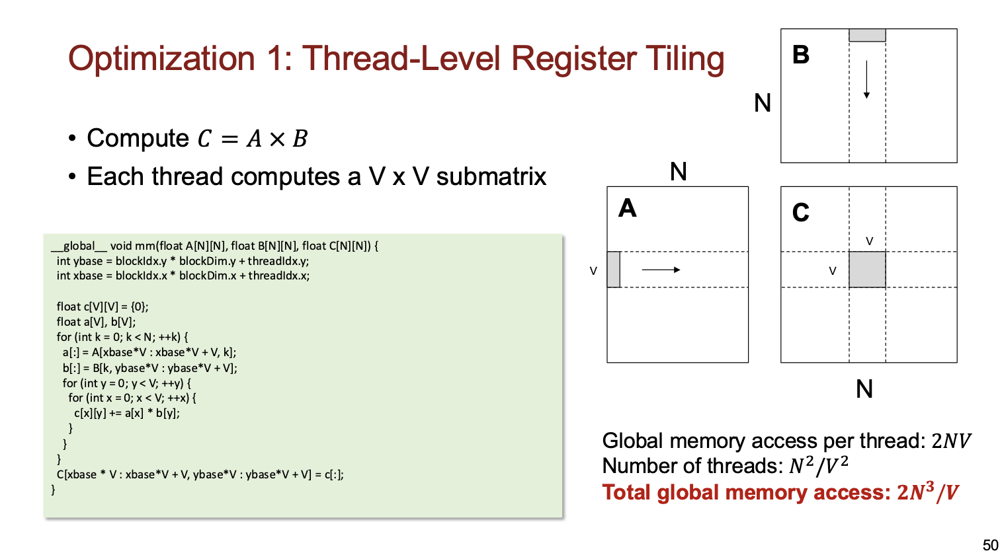
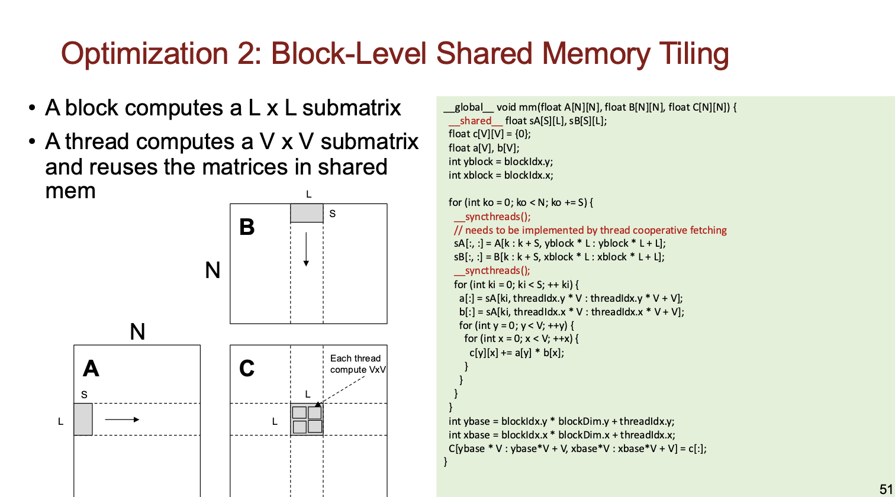
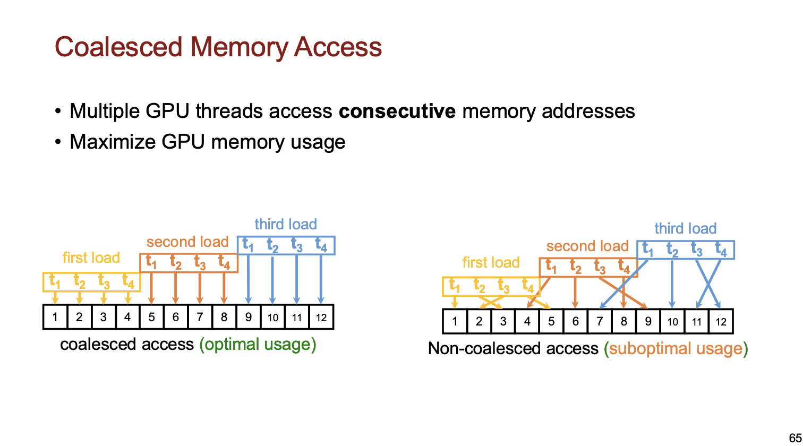

## Grid, Block, and Thread

each block has shared memory for all threads within the block.

each thread has its own private memory.

## CUDA Thread Block Scheduling
+ one block is mapped to one SMM core (streaming multiprocessor core)

### warp
+ warp is the execution context storage for CUDA threads.
+ a warp consists of 32 threads, each thread is an instruction bank.

## Matrix Multiplication in CUDA

## Parallel Reduction in CUDA

sequential addressing > interleaved addressing