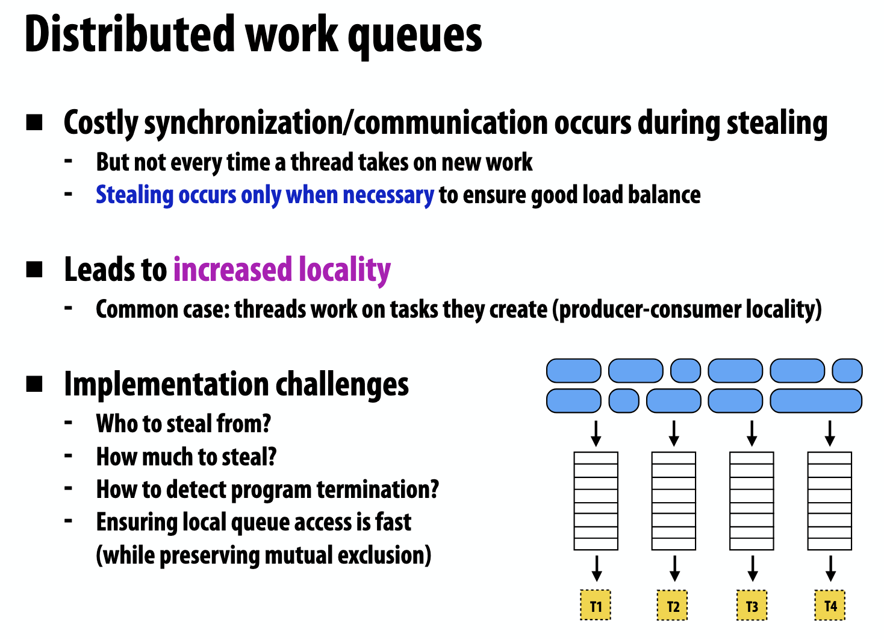
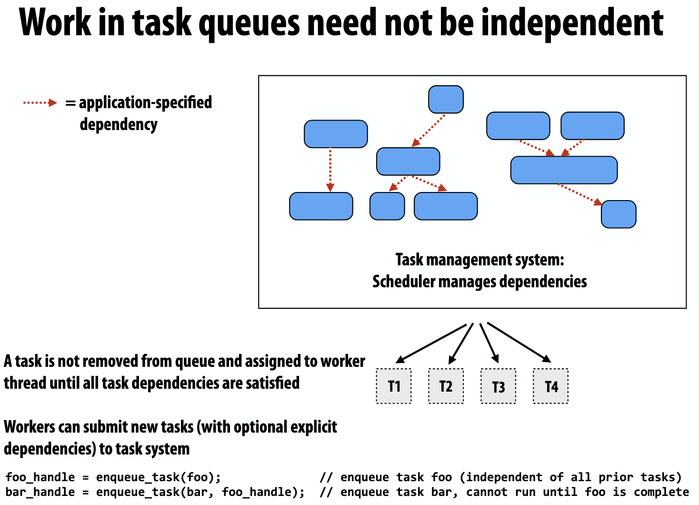
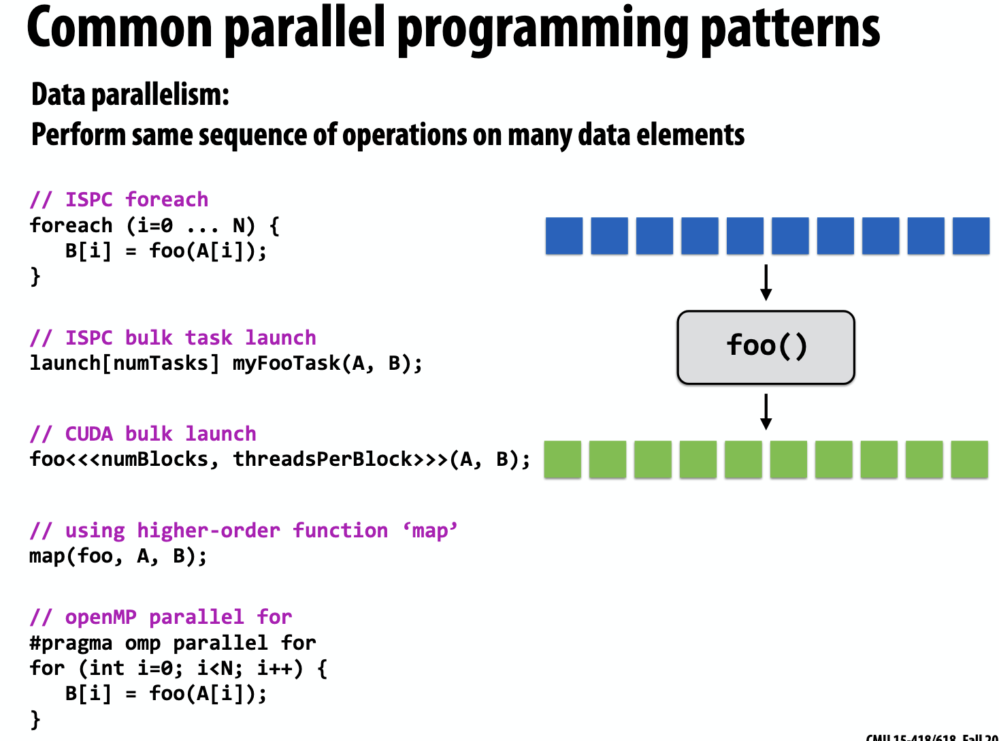
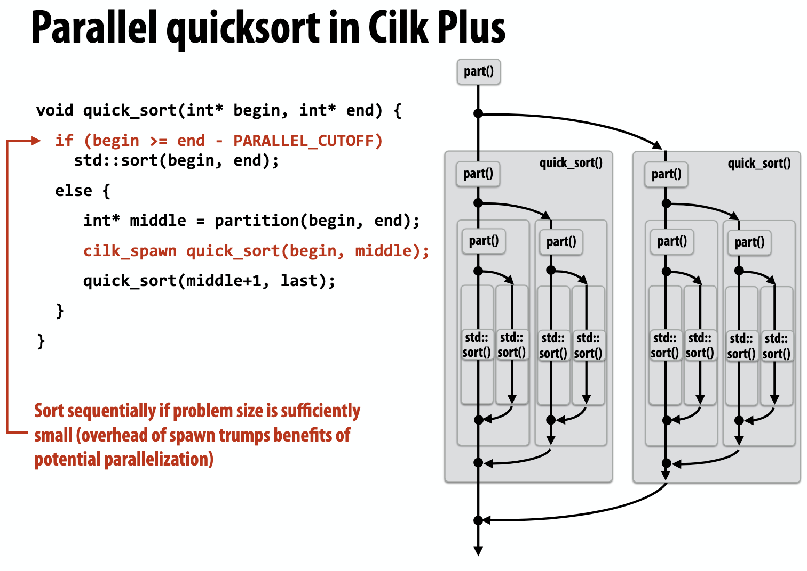
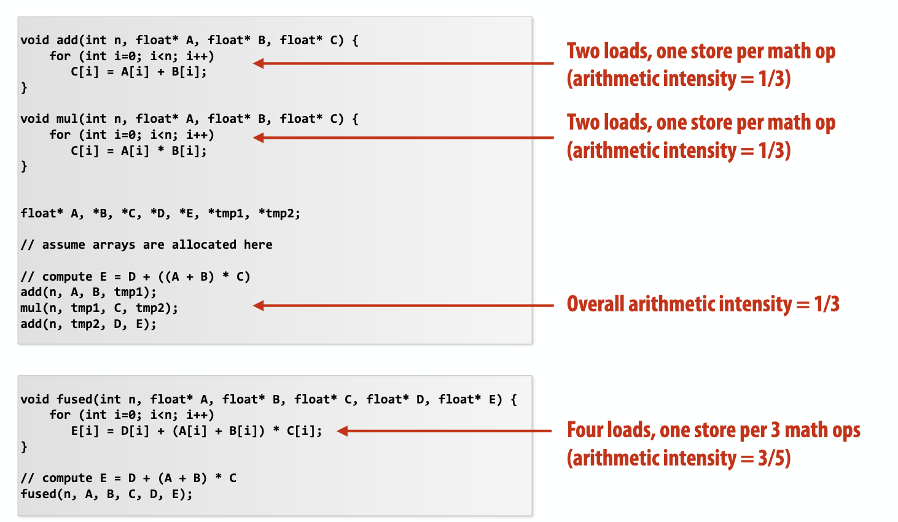

# Performance Optimization 
## Balance workloads
### assignment of work
+ static assignment
+ dynamic assignment
### work granularity
+ small work granularity 
+ large work granularity
### Smarter task scheduling
+ Distributed work queues

    

    

## Scheduling fork-join parallelism
### common programming patterns

### Cilk Plus

`cilk_spawn`创建新的 independent work，并将其放入 thread0 的 queue 中，而非创建新的 thread；其他 thread 可以从 queue0 中 steal work

于是问题来了，thread0 是先运行 spawned child 还是 spawn 后面的 continuation 呢

+ child first , stealing continuation

+ continuation first, steal child

## Techniques for reducing communication
+ Improving temporal locality by changing grid traversal order

+ Improving temporal locality by fusing loops

    

+ Contention

    Replicate contended resources (e.g., local copies, fine-grained locks)
    Stagger access to contended resources