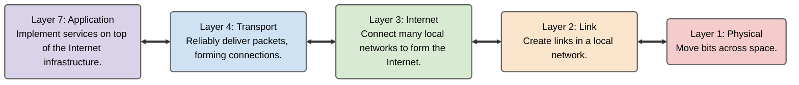

```mermaid
flowchart LR
    %% 使用内联 HTML 强制文字为黑色，并用 <br> 换行
    L7("<span style='color:#000 !important;'>Layer 7: Application<br>Implement services on top of the Internet infrastructure.</span>")
    L4("<span style='color:#000 !important;'>Layer 4: Transport<br>Reliably deliver packets, forming connections.</span>")
    L3("<span style='color:#000 !important;'>Layer 3: Internet<br>Connect many local networks to form the Internet.</span>")
    L2("<span style='color:#000 !important;'>Layer 2: Link<br>Create links in a local network.</span>")
    L1("<span style='color:#000 !important;'>Layer 1: Physical<br>Move bits across space.</span>")

    %% 保留您原本的上下层级双向加粗箭头
    L7 <==> L4
    L4 <==> L3
    L3 <==> L2
    L2 <==> L1

    %% 使用 style 直接控制每个框的背景色和边框
    style L7 fill:#d9d2e9,stroke:#666,stroke-width:2px
    style L4 fill:#cfe2f3,stroke:#666,stroke-width:2px
    style L3 fill:#d9ead3,stroke:#666,stroke-width:2px
    style L2 fill:#fce5cd,stroke:#666,stroke-width:2px
    style L1 fill:#f4cccc,stroke:#666,stroke-width:2px
```
