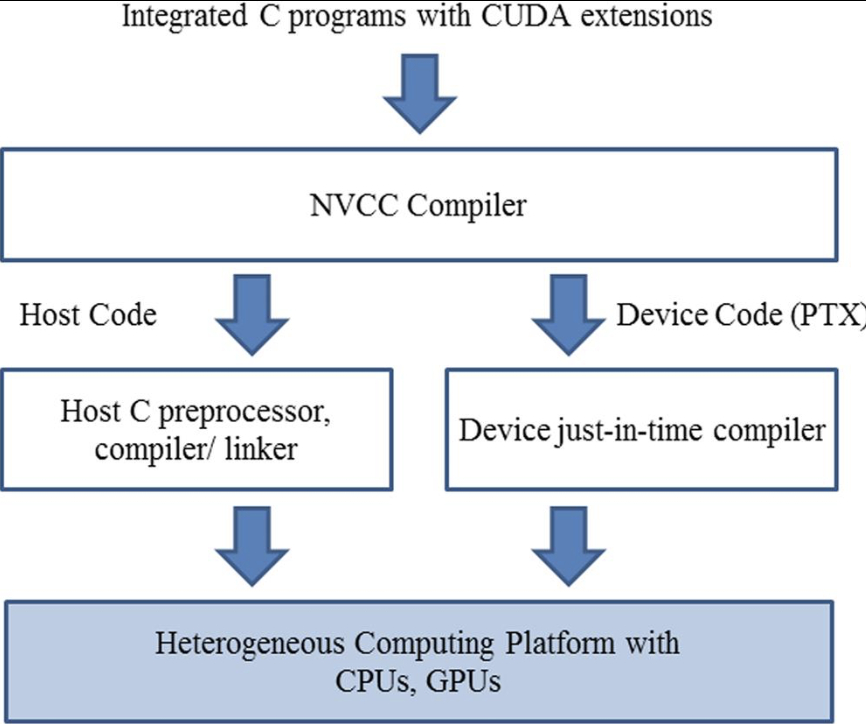

## Chapter1
由于硬件支持，cuda threads 的生成和调度开销很小，通常只需几个时钟周期；相比之下，传统的 cpu threads 则需要上千个时钟周期生成和调度

CUDA programmers can assume that these threads take very few clock cycles to generate and schedule, owing to efficient hardware support. This assumption contrasts with traditional CPU threads, which typically take thousands of clock cycles to generate and schedule.

In CUDA, the execution of each thread is sequential as well. A CUDA program initiates parallel execution by calling kernel functions, which causes the underlying runtime mechanisms to launch a grid of threads that process different parts of the data in parallel.

+ `__host__`: callable from host, executed on host

+ `__global__`: callable from host, executed on device

+ `__device__`: callable from device, executed on device

the NVCC compiler processes a CUDA C program, using the CUDA keywords to separate the host code and device code. The host code is straight ANSI C code, which is compiled with the host’s standard C/C++ compilers and is run as a traditional CPU process. The device code, which is marked with CUDA keywords that designate CUDA kernels and their associated helper functions and data structures, is compiled by NVCC into virtual binary files called PTX files. These PTX files are further compiled by a runtime component of NVCC into the real object files and executed on a CUDA-capable GPU device.

