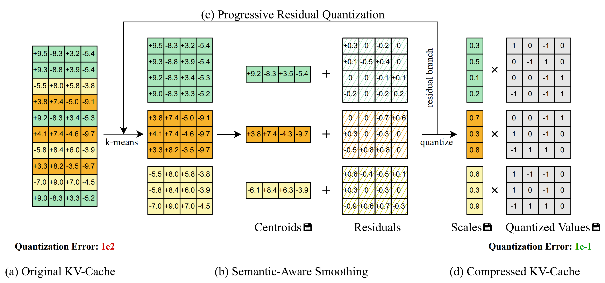

+ 属于 KV cache quantization
+ 用于加速 AR DiT 视频生成
+ 无需训练，即插即用

> tldr: 先通过 k-means 聚类 token，然后分组量化，称为 Semantic-Aware Smoothing（sas）；量化形成的残差再进行 sas，循环若干次，称为 Progressive Residual Quantization（prq）

## Semantic-Aware Smoothing
The key observation behind QVG is that video KV-cache exhibits strong spatiotemporal redundancy: tokens that are spatially or temporally adjacent tend to be numerically similar in latent space. A fixed spatial patch across consecutive frames changes slowly (temporal redundancy), and nearby patches within the same frame share similar features (spatial redundancy).

Semantic-Aware Smoothing exploits this redundancy through two steps:

Step 1: Semantic-based grouping. We apply the k-means algorithm on the KV-cache along the sequence dimension to partition tokens into semantically similar groups. Tokens within the same group exhibit significantly more homogeneous value distributions, since they share similar spatial and temporal characteristics.

Step 2: Centroid subtraction. For each group, we subtract its centroid (mean value) to obtain a residual tensor. Since the large-magnitude values are shared across semantically similar tokens and captured by the centroid, the resulting residuals have a much smaller magnitude and more concentrated distribution around zero — an ideal target for low-bit quantization.

This simple yet effective technique reduces quantization error by ~6.9× for keys and ~2.6× for values across all precision choices, without any training or fine-tuning. 

## Progressive Residual Quantization
Inspired by streaming video codecs that progressively encode multi-scale representations, QVG introduces Progressive Residual Quantization — a coarse-to-fine scheme that iteratively refines quantization in multiple stages.

Starting from the initial residual (output of Semantic-Aware Smoothing), each subsequent stage applies Semantic-Aware Smoothing again on the remaining residual to capture finer-grained details. After T stages, the final residual is quantized to low-bit integers, while the centroids and assignment vectors from all stages are stored as compact metadata.

The first stage provides the dominant error reduction (5.83× MSE reduction vs. naive quantization). Subsequent stages continue to improve quality with diminishing returns, enabling a smooth trade-off between quality and compression by simply adjusting the number of stages.

For reconstruction, the process is reversed: starting from the quantized output, centroids are progressively added back from the last stage to the first, faithfully recovering the original tensor. 

## Algorithm-System Co-design
+ Streaming centroid caching: the k-means centroids from the previous video chunk are reused to initialize clustering for the next chunk, reducing k-means overhead by 3×.

+ Fused dequantization kernel: a custom CUDA kernel that dequantizes the tensor and adds back assigned centroids for all Progressive Residual Quantization stages in a single pass, keeping intermediate results in registers to avoid redundant global memory accesses.

+ FP8 scaling factors: scaling factors are stored in FP8 E4M3 format to further reduce memory overhead.