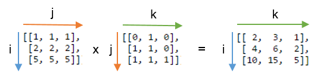
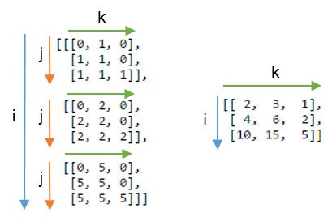
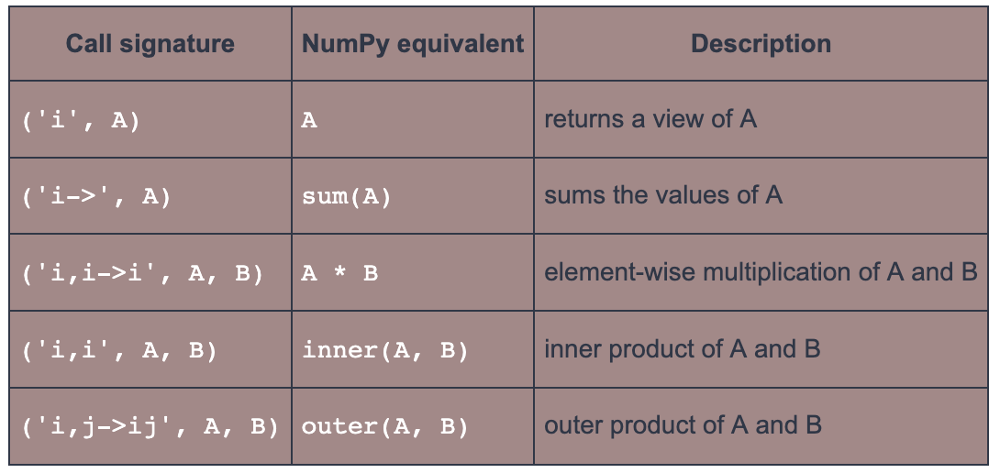
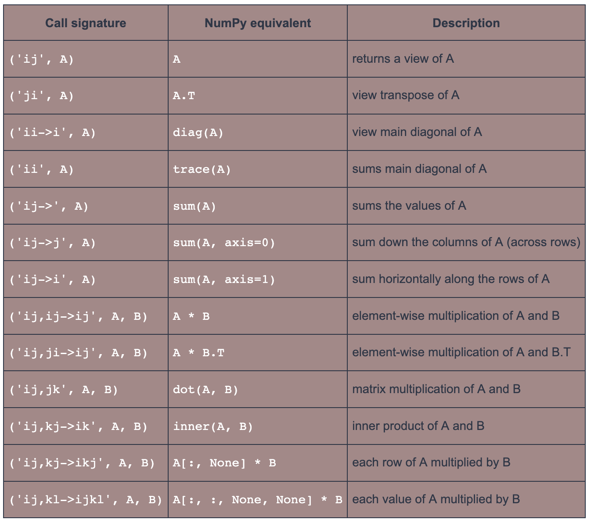

## `np.einsum`
choose the correct labelling for the axes of the inputs arrays and the array that we want to get out.
### 示例
A 为 1 维，用 i 表示该维度；B 为 2 维，用 i，j 表示这两个维度；共用 i 表示 A 和 B 的元素沿着各自的 i 维度相乘

```python
A = np.array([0, 1, 2])

B = np.array([[ 0,  1,  2,  3],
              [ 4,  5,  6,  7],
              [ 8,  9, 10, 11]])

np.einsum('i,ij->i', A, B)
```

------

A 为 2 维，用 i，j 表示该维度；B 为 2 维，用 j，k 表示这两个维度；共用 j 表示 A 和 B 的元素沿着各自的 j 维度相乘；箭头后方 ik 表示沿 i，k 的维度顺序排列，并且将之前的 j 维度相乘的元素求和

```python
np.einsum('ij,jk->ik', A, B) 
```



------

如下图，不省略 j 维，则会是这样
```python
np.einsum('ij,jk->ijk', A, B)
```



### 一维向量常用表达式


### 二位矩阵常用表达式
